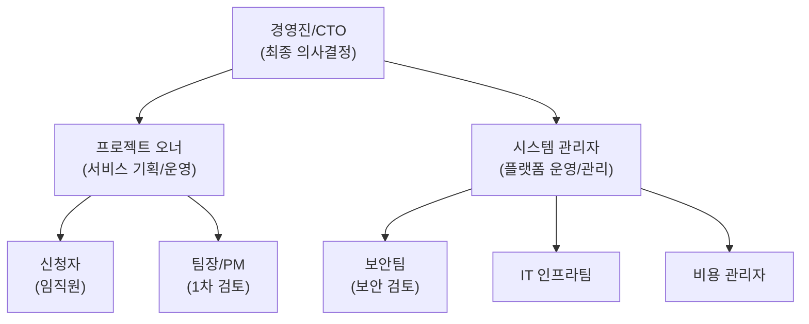
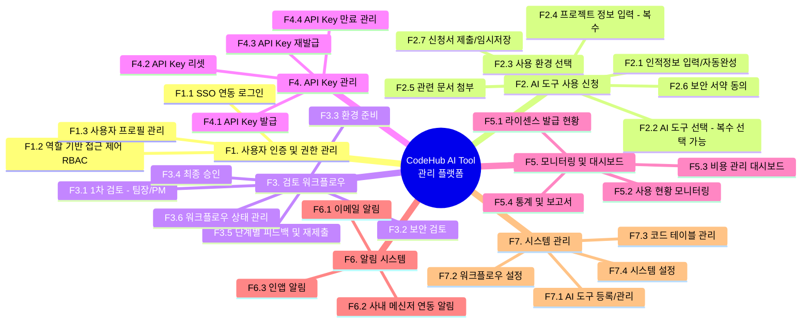
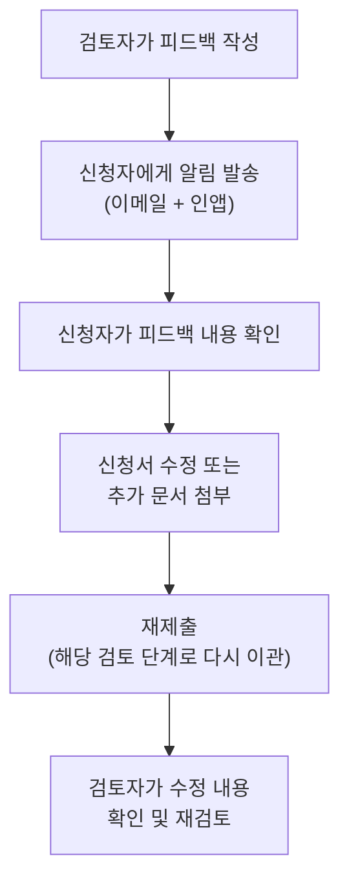
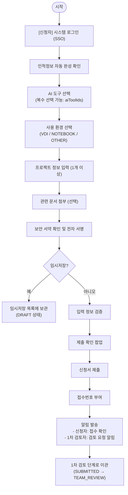
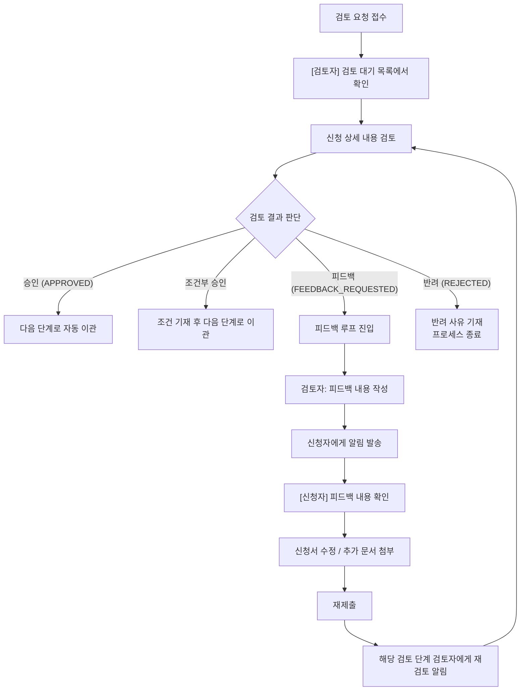
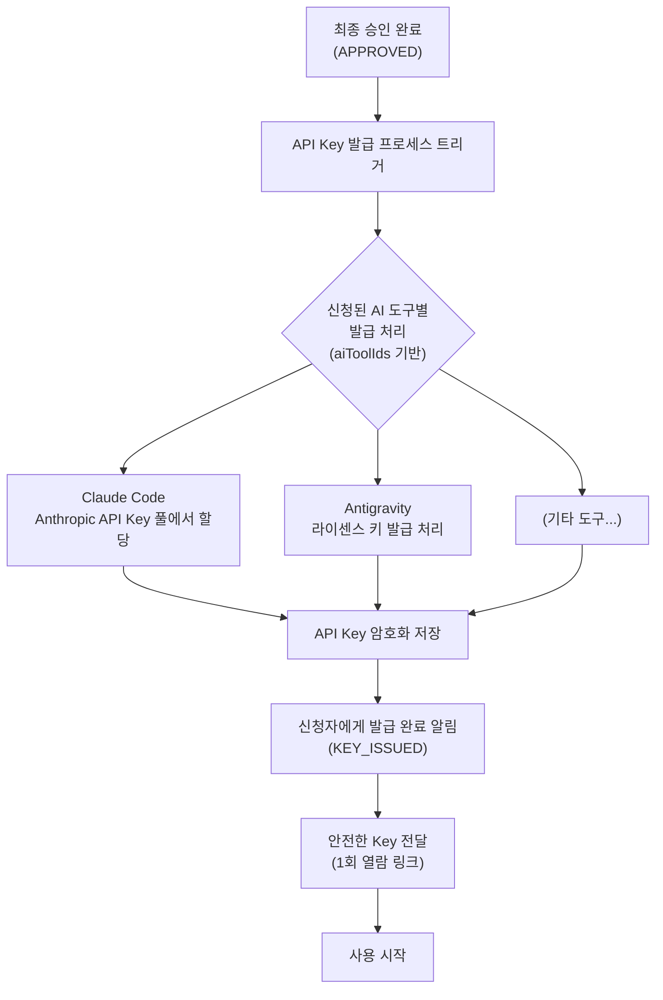
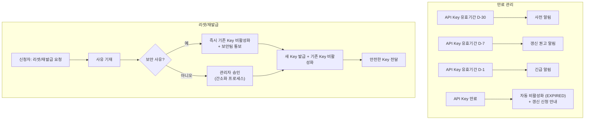
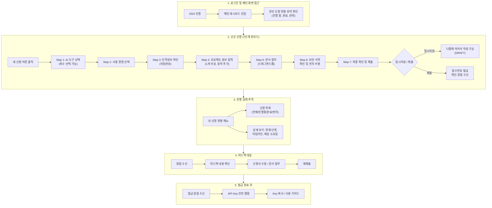
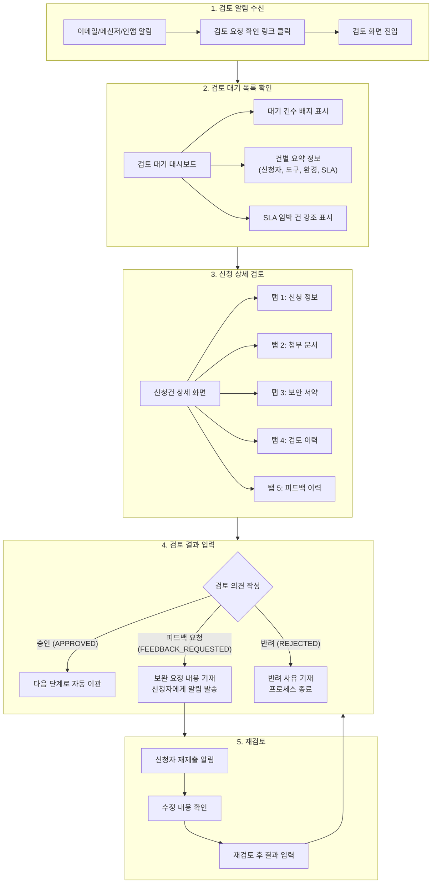
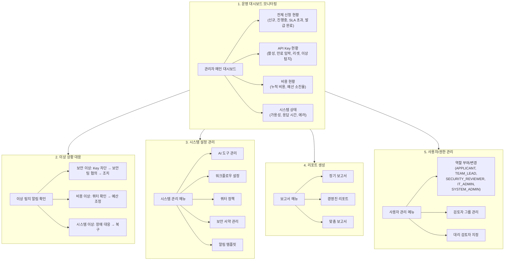

# CodeHub AI Tool 관리 플랫폼 - 프로젝트 기획안

| 항목 | 내용 |
|------|------|
| **문서명** | CodeHub AI Tool 관리 플랫폼 프로젝트 기획안 |
| **문서 버전** | v1.1 |
| **작성일** | 2026-02-11 |
| **작성자** | 프로젝트 기획팀 |
| **문서 상태** | 업데이트 (Updated) |
| **승인자** | - |
| **배포 대상** | 프로젝트 이해관계자 전원 |

---

## 목차

1. [프로젝트 개요](#1-프로젝트-개요)
2. [서비스 비전 및 목표](#2-서비스-비전-및-목표)
3. [이해관계자 정의](#3-이해관계자-정의)
4. [핵심 기능 정의](#4-핵심-기능-정의)
5. [서비스 프로세스 플로우](#5-서비스-프로세스-플로우)
6. [프로젝트 범위 및 단계별 마일스톤](#6-프로젝트-범위-및-단계별-마일스톤)
7. [리스크 관리](#7-리스크-관리)
8. [기대효과](#8-기대효과)
9. [용어 정의](#9-용어-정의)

---

## 1. 프로젝트 개요

### 1.1 프로젝트 배경

AI 코딩 도구의 급격한 발전과 함께 소프트웨어 개발 생산성을 획기적으로 향상시킬 수 있는 외부 AI 도구들이 등장하고 있다. Claude Code, Antigravity 등 AI 기반 코딩 어시스턴트는 코드 생성, 디버깅, 리팩토링, 문서화 등 개발 전반에 걸쳐 개발자의 생산성을 크게 높여주는 도구로 자리잡고 있다.

그러나 사내에서 외부 AI 코딩 도구를 무분별하게 도입할 경우 다음과 같은 문제가 발생할 수 있다:

- **보안 리스크**: 사내 소스코드, 비즈니스 로직, 고객 데이터 등 민감 정보가 외부 AI 서비스로 전송될 위험
- **비용 관리 어려움**: 개별적으로 라이센스를 구매하거나 API Key를 발급받을 경우 전사 비용 관리가 불가능
- **거버넌스 부재**: 누가 어떤 도구를 어떤 목적으로 사용하는지 추적 및 관리 체계의 부재
- **환경 표준화 부재**: VDI, 개인 노트북 등 다양한 환경에서의 사용 정책 부재

이에 따라 외부 AI 코딩 도구의 도입을 체계적으로 관리하고, 신청-검토-승인-발급-모니터링의 전 과정을 통합 관리할 수 있는 웹 기반 플랫폼 구축이 필요하다.

### 1.2 프로젝트 목적

**"CodeHub AI Tool 관리 플랫폼"**(이하 CodeHub)은 사내 임직원이 외부 AI 코딩 도구를 안전하고 효율적으로 사용할 수 있도록 신청, 검토, 승인, 발급, 모니터링의 전 라이프사이클을 통합 관리하는 웹서비스이다.

본 프로젝트의 구체적 목적은 다음과 같다:

1. **체계적 도구 도입 관리**: 외부 AI 코딩 도구의 사용 신청부터 발급까지 표준화된 프로세스 제공
2. **보안 강화**: 보안 서약, 보안 검토 등 다단계 보안 절차를 통한 정보 유출 방지
3. **비용 최적화**: 전사 라이센스 및 API Key 사용 현황을 실시간으로 모니터링하여 비용 효율성 확보
4. **거버넌스 확립**: 사용자, 프로젝트, 사용 환경 등에 대한 종합적 관리 체계 구축
5. **생산성 향상**: 빠르고 투명한 신청-승인 프로세스로 도구 도입 리드타임 최소화

### 1.3 프로젝트 범위

#### 1.3.1 대상 시스템

| 구분 | 내용 |
|------|------|
| **시스템명** | CodeHub AI Tool 관리 플랫폼 |
| **시스템 유형** | 웹 기반 어플리케이션 (SPA) |
| **대상 사용자** | 사내 전 임직원 (개발자, PM, 팀장, 보안담당자, IT인프라 담당자, 시스템 관리자) |
| **대상 AI 도구** | Claude Code, Antigravity (향후 확장 가능한 구조) |
| **사용 환경** | VDI (Virtual Desktop Infrastructure), Notebook (사내 지급), 기타 환경 |

#### 1.3.2 서비스 범위 (In-Scope)

- AI 도구 사용 신청 및 접수
- 다단계 검토 워크플로우 (1차 검토, 보안 검토, 환경 준비, 최종 승인)
- 각 검토 단계별 피드백 및 재제출 프로세스
- 보안 서약 전자 서명
- API Key 발급, 리셋, 재발급 관리
- 라이센스 발급 현황 대시보드
- 사용 현황 모니터링
- 비용 관리 대시보드
- 사용자 알림 (이메일, 사내 메신저 연동)

#### 1.3.3 서비스 범위 외 (Out-of-Scope)

- AI 도구 자체의 개발 및 커스터마이징
- AI 도구의 내부 기능 또는 성능 관리
- 사내 인사 시스템(HR) 자체 구축 (연동만 포함)
- 결제 시스템 구축 (비용 모니터링만 포함)
- AI 도구별 교육 콘텐츠 제작 (별도 프로젝트로 분리)

---

## 2. 서비스 비전 및 목표

### 2.1 서비스 비전

> **"안전하고 효율적인 AI 코딩 도구 도입을 통해, 전사 개발 생산성을 극대화하는 원스톱 관리 플랫폼"**

CodeHub은 단순한 신청 시스템이 아닌, AI 코딩 도구의 전체 라이프사이클을 관리하는 통합 플랫폼으로서의 역할을 수행한다. 보안과 편의성의 균형을 유지하면서, 임직원이 필요한 AI 도구를 빠르게 도입하고 안전하게 활용할 수 있는 환경을 제공한다.

### 2.2 서비스 핵심 가치

| 핵심 가치 | 설명 |
|-----------|------|
| **보안 우선 (Security First)** | 다단계 보안 검토와 서약 체계를 통해 사내 정보 자산을 보호한다 |
| **투명한 프로세스 (Transparency)** | 신청자가 자신의 신청 현황과 검토 진행 상태를 실시간으로 확인할 수 있다 |
| **신속한 처리 (Agility)** | 표준화된 워크플로우와 병렬 처리를 통해 최소한의 시간 내 도구 발급을 완료한다 |
| **확장 가능성 (Scalability)** | 새로운 AI 도구의 추가와 검토 프로세스의 변경에 유연하게 대응할 수 있는 구조를 갖춘다 |
| **데이터 기반 관리 (Data-Driven)** | 사용 현황, 비용, 라이센스 등의 데이터를 기반으로 의사결정을 지원한다 |

### 2.3 정량적 목표

| 목표 항목 | 목표치 | 비고 |
|-----------|--------|------|
| 신청~발급 평균 처리 기간 | 5 영업일 이내 | 보안 검토 포함 |
| 신청자 만족도 | 4.0/5.0 이상 | 분기별 설문 |
| 시스템 가용성 | 99.5% 이상 | 업무시간 기준 (09:00~18:00) |
| 전사 AI 도구 비용 가시성 | 100% | 전체 발급 건 대비 모니터링 비율 |
| 보안 사고 발생 건수 | 0건 | 정보 유출 관련 |
| 프로세스 자동화율 | 70% 이상 | 수동 개입 최소화 |

### 2.4 단계별 서비스 목표

| 단계 | 기간 | 목표 |
|------|------|------|
| **Phase 1 (MVP)** | 1~3개월 | 핵심 신청/검토/발급 프로세스 구축, Claude Code 및 Antigravity 지원 |
| **Phase 2 (고도화)** | 4~6개월 | 모니터링 대시보드 강화, 비용 관리, 자동화 확대 |
| **Phase 3 (확장)** | 7~12개월 | 추가 AI 도구 확장, 사내 시스템 연동 강화, 셀프서비스 확대 |

### 2.5 정성적 목표

| 목표 영역 | 정성적 목표 | 달성 기준 |
|-----------|------------|----------|
| **사용자 경험** | 신청자가 별도의 교육 없이도 직관적으로 신청 프로세스를 완료할 수 있는 서비스 제공 | 신규 사용자 온보딩 시간 30분 이내, 사용자 인터뷰 긍정 피드백 80% 이상 |
| **보안 문화** | AI 도구 사용에 있어 보안 의식을 자연스럽게 내재화하는 프로세스 구축 | 보안 서약 이행률 100%, 보안 교육 자료 열람율 90% 이상 |
| **조직 신뢰** | 투명한 검토 프로세스를 통해 신청자와 검토자 간 상호 신뢰 형성 | 프로세스 공정성 평가 4.0/5.0 이상 |
| **데이터 기반 문화** | 사용 데이터를 기반으로 AI 도구 투자 및 운영 의사결정을 수행하는 문화 정착 | 경영진 리포트 활용 빈도 월 2회 이상, 데이터 기반 의사결정 사례 분기당 3건 이상 |
| **확장 가능성** | 새로운 AI 도구가 등장하더라도 최소한의 노력으로 플랫폼에 통합할 수 있는 유연한 구조 확보 | 신규 도구 추가 소요 시간 2주 이내 |
| **운영 자율성** | 개발팀의 지원 없이도 관리자가 워크플로우 및 정책을 자율적으로 운영할 수 있는 환경 제공 | 관리자 자체 설정 변경 비율 80% 이상 |

---

## 3. 이해관계자 정의

### 3.1 이해관계자 맵



### 3.2 이해관계자별 상세 정의

#### 3.2.1 신청자 (임직원)

| 항목 | 내용 |
|------|------|
| **역할** | AI 코딩 도구 사용을 신청하는 사내 임직원 |
| **주요 대상** | 소프트웨어 개발자, 데이터 엔지니어, DevOps 엔지니어, QA 엔지니어 등 |
| **주요 니즈** | 빠르고 간편한 신청 프로세스, 실시간 진행 상태 확인, 명확한 피드백 |
| **시스템 접근 권한** | 신청서 작성/수정, 본인 신청 현황 조회, API Key 확인, 보안 서약 서명 |
| **주요 활동** | 도구 사용 신청, 프로젝트 정보 입력, 문서 첨부, 보안 서약 동의, 피드백 대응 |

#### 3.2.2 1차 검토자 (팀장/PM)

| 항목 | 내용 |
|------|------|
| **역할** | 신청 내용의 타당성 및 업무 필요성을 1차적으로 검토 |
| **주요 대상** | 신청자의 직속 팀장 또는 프로젝트 PM |
| **주요 니즈** | 팀원의 신청 현황 일괄 확인, 효율적 검토 및 피드백 처리 |
| **시스템 접근 권한** | 소속 팀원 신청 목록 조회, 승인/반려/피드백, 1차 검토 처리 |
| **주요 활동** | 업무 필요성 검토, 프로젝트 적합성 확인, 승인 또는 보완 요청 |

#### 3.2.3 보안 검토자 (보안팀)

| 항목 | 내용 |
|------|------|
| **역할** | 보안 관점에서 AI 도구 사용의 적정성 및 리스크 검토 |
| **주요 대상** | 사내 정보보안팀 소속 보안 담당자 |
| **주요 니즈** | 보안 서약 이행 확인, 프로젝트별 보안 등급 확인, 보안 정책 준수 여부 판단 |
| **시스템 접근 권한** | 전체 보안 검토 대기 목록 조회, 보안 검토 처리, 보안 정책 설정 |
| **주요 활동** | 보안 서약 내용 확인, 데이터 민감도 평가, 보안 조건 부여, 승인/반려 |

#### 3.2.4 IT 인프라 담당자

| 항목 | 내용 |
|------|------|
| **역할** | 승인된 신청 건에 대한 사용 환경 세팅 및 기술 인프라 준비 |
| **주요 대상** | IT 인프라팀 소속 엔지니어 |
| **주요 니즈** | 환경 준비 요청 목록 확인, 환경별 표준 설정 가이드, 작업 이력 관리 |
| **시스템 접근 권한** | 환경 준비 대기 목록 조회, 환경 설정 처리, 인프라 현황 확인 |
| **주요 활동** | VDI/노트북 환경 설정, 네트워크 정책 적용, 도구 설치/설정 지원 |

#### 3.2.5 최종 승인자 (관리자)

| 항목 | 내용 |
|------|------|
| **역할** | 모든 검토가 완료된 신청 건에 대해 최종 승인 및 API Key 발급 지시 |
| **주요 대상** | 서비스 운영 관리자 또는 지정된 최종 승인 권한자 |
| **주요 니즈** | 전체 프로세스 현황 파악, 신속한 최종 승인, 이상 케이스 모니터링 |
| **시스템 접근 권한** | 전체 신청 현황 조회, 최종 승인/반려, API Key 발급 실행, 대시보드 전체 접근 |
| **주요 활동** | 최종 승인, API Key 발급, 발급 현황 모니터링, 비용 관리 |

#### 3.2.6 시스템 관리자

| 항목 | 내용 |
|------|------|
| **역할** | CodeHub 플랫폼 자체의 운영, 관리, 설정 |
| **주요 대상** | 플랫폼 운영 담당자 |
| **주요 니즈** | 시스템 안정성 확보, 사용자/권한 관리, 워크플로우 설정 유연성 |
| **시스템 접근 권한** | 시스템 전체 설정, 사용자 관리, 워크플로우 설정, AI 도구 관리, 전체 데이터 접근 |
| **주요 활동** | 시스템 설정 관리, 코드 테이블 관리, AI 도구 등록/관리, 사용자 권한 설정, 장애 대응 |

#### 3.2.7 비용 관리자

| 항목 | 내용 |
|------|------|
| **역할** | AI 도구 사용에 따른 전사 비용의 모니터링 및 최적화 |
| **주요 대상** | 재무팀 또는 IT 예산 관리 담당자 |
| **주요 니즈** | 부서별/프로젝트별 비용 현황, 예산 대비 실적, 비용 추세 분석 |
| **시스템 접근 권한** | 비용 대시보드 조회, 비용 관련 보고서 생성, 예산 한도 설정 |
| **주요 활동** | 비용 현황 모니터링, 예산 관리, 비용 최적화 권고, 보고서 작성 |

### 3.3 RACI 매트릭스

| 활동 | 신청자 | 1차 검토자 | 보안팀 | IT인프라 | 최종 승인자 | 시스템 관리자 | 비용 관리자 |
|------|--------|-----------|--------|----------|-------------|-------------|------------|
| 도구 사용 신청 | **R** | I | - | - | - | - | - |
| 1차 검토 | I | **R/A** | - | - | - | - | - |
| 보안 검토 | I | C | **R/A** | - | - | - | - |
| 환경 준비 | I | - | - | **R/A** | - | C | - |
| 최종 승인 | I | I | I | I | **R/A** | - | - |
| API Key 발급 | I | - | - | - | **A** | **R** | - |
| 비용 모니터링 | - | - | - | - | C | C | **R/A** |
| 시스템 운영 | - | - | - | C | - | **R/A** | - |

> R: Responsible (실행), A: Accountable (책임), C: Consulted (자문), I: Informed (통보)

---

## 4. 핵심 기능 정의

### 4.1 기능 구조도 (Feature Map)



### 4.2 기능별 상세 설명

#### F1. 사용자 인증 및 권한 관리

##### F1.1 SSO 연동 로그인
- 사내 SSO(Single Sign-On) 시스템과 연동하여 별도 계정 생성 없이 로그인
- SAML 2.0 또는 OAuth 2.0 / OIDC 프로토콜 지원
- 사내 AD(Active Directory) 또는 LDAP 연동을 통한 사용자 정보 자동 동기화
- 로그인 시 사번, 이름, 소속 부서, 직급 등 인적정보 자동 매핑

##### F1.2 역할 기반 접근 제어 (RBAC)
- **역할 정의**:
  - `APPLICANT` (신청자): 일반 임직원, 신청서 작성 및 본인 현황 조회
  - `TEAM_LEAD` (1차 검토자/팀장): 소속 팀원 신청 1차 검토
  - `SECURITY_REVIEWER` (보안 검토자): 보안 관점 검토
  - `IT_ADMIN` (IT 인프라/최종 승인자): 환경 준비, 설정, 최종 승인 및 발급 실행, 비용 현황 관리
  - `SYSTEM_ADMIN` (시스템 관리자): 전체 시스템 설정 및 관리
- 한 사용자가 복수 역할을 보유할 수 있음
- 역할별 메뉴 접근 권한, 데이터 접근 범위 차등 적용

##### F1.3 사용자 프로필 관리
- SSO에서 가져온 인적정보 조회
- 추가 정보 수정 (연락처, 선호 알림 채널 등)
- 본인의 역할 및 권한 확인

#### F2. AI 도구 사용 신청

##### F2.1 인적정보 입력/자동완성
- SSO 로그인 정보 기반으로 인적정보 자동 완성:
  - 사번, 성명, 소속 부서, 팀, 직급, 이메일, 연락처
- 자동 완성된 정보 확인 및 일부 수정 가능 (연락처 등)
- 인사 시스템(HR) 연동을 통한 최신 정보 반영

##### F2.2 AI 도구 선택

**카드형 UI를 통한 직관적 도구 선택 화면 제공**:

각 AI 도구는 카드(Card) 형태의 UI로 표시되며, 한눈에 도구의 특징을 파악하고 비교할 수 있도록 구성한다.

- **카드 표시 정보**:
  - 도구 로고 및 이름
  - 제공사 (Anthropic, Antigravity 등)
  - 도구 카테고리 (코드 생성, 코드 리뷰, 디버깅 등)
  - 핵심 기능 요약 (3~5개 항목)
  - 월간 예상 비용 범위
  - 사용 제한사항 요약
  - 사내 사용자 수 (현재 발급 건수)
  - 사용자 평균 만족도
  - "신청하기" 버튼

- **도구별 상세 정보**:

| 항목 | Claude Code | Antigravity |
|------|-------------|-------------|
| **제공사** | Anthropic | Antigravity Inc. |
| **주요 기능** | AI 코드 생성, 코드 리뷰, 디버깅, 리팩토링, 문서화, 테스트 코드 생성 | AI 기반 개발 워크플로우 자동화, 코드 분석, 생산성 대시보드 |
| **지원 언어** | Python, JavaScript, TypeScript, Java, Go, Rust 등 다수 | Python, JavaScript, Java, C++ 등 |
| **과금 방식** | API 호출 기반 (토큰 사용량) | 월정액 라이센스 |
| **월 예상 비용** | 사용량에 따라 변동 ($50~$500/인) | 고정 $30/인/월 |
| **사용 제한사항** | 일일 토큰 한도 설정 가능, 기밀 등급 프로젝트 사용 시 추가 보안 검토 필요 | 동시 세션 수 제한, 오프라인 모드 미지원 |
| **사용 환경** | VDI, Notebook 모두 지원 | VDI 우선 지원, Notebook 일부 제한 |

- 복수 도구 동시 신청 지원 (도구별 체크박스 선택, `aiToolIds: string[]`, `aiToolNames: string[]`로 관리)
- 하나의 신청서에서 여러 AI 도구를 동시에 선택할 수 있으며, 선택된 도구별로 동적 폼 구성
- 도구 비교 기능 제공 (2개 이상 선택 시 비교표 자동 생성)
- 도구별 사용 가이드 및 FAQ 링크 제공

##### F2.3 사용 환경 선택

사용 환경에 따라 보안 정책, 네트워크 설정, 도구 설치 방법이 상이하므로 환경 선택은 검토 및 환경 준비 단계에 직접적인 영향을 미친다.

- **사용 환경 유형 및 상세 요구사항**:

**[VDI (Virtual Desktop Infrastructure)]**

| 항목 | 내용 |
|------|------|
| **환경 설명** | 사내 데이터센터에서 운영되는 가상 데스크톱. 모든 데이터가 사내 네트워크 내에서 처리됨 |
| **보안 수준** | 높음 - 데이터 외부 유출 경로 차단, 화면 캡처 방지, 클립보드 제어 가능 |
| **필요 입력 정보** | VDI 할당 ID, VDI 유형 (표준형/고성능형), 할당 CPU/메모리 사양, 현재 VDI 접속 방식 |
| **환경 준비 작업** | VDI 이미지에 AI 도구 패키지 배포, API 엔드포인트 방화벽 허용, 프록시 설정, SSL 인증서 배포 |
| **장점** | 중앙 집중 관리 용이, 보안 통제 강력, 도구 배포 자동화 가능 |
| **제약사항** | 네트워크 지연 발생 가능, GPU 사용 제한, VDI 리소스 추가 할당 필요 시 별도 승인 |

**[Notebook (사내 지급)]**

| 항목 | 내용 |
|------|------|
| **환경 설명** | 사내에서 지급한 업무용 노트북. 사내/사외 네트워크 모두에서 사용 가능 |
| **보안 수준** | 중간 - MDM(Mobile Device Management) 정책 적용, DLP(Data Loss Prevention) 에이전트 설치 필수 |
| **필요 입력 정보** | 장비 관리 번호 (자산 번호), OS 종류 및 버전, MDM 에이전트 설치 여부, DLP 에이전트 설치 여부 |
| **환경 준비 작업** | 원격 배포를 통한 도구 설치, VPN 설정 확인, 네트워크 정책 적용, DLP 정책 업데이트 |
| **장점** | 사용자 이동성 확보, 로컬 리소스 활용 가능, 오프라인 작업 일부 가능 |
| **제약사항** | 분실/도난 리스크, 사외 네트워크 사용 시 추가 보안 조치 필요, 개인 환경 편차 발생 |

**[기타 환경]**

| 항목 | 내용 |
|------|------|
| **환경 설명** | 개발 서버, CI/CD 파이프라인, 클라우드 개발 환경 등 VDI/Notebook에 해당하지 않는 특수 환경 |
| **보안 수준** | 환경에 따라 별도 평가 필요 |
| **필요 입력 정보** | 환경 유형 상세 설명, 접근 방식, 네트워크 구성, 보안 조치 현황, 사용 사유 |
| **환경 준비 작업** | 개별 환경 분석 후 맞춤 설정, 보안팀과 IT인프라팀 합동 검토 필요 |
| **장점** | 특수 목적에 최적화된 환경 활용 가능 |
| **제약사항** | 표준화된 프로세스 적용 어려움, 환경 준비에 추가 시간 소요, 보안 검토 강화 대상 |

- 선택한 환경에 따라 보안 검토 기준 및 환경 준비 체크리스트가 자동으로 달라짐
- 복수 환경 선택 가능 (예: VDI + Notebook 동시 사용)

##### F2.4 프로젝트 정보 입력 (복수)
- 하나의 신청에서 복수의 프로젝트 정보를 입력할 수 있음
- 프로젝트별 입력 항목:
  - 프로젝트명
  - 프로젝트 코드 (사내 프로젝트 관리 시스템 연동)
  - 프로젝트 설명
  - 사용 목적 (코드 생성, 리뷰, 디버깅, 문서화 등 복수 선택)
  - 프로젝트 보안 등급 (일반, 대외비, 기밀)
  - 프로젝트 기간
  - 예상 사용 빈도 (일일/주간/월간)
  - 담당 PM 정보
- 프로젝트 추가/삭제 기능 (동적 폼)
- 기존 신청 이력에서 프로젝트 정보 불러오기 기능

##### F2.5 관련 문서 첨부
- 신청과 관련된 문서를 첨부할 수 있는 기능:
  - 프로젝트 계획서
  - 보안 관련 문서
  - 기타 참고 자료
- 지원 파일 형식: PDF, DOCX, XLSX, PPTX, PNG, JPG
- 파일 크기 제한: 개별 10MB, 전체 50MB
- 파일 미리보기 기능
- 첨부 파일 버전 관리 (피드백 후 재첨부 시)

##### F2.6 보안 서약 동의
- AI 도구 사용에 대한 보안 서약 내용 표시:
  - 사내 기밀 정보 외부 전송 금지
  - 고객 개인정보 AI 도구 입력 금지
  - 소스코드 외부 유출 방지 조치 준수
  - AI 생성 코드의 보안 검증 의무
  - 사용 로그 모니터링 동의
  - 정책 위반 시 제재 사항 고지
- 전자 서명 방식의 동의 처리
- 서약 일시 및 서명 기록 보관
- 보안 서약 내용은 관리자가 수정 가능

##### F2.7 신청서 제출/임시저장
- 임시 저장 기능:
  - 작성 중인 신청서를 언제든 임시 저장 가능
  - 임시 저장 목록에서 이어서 작성 가능
  - 자동 임시 저장 (일정 간격)
- 제출 전 입력 정보 유효성 검증:
  - 필수 항목 누락 체크
  - 형식 검증 (이메일, 전화번호 등)
  - 보안 서약 동의 여부 확인
- 제출 시 확인 팝업 (입력 정보 요약 표시)
- 제출 완료 후 접수 번호 부여 및 알림 발송

#### F3. 검토 워크플로우

##### F3.1 1차 검토 (팀장/PM)

**검토 목적**: 신청자의 업무 필요성 및 프로젝트 적합성 확인

| 항목 | 내용 |
|------|------|
| **검토자** | 신청자의 직속 팀장 또는 프로젝트 PM |
| **검토 기준** | 업무 필요성, 프로젝트 적합성, 사용 목적 타당성 |
| **검토 결과** | 승인, 반려, 피드백(보완 요청) |
| **SLA** | 접수 후 2 영업일 이내 처리 |

- 검토 대기 목록에서 본인 소속 팀원 신청건 확인
- 신청 상세 내용 열람 (인적정보, 프로젝트 정보, 첨부 문서 등)
- 승인: 다음 단계(보안 검토)로 자동 이관
- 반려: 반려 사유 기재 필수, 신청자에게 알림 발송
- 피드백: 보완 요청 내용 기재, 신청자에게 알림 발송 후 수정/재제출 대기

##### F3.2 보안 검토

**검토 목적**: 보안 정책 준수 여부 및 보안 리스크 평가

| 항목 | 내용 |
|------|------|
| **검토자** | 정보보안팀 담당자 |
| **검토 기준** | 보안 서약 이행, 프로젝트 보안 등급, 데이터 민감도, 사용 환경 적절성 |
| **검토 결과** | 승인, 반려, 조건부 승인, 피드백(보완 요청) |
| **SLA** | 접수 후 3 영업일 이내 처리 |

- 보안 서약 서명 내용 및 일시 확인
- 프로젝트별 보안 등급에 따른 차등 검토
- 사용 환경(VDI/Notebook/기타)별 보안 적합성 판단
- 조건부 승인: 특정 보안 조건 부여 후 승인 (예: "기밀 프로젝트 코드 입력 금지")
- 보안 검토 이력 및 판단 근거 기록

##### F3.3 환경 준비

**목적**: 승인된 신청 건에 대한 기술 인프라 환경 세팅

| 항목 | 내용 |
|------|------|
| **담당자** | IT 인프라팀 |
| **작업 내용** | 네트워크 정책 적용, 도구 설치, 환경 설정 |
| **작업 결과** | 완료, 불가(사유 기재), 피드백(추가 정보 요청) |
| **SLA** | 접수 후 2 영업일 이내 처리 |

- 환경 준비 작업 목록 자동 생성 (사용 환경 유형에 따라)
- VDI 환경:
  - VDI 이미지에 AI 도구 패키지 설치
  - 네트워크 방화벽 규칙 적용 (AI 서비스 엔드포인트 접근 허용)
  - 프록시 설정
- Notebook 환경:
  - 원격 배포를 통한 도구 설치
  - 네트워크 정책 적용
  - VPN 설정 (필요시)
- 환경 준비 완료 체크리스트 확인
- 설정 완료 후 다음 단계(최종 승인)로 자동 이관

##### F3.4 최종 승인

**목적**: 모든 검토와 환경 준비가 완료된 건에 대한 최종 승인 및 발급 지시

| 항목 | 내용 |
|------|------|
| **승인자** | 서비스 관리자 또는 지정된 최종 승인 권한자 |
| **승인 기준** | 모든 이전 단계 정상 완료 확인, 종합 판단 |
| **승인 결과** | 최종 승인(발급 진행), 반려(사유 기재) |
| **SLA** | 접수 후 1 영업일 이내 처리 |

- 전체 검토 이력 요약 확인 (1차 검토, 보안 검토, 환경 준비 결과)
- 최종 승인 시 API Key 자동 발급 프로세스 트리거
- 신청자에게 최종 승인 및 발급 완료 알림 발송

##### F3.5 단계별 피드백 및 재제출 프로세스

모든 검토 단계(F3.1~F3.4)에서 공통으로 적용되는 피드백 프로세스:



- 피드백 이력 전체 추적 가능 (타임라인 형태)
- 각 피드백에 대한 신청자의 대응 내용 기록
- 피드백 횟수 제한 설정 가능 (무한 루프 방지)
- 피드백 미응답 시 자동 알림 (리마인더) 발송
- 일정 기간 미응답 시 자동 반려 처리

##### F3.6 워크플로우 상태 관리

- **신청 상태 정의** (`ApplicationStatus`):

| 상태 | 설명 |
|------|------|
| `DRAFT` | 임시 저장 (미제출) |
| `SUBMITTED` | 제출 완료 (접수) |
| `TEAM_REVIEW` | 1차 검토 중 (팀장/PM) |
| `SECURITY_REVIEW` | 보안 검토 중 |
| `ENV_PREPARATION` | 환경 준비 중 |
| `FINAL_APPROVAL` | 최종 승인 대기 |
| `APPROVED` | 최종 승인 완료 |
| `KEY_ISSUED` | API Key 발급 완료 (사용 가능) |
| `REJECTED` | 반려 |
| `FEEDBACK_REQUESTED` | 보완 요청 (피드백 대기) |

> **참고**: 각 검토 단계(TEAM_REVIEW, SECURITY_REVIEW, ENV_PREPARATION, FINAL_APPROVAL)에서 피드백이 필요한 경우 `FEEDBACK_REQUESTED` 상태로 전환되며, 신청자가 수정/재제출하면 해당 검토 단계로 복귀한다.

- 상태 변경 시 자동 알림 발송
- 전체 상태 변경 이력 추적 (Audit Trail)
- 각 단계별 처리 기한 관리 및 SLA 알림

##### F3.7 자동 에스컬레이션 정책

각 검토 단계에서 SLA를 초과하는 경우 자동으로 상위 관리자에게 에스컬레이션이 수행된다.

| 단계 | SLA | 1차 리마인더 | 2차 리마인더 | 자동 에스컬레이션 | 에스컬레이션 대상 |
|------|-----|-------------|-------------|-------------------|------------------|
| 1차 검토 | 2 영업일 | SLA 50% 경과 (1일) | SLA 80% 경과 (1.5일) | SLA 초과 시 즉시 | 해당 팀 상위 관리자 |
| 보안 검토 | 3 영업일 | SLA 50% 경과 (1.5일) | SLA 80% 경과 (2.5일) | SLA 초과 시 즉시 | 보안팀 팀장 |
| 환경 준비 | 2 영업일 | SLA 50% 경과 (1일) | SLA 80% 경과 (1.5일) | SLA 초과 시 즉시 | IT인프라팀 팀장 |
| 최종 승인 | 1 영업일 | SLA 50% 경과 (0.5일) | SLA 80% 경과 (0.8일) | SLA 초과 시 즉시 | 서비스 운영 책임자 |

- **에스컬레이션 프로세스**:
  1. 1차 리마인더: 담당 검토자에게 이메일/메신저 리마인더 자동 발송
  2. 2차 리마인더: 담당 검토자 + 검토자 직속 상위자에게 리마인더 발송
  3. 자동 에스컬레이션: SLA 초과 시 에스컬레이션 대상에게 알림 발송, 대리 검토자 지정 요청
  4. 대리 검토: 에스컬레이션 대상이 직접 검토하거나 대리 검토자를 지정하여 처리

- **에스컬레이션 이력 관리**: 모든 에스컬레이션 발생 건에 대해 일시, 사유, 처리 결과 기록
- **에스컬레이션 통계**: 월간/분기간 에스컬레이션 발생 빈도, 주요 원인 분석 보고서 제공

#### F4. API Key 관리

##### F4.1 API Key 발급
- 최종 승인 완료 시 자동 발급 프로세스 실행
- AI 도구별 API Key 발급:
  - Claude Code: Anthropic API Key 발급 (사내 기업 계정 풀에서 할당)
  - Antigravity: 해당 서비스 라이센스 키 발급
- 발급된 API Key는 암호화 저장
- 신청자에게 안전한 방법으로 API Key 전달 (1회 열람 가능 링크 등)
- 발급 이력 기록 (발급 일시, 도구 유형, 유효 기간 등)

##### F4.2 API Key 리셋
- 기존 API Key를 무효화하고 새로운 Key 발급
- 리셋 사유 기재 필수 (보안 사고 의심, Key 노출 등)
- 리셋 시 기존 Key 즉시 비활성화
- 리셋 이력 기록 및 보안팀 자동 통보 (보안 사유인 경우)

##### F4.3 API Key 재발급
- 만료 또는 기타 사유로 인한 재발급
- 재발급 시 간소화된 검토 프로세스 적용 가능 (관리자 설정에 따라)
- 기존 사용 이력 연속성 유지

##### F4.4 API Key 만료 관리
- API Key 유효 기간 설정 (기본값: 6개월, 관리자 설정 가능)
- 만료 사전 알림 (30일 전, 7일 전, 1일 전)
- 만료 시 자동 비활성화
- 만료 후 갱신 신청 프로세스 (간소화된 검토)
- 장기 미사용 Key 자동 만료 정책 (예: 30일 미사용 시 비활성화)

##### F4.5 사용량 쿼터(Quota) 설정

API Key별/사용자별/프로젝트별/부서별로 사용량 쿼터를 설정하여 비용을 통제하고 공정한 리소스 배분을 보장한다.

- **쿼터 유형**:

| 쿼터 유형 | 적용 대상 | 설정 항목 | 초과 시 동작 |
|-----------|----------|----------|-------------|
| **개인 쿼터** | API Key별 (사용자별) | 일일 API 호출 수, 일일 토큰 사용량, 월간 총 비용 한도 | 경고 알림 후 일시 차단 또는 속도 제한 |
| **프로젝트 쿼터** | 프로젝트 단위 | 월간 총 토큰 사용량, 월간 총 비용 한도, 동시 사용자 수 | 프로젝트 PM에게 알림, 추가 예산 승인 요청 |
| **부서 쿼터** | 부서 단위 | 월간 총 비용 한도, 부서 내 라이센스 수 상한 | 부서장에게 알림, 추가 예산 배정 요청 |
| **전사 쿼터** | 전체 조직 | 월간/연간 총 예산 한도, 도구별 총 라이센스 수 | 관리자에게 긴급 알림, 신규 발급 일시 중단 |

- **쿼터 임계치 알림**:
  - 50% 도달: 정보성 알림 (인앱)
  - 80% 도달: 경고 알림 (이메일 + 인앱)
  - 95% 도달: 긴급 경고 (이메일 + 메신저 + 인앱)
  - 100% 도달: 초과 알림 및 설정된 초과 정책 실행

- **쿼터 관리 기능**:
  - 관리자가 쿼터 기본값 및 개별 값 설정 가능
  - 쿼터 변경 이력 추적
  - 쿼터 사용 현황 실시간 조회
  - 쿼터 초과 예외 처리 (관리자 승인으로 임시 확장)

#### F5. 모니터링 및 대시보드

##### F5.1 라이센스 발급 현황 대시보드
- **전체 현황 요약**:
  - 전체 신청 건수, 진행 중 건수, 발급 완료 건수, 반려 건수
  - AI 도구별 발급 현황
  - 사용 환경별 발급 현황
- **부서별 현황**:
  - 부서별 AI 도구 사용 현황
  - 부서별 라이센스 배분 현황
- **추세 분석**:
  - 월별/분기별 신청 및 발급 추이
  - 도구별 수요 변화 추이
- 데이터 필터링 및 정렬 기능
- 엑셀/CSV 내보내기 기능

##### F5.2 사용 현황 모니터링
- **개인별 사용 현황**:
  - API 호출 횟수, 토큰 사용량
  - 최근 사용 일시
  - 사용 패턴 분석
- **프로젝트별 사용 현황**:
  - 프로젝트별 총 사용량
  - 프로젝트별 사용자 목록
- **이상 사용 감지**:
  - 비정상적 사용 패턴 탐지 (과다 사용, 비업무시간 사용 등)
  - 이상 감지 시 자동 알림 발송

##### F5.3 비용 관리 대시보드
- **비용 현황**:
  - 전사 총 비용 (월별, 분기별, 연별)
  - AI 도구별 비용 내역
  - 부서별 비용 배분
  - 프로젝트별 비용 내역
- **예산 관리**:
  - 부서별/프로젝트별 예산 한도 설정
  - 예산 소진율 실시간 표시
  - 예산 초과 시 알림 및 사용 제한
- **비용 예측**:
  - 현재 사용 추세 기반 비용 예측
  - 월말/분기말 예상 비용 산출

##### F5.4 이상 사용 탐지 및 알림

AI 도구의 비정상적 사용 패턴을 실시간으로 탐지하고, 보안 위협 및 비용 초과를 사전에 방지한다.

- **탐지 규칙 유형**:

| 탐지 유형 | 탐지 조건 (예시) | 알림 수준 | 자동 조치 |
|-----------|-----------------|----------|----------|
| 과다 사용 | 일일 사용량이 평균 대비 300% 초과 | 경고 | 사용자 및 관리자 알림 |
| 비업무시간 사용 | 22:00~06:00 시간대 API 호출 발생 | 주의 | 사용자에게 확인 요청 알림 |
| 비정상 패턴 | 짧은 시간 내 대량 API 호출 (분당 100회 초과) | 긴급 | 즉시 Key 일시 차단 + 보안팀 통보 |
| 장기 미사용 | 30일 이상 API 호출 없음 | 정보 | 사용 의향 확인 알림 |
| 지리적 이상 | 등록된 사용 환경과 다른 IP 대역에서 접근 | 긴급 | 즉시 Key 일시 차단 + 보안팀 통보 |
| 민감 키워드 | AI 도구 입력에 민감 정보 패턴 감지 (선택적) | 경고 | 보안팀 통보 |

- 탐지 규칙은 관리자가 추가/수정/삭제 가능
- 탐지 이력 및 대응 결과 전체 기록
- 월간 이상 탐지 현황 보고서 자동 생성

##### F5.5 통계 및 보고서

**일반 보고서**:
- 정기 보고서 자동 생성 (일간, 주간, 월간, 분기간)
- 맞춤형 보고서 생성 기능 (기간, 부서, 도구, 항목 선택)
- 주요 KPI 추적:
  - 평균 처리 기간 (신청~발급)
  - 단계별 평균 처리 시간
  - 반려율 및 반려 사유 분석
  - 피드백 평균 횟수 및 주요 피드백 유형
  - 사용자 만족도
  - SLA 준수율
  - 에스컬레이션 발생률

**경영진 리포트 (Executive Report)**:

경영진이 AI 도구 투자에 대한 의사결정을 내릴 수 있도록 핵심 지표를 요약한 리포트를 제공한다.

| 리포트 항목 | 내용 | 주기 |
|------------|------|------|
| **ROI 분석** | AI 도구 투자 비용 대비 개발 생산성 향상 효과 (코드 생산량, 버그 감소율, 개발 속도 변화) | 분기 |
| **비용 효율성** | 도구별/부서별 비용 대비 사용량, 인당 평균 비용, 비용 추세 | 월간 |
| **도입 현황** | 전사 도입률, 부서별 침투율, 신규 신청 추세, 활성 사용자 비율 | 월간 |
| **생산성 지표** | AI 도구 사용 전후 개발 생산성 비교 (설문 기반 + 정량 데이터) | 분기 |
| **보안 현황** | 보안 사고 발생 건수, 이상 탐지 건수, 보안 서약 이행 현황 | 월간 |
| **벤치마크** | 업계 평균 대비 AI 도구 활용 수준 비교 (가능한 경우) | 반기 |

- 리포트는 PDF, PowerPoint 형태로 자동 생성
- 이메일을 통한 정기 배포 (수신자 설정 가능)
- 대시보드에서 실시간 열람 가능

#### F6. 알림 시스템

##### F6.1 이메일 알림
- 주요 알림 이벤트:
  - 신청 접수 확인
  - 검토 단계 변경
  - 피드백/보완 요청
  - 승인/반려 통보
  - API Key 발급 완료
  - API Key 만료 사전 알림
  - SLA 초과 경고 (검토자 대상)
- HTML 형식의 이메일 템플릿
- 알림 설정 (수신 여부 선택 가능)

##### F6.2 사내 메신저 연동 알림
- 사내 메신저 (Slack, Teams, 카카오워크 등) 연동
- Webhook 또는 Bot을 통한 실시간 알림
- 메신저 내에서 간단한 액션 처리 (승인/반려 버튼)

##### F6.3 인앱 알림
- 플랫폼 내 알림 센터
- 읽음/안읽음 상태 관리
- 알림 이력 조회
- 실시간 알림 (WebSocket 기반)

#### F7. 시스템 관리

##### F7.1 AI 도구 등록/관리
- 새로운 AI 도구를 시스템에 등록
- 도구별 설정:
  - 도구명, 설명, 제공사
  - API Key 발급 방식
  - 필요한 신청 정보 (동적 폼 필드 설정)
  - 기본 유효 기간
  - 비용 단가 정보
- 도구 활성화/비활성화
- 확장 가능한 플러그인 구조

##### F7.2 워크플로우 설정
- 검토 단계 순서 설정
- 단계별 검토자 그룹 지정
- 단계별 SLA 설정
- 조건부 워크플로우 분기 (예: 보안 등급에 따라 보안 검토 강화)
- 특정 조건에서 단계 건너뛰기 (예: 재발급 시 환경 준비 건너뛰기)

##### F7.3 코드 테이블 관리
- 사용 환경 유형
- 프로젝트 보안 등급
- 신청 상태 코드
- 반려 사유 코드
- 부서/팀 코드 (HR 연동)
- 기타 공통 코드

##### F7.4 시스템 설정
- 파일 첨부 제한 (크기, 형식)
- 임시 저장 주기
- 자동 만료 기간
- 피드백 최대 횟수
- SLA 기본값
- 이메일 템플릿 관리
- 시스템 공지사항 관리

---

## 5. 서비스 프로세스 플로우

### 5.1 전체 프로세스 개요

```mermaid
sequenceDiagram
    participant 신청자
    participant 1차 검토자 as 1차 검토자<br/>(TEAM_LEAD)
    participant 보안팀 as 보안팀<br/>(SECURITY_REVIEWER)
    participant IT인프라 as IT 인프라<br/>(IT_ADMIN)
    participant 최종승인자 as 최종 승인자<br/>(IT_ADMIN)

    신청자->>1차 검토자: (1) 도구 사용 신청 [SUBMITTED → TEAM_REVIEW]
    Note over 1차 검토자: (2) 1차 검토
    1차 검토자-->>신청자: [피드백 루프: FEEDBACK_REQUESTED]
    신청자-->>1차 검토자: [수정 후 재제출]
    1차 검토자->>보안팀: (3) 승인 후 이관 [SECURITY_REVIEW]
    Note over 보안팀: (4) 보안 검토
    보안팀-->>신청자: [피드백 루프: FEEDBACK_REQUESTED]
    신청자-->>보안팀: [수정 후 재제출]
    보안팀->>IT인프라: (5) 승인 후 이관 [ENV_PREPARATION]
    Note over IT인프라: (6) 환경 준비
    IT인프라-->>신청자: [피드백 루프: FEEDBACK_REQUESTED]
    신청자-->>IT인프라: [수정 후 재제출]
    IT인프라->>최종승인자: (7) 완료 후 이관 [FINAL_APPROVAL]
    Note over 최종승인자: (8) 최종 승인 [APPROVED]
    Note over 최종승인자: (9) API Key 발급 [KEY_ISSUED]
    최종승인자->>신청자: (10) 발급 완료 알림 및 API Key 전달
```

### 5.2 상세 프로세스 설명

#### 5.2.1 신청 프로세스



#### 5.2.2 검토 프로세스 (각 단계 공통)



#### 5.2.3 발급 프로세스



#### 5.2.4 API Key 관리 프로세스



### 5.3 관점별 프로세스 플로우

#### 5.3.1 신청자 관점 플로우

신청자(임직원)가 경험하는 전체 여정(Journey)을 단계별로 정리한다.



#### 5.3.2 검토자 관점 플로우

각 단계의 검토자(팀장, 보안팀, IT인프라팀, 최종 승인자)가 수행하는 검토 업무 흐름을 정리한다.



#### 5.3.3 관리자 관점 플로우

시스템 관리자 및 비용 관리자가 플랫폼을 운영하고 관리하는 업무 흐름을 정리한다.



### 5.4 예외 프로세스

#### 5.3.1 긴급 발급 프로세스
- 긴급한 업무 필요에 의한 신속 발급이 필요한 경우
- 최종 승인자의 판단으로 보안 검토 병렬 처리 또는 사후 보안 검토 가능
- 긴급 발급 건 별도 표시 및 사후 보안 검토 추적

#### 5.3.2 일괄 신청 프로세스
- 프로젝트 단위로 다수 인원이 동시에 동일 도구를 신청하는 경우
- PM이 프로젝트 정보를 1회 입력 후 팀원 목록 일괄 등록
- 1차 검토 일괄 처리

#### 5.3.3 신청 취소 프로세스
- 신청자가 진행 중인 신청을 취소하는 경우
- 검토 진행 중인 단계의 검토자에게 취소 알림
- 취소 사유 기재 및 이력 보관

---

## 6. 프로젝트 범위 및 단계별 마일스톤

### 6.1 프로젝트 단계 구성

본 프로젝트는 3개의 Phase로 나누어 점진적으로 구축한다.

#### Phase 1: MVP (Minimum Viable Product) - 핵심 기능 구축

**기간**: 약 3개월 (1~3개월차)

**목표**: 핵심 신청-검토-발급 프로세스의 정상 운영

| 주차 | 마일스톤 | 주요 산출물 |
|------|---------|------------|
| 1~2주 | M1. 프로젝트 킥오프 및 설계 완료 | 요구사항 정의서, 시스템 아키텍처 설계서, UI/UX 설계서 |
| 3~4주 | M2. 개발 환경 구축 및 기반 설계 완료 | 개발 환경, DB 스키마, API 설계, 프로젝트 구조 |
| 5~6주 | M3. 사용자 인증 및 신청 기능 개발 완료 | SSO 연동, 신청 폼, 임시저장, 제출 기능 |
| 7~8주 | M4. 검토 워크플로우 개발 완료 | 4단계 검토 프로세스, 피드백 루프, 상태 관리 |
| 9~10주 | M5. API Key 관리 및 알림 기능 개발 완료 | Key 발급/리셋/재발급, 이메일 알림, 인앱 알림 |
| 11~12주 | M6. 통합 테스트 및 MVP 출시 | 통합 테스트, UAT, 운영 배포, 사용자 가이드 |

**Phase 1 포함 기능**:
- F1. 사용자 인증 및 권한 관리 (전체)
- F2. AI 도구 사용 신청 (전체)
- F3. 검토 워크플로우 (전체)
- F4. API Key 관리 (발급, 리셋)
- F6. 알림 시스템 (이메일, 인앱 기본)
- F7. 시스템 관리 (기본 설정)

#### Phase 2: 고도화 - 모니터링 및 자동화

**기간**: 약 3개월 (4~6개월차)

**목표**: 모니터링 체계 완성 및 운영 효율화

| 주차 | 마일스톤 | 주요 산출물 |
|------|---------|------------|
| 13~14주 | M7. 라이센스 현황 대시보드 구축 | 전체/부서별/도구별 현황 대시보드 |
| 15~16주 | M8. 사용 현황 모니터링 구축 | 개인별/프로젝트별 사용량 모니터링, 이상 감지 |
| 17~18주 | M9. 비용 관리 대시보드 구축 | 비용 현황, 예산 관리, 비용 예측 |
| 19~20주 | M10. 고도화 기능 개발 완료 | API Key 재발급/만료 관리, 일괄 신청, 메신저 연동 |
| 21~22주 | M11. 통계 및 보고서 기능 완료 | 정기 보고서, 맞춤 보고서, KPI 대시보드 |
| 23~24주 | M12. Phase 2 출시 | 통합 테스트, 운영 배포 |

**Phase 2 포함 기능**:
- F4. API Key 관리 (재발급, 만료 관리)
- F5. 모니터링 및 대시보드 (전체)
- F6. 알림 시스템 (메신저 연동)
- F7. 시스템 관리 (워크플로우 설정 고도화)
- 일괄 신청, 긴급 발급 프로세스

#### Phase 3: 확장 - 확장성 및 연동 강화

**기간**: 약 6개월 (7~12개월차)

**목표**: 추가 AI 도구 확장 및 사내 시스템 연동 완성

| 주차 | 마일스톤 | 주요 산출물 |
|------|---------|------------|
| 25~28주 | M13. 추가 AI 도구 확장 | 플러그인 아키텍처, 신규 도구 2종 이상 추가 |
| 29~32주 | M14. 사내 시스템 연동 강화 | HR 시스템 심화 연동, 프로젝트 관리 시스템 연동 |
| 33~36주 | M15. 셀프서비스 기능 확대 | 갱신 자동화, 셀프 환경 설정, FAQ/가이드 포탈 |
| 37~40주 | M16. 운영 최적화 및 안정화 | 성능 최적화, 자동화 확대, 운영 프로세스 안정화 |
| 41~44주 | M17. Phase 3 완료 | 최종 테스트, 전체 기능 안정화 |
| 45~48주 | M18. 프로젝트 종료 및 이관 | 운영 이관, 최종 문서화, 프로젝트 회고 |

**Phase 3 포함 기능**:
- 신규 AI 도구 추가 (플러그인 구조)
- HR 시스템 심화 연동 (조직 변경 자동 반영 등)
- 프로젝트 관리 시스템 연동
- 갱신 자동화 (자동 갱신 설정)
- 셀프서비스 포탈
- 운영 자동화 및 최적화

### 6.2 주요 산출물 목록

| 단계 | 산출물 | 설명 |
|------|--------|------|
| 기획 | 프로젝트 기획안 | 본 문서 |
| 기획 | 요구사항 정의서 | 기능/비기능 요구사항 상세 |
| 설계 | 시스템 아키텍처 설계서 | 기술 아키텍처, 데이터 모델 |
| 설계 | UI/UX 설계서 | 화면 설계, 사용자 플로우 |
| 설계 | API 명세서 | REST API 상세 스펙 |
| 개발 | 소스코드 | Frontend, Backend, DB |
| 테스트 | 테스트 계획서 / 결과서 | 단위, 통합, UAT |
| 배포 | 배포 가이드 | 배포 절차, 환경 설정 |
| 운영 | 사용자 가이드 | 역할별 사용 매뉴얼 |
| 운영 | 운영 가이드 | 장애 대응, 모니터링 가이드 |

---

## 7. 리스크 관리

### 7.1 리스크 식별 및 대응 전략

#### 7.1.1 기술적 리스크

| ID | 리스크 | 발생 확률 | 영향도 | 위험도 | 대응 전략 |
|----|--------|----------|--------|--------|----------|
| R-T01 | SSO 연동 시 사내 인증 시스템과의 호환성 문제 | 중 | 높음 | 높음 | 사전에 SSO 시스템 담당자와 연동 방식 사전 협의, SAML/OIDC 양쪽 모두 지원하는 구조 설계 |
| R-T02 | AI 도구 제공사의 API 변경으로 인한 발급 프로세스 장애 | 중 | 높음 | 높음 | API 버전 관리 체계 구축, 도구별 어댑터 패턴 적용으로 변경 영향 최소화 |
| R-T03 | 대량 신청 시 시스템 성능 저하 | 낮음 | 중 | 낮음 | 비동기 처리 아키텍처 적용, 신청 큐잉 시스템 도입, 성능 테스트 사전 수행 |
| R-T04 | API Key 보안 취약점 발생 | 낮음 | 높음 | 중 | API Key 암호화 저장, 1회성 열람 링크, 정기 보안 점검 수행 |
| R-T05 | 외부 AI 서비스 장애로 인한 Key 발급 실패 | 중 | 중 | 중 | 발급 재시도 로직, 장애 상황 알림, 수동 발급 대체 프로세스 마련 |

#### 7.1.2 운영적 리스크

| ID | 리스크 | 발생 확률 | 영향도 | 위험도 | 대응 전략 |
|----|--------|----------|--------|--------|----------|
| R-O01 | 검토자의 응답 지연으로 SLA 미달 | 높음 | 중 | 높음 | SLA 임박 시 자동 리마인더, 대리 검토자 지정 기능, 에스컬레이션 프로세스 |
| R-O02 | 보안 서약 위반 사례 발생 | 중 | 높음 | 높음 | 사용 로그 모니터링 강화, 이상 사용 패턴 탐지, 위반 시 즉시 Key 비활성화 |
| R-O03 | 사용자의 낮은 시스템 활용도 | 중 | 중 | 중 | 직관적 UI/UX 설계, 사용자 교육 실시, 온보딩 가이드 제공 |
| R-O04 | 워크플로우 변경 요구 빈번 발생 | 중 | 낮음 | 낮음 | 설정 가능한 워크플로우 엔진 구현, 관리자 화면에서 유연한 설정 변경 가능 |

#### 7.1.3 프로젝트 리스크

| ID | 리스크 | 발생 확률 | 영향도 | 위험도 | 대응 전략 |
|----|--------|----------|--------|--------|----------|
| R-P01 | 요구사항 변경으로 인한 일정 지연 | 높음 | 중 | 높음 | Phase별 점진적 개발 전략으로 변경 영향 최소화, 변경 관리 프로세스 운영 |
| R-P02 | 주요 이해관계자(보안팀, IT인프라팀)의 참여 부족 | 중 | 높음 | 높음 | 프로젝트 초기부터 이해관계자 참여 확보, 정기 리뷰 미팅 운영 |
| R-P03 | 개발 인력 부족 또는 이탈 | 중 | 높음 | 높음 | 핵심 기능 우선 개발, 기술 문서화 철저, 코드 리뷰 문화 정착 |
| R-P04 | AI 도구 정책 변경 (제공사 또는 사내) | 중 | 중 | 중 | 확장 가능한 아키텍처 설계, 정책 변경 모니터링, 빠른 대응 체계 구축 |

### 7.2 리스크 모니터링 계획

| 활동 | 주기 | 담당 |
|------|------|------|
| 리스크 현황 리뷰 | 격주 | PM |
| 리스크 대응 현황 점검 | 월간 | PM + 이해관계자 |
| 신규 리스크 식별 | 상시 | 전 팀원 |
| 리스크 대시보드 업데이트 | 주간 | PM |
| 리스크 대응 효과성 평가 | 분기 | PM + 프로젝트 오너 |

---

## 8. 기대효과

### 8.1 정량적 기대효과

| 기대효과 | 현재 (AS-IS) | 목표 (TO-BE) | 개선율 |
|---------|-------------|-------------|--------|
| **도구 도입 소요 시간** | 2~4주 (수동 프로세스) | 5 영업일 이내 | 60~75% 단축 |
| **전사 AI 도구 비용 가시성** | 0% (개별 관리) | 100% (통합 관리) | 100% 향상 |
| **보안 사고 발생 위험** | 관리 체계 부재 | 다단계 보안 검토 적용 | 리스크 대폭 감소 |
| **검토 프로세스 투명성** | 이메일/구두 기반 | 실시간 상태 추적 가능 | 100% 향상 |
| **관리자 업무 부하** | 수동 엑셀 관리 | 자동화된 대시보드 | 70% 감소 |
| **라이센스 활용률** | 파악 불가 | 실시간 모니터링 | 미사용 라이센스 회수 가능 |

### 8.2 정성적 기대효과

#### 8.2.1 조직 관점
- **거버넌스 체계 확립**: 외부 AI 도구 사용에 대한 전사적 관리 프레임워크 마련
- **보안 강화**: 체계적인 보안 검토와 서약을 통한 정보 자산 보호
- **데이터 기반 의사결정**: 사용 현황, 비용, 효과성 데이터를 기반으로 한 AI 도구 투자 의사결정 지원
- **표준 프로세스 확립**: 신청부터 발급, 운영까지의 표준 프로세스로 조직 성숙도 향상

#### 8.2.2 사용자 관점
- **편의성 향상**: 원스톱 신청 및 실시간 진행 상태 확인으로 사용자 경험 개선
- **투명성 확보**: 신청 상태, 피드백 내용, 예상 소요 시간 등을 명확하게 파악 가능
- **빠른 도구 확보**: 표준화된 프로세스로 불필요한 대기 시간 최소화
- **셀프서비스**: Key 리셋, 갱신 등을 직접 처리할 수 있어 자율성 향상

#### 8.2.3 관리자 관점
- **업무 효율화**: 수동 관리 업무의 자동화로 운영 효율성 대폭 향상
- **현황 파악 용이**: 대시보드를 통한 실시간 현황 파악 및 이상 감지
- **비용 최적화**: 사용량 기반 비용 관리 및 미사용 라이센스 회수를 통한 비용 절감
- **컴플라이언스 충족**: 감사 증적(Audit Trail) 자동 생성으로 내/외부 감사 대응 용이

### 8.3 장기적 가치

- **AI 도구 활용 문화 확산**: 체계적 관리 체계를 기반으로 사내 AI 도구 활용 문화 촉진
- **확장 플랫폼**: AI 코딩 도구 외에도 다양한 AI SaaS 도구의 관리로 확장 가능
- **벤치마크 사례**: 업계 내 AI 도구 도입 관리의 모범 사례로 활용 가능
- **개발 생산성 데이터 축적**: AI 도구 사용과 개발 생산성 간의 상관관계 데이터 축적

---

## 9. 용어 정의

| 용어 | 약어 | 정의 |
|------|------|------|
| **CodeHub** | - | 본 프로젝트에서 구축하는 AI Tool 관리 플랫폼의 서비스명 |
| **AI 코딩 도구** | - | AI 기술을 기반으로 소프트웨어 개발을 지원하는 외부 서비스 (Claude Code, Antigravity 등) |
| **Claude Code** | - | Anthropic이 제공하는 AI 기반 코딩 어시스턴트 도구 |
| **Antigravity** | - | AI 기반 개발 생산성 도구 |
| **API Key** | - | AI 도구 서비스에 접근하기 위한 인증 키 (Application Programming Interface Key) |
| **VDI** | Virtual Desktop Infrastructure | 가상 데스크톱 인프라. 서버에서 구동되는 가상 데스크톱 환경을 사용자에게 제공하는 기술 |
| **SSO** | Single Sign-On | 한 번의 인증으로 여러 시스템에 접근할 수 있게 하는 통합 인증 체계 |
| **RBAC** | Role-Based Access Control | 역할 기반 접근 제어. 사용자의 역할에 따라 시스템 접근 권한을 부여하는 방식 |
| **SLA** | Service Level Agreement | 서비스 수준 협약. 각 검토 단계의 처리 기한 등 서비스 품질 기준 |
| **MVP** | Minimum Viable Product | 최소 기능 제품. 핵심 기능만 포함한 최초 출시 버전 |
| **워크플로우** | Workflow | 업무 처리의 순서와 흐름. 신청-검토-승인-발급의 전체 과정 |
| **피드백 루프** | Feedback Loop | 검토자의 보완 요청에 대해 신청자가 수정 후 재제출하는 순환 과정 |
| **1차 검토** | L1 Review | 신청자의 직속 팀장/PM이 업무 필요성을 검토하는 첫 번째 검토 단계 |
| **보안 검토** | Security Review | 정보보안팀이 보안 정책 준수 여부를 검토하는 단계 |
| **환경 준비** | Infra Setup | IT 인프라팀이 AI 도구 사용을 위한 기술 환경을 세팅하는 단계 |
| **최종 승인** | Final Approval | 모든 검토가 완료된 후 최종 승인권자가 발급을 확정하는 단계 |
| **보안 서약** | Security Pledge | AI 도구 사용 시 보안 정책을 준수하겠다는 전자 서명 기반 서약 |
| **Audit Trail** | - | 감사 추적. 시스템 내 모든 활동의 이력을 시간순으로 기록한 것 |
| **에스컬레이션** | Escalation | 처리 기한 초과 또는 이슈 발생 시 상위 관리자에게 보고/이관하는 프로세스 |
| **SAML** | Security Assertion Markup Language | SSO 구현에 사용되는 XML 기반 인증 표준 프로토콜 |
| **OIDC** | OpenID Connect | OAuth 2.0 기반의 인증 프로토콜 |
| **LDAP** | Lightweight Directory Access Protocol | 사용자 디렉토리 정보에 접근하기 위한 경량 프로토콜 |
| **AD** | Active Directory | Microsoft의 디렉토리 서비스. 사내 사용자 및 그룹 정보 관리 |
| **UAT** | User Acceptance Test | 사용자 인수 테스트. 최종 사용자가 시스템의 적합성을 검증하는 테스트 |
| **RACI** | - | Responsible, Accountable, Consulted, Informed의 약자. 역할과 책임을 정의하는 매트릭스 |

---

## 부록

### A. 문서 이력

| 버전 | 일자 | 작성자 | 변경 내용 |
|------|------|--------|----------|
| v1.0 | 2026-02-11 | 프로젝트 기획팀 | 최초 작성 |
| v1.1 | 2026-02-11 | 프로젝트 기획팀 | ASCII 다이어그램을 Mermaid로 변환, 역할 정의를 코드 기반(APPLICANT, TEAM_LEAD, SECURITY_REVIEWER, IT_ADMIN, SYSTEM_ADMIN)으로 업데이트, 신청 상태값을 코드 기반(ApplicationStatus)으로 업데이트, AI 도구 다중 선택(aiToolIds) 반영 |

### B. 관련 문서

| 문서명 | 위치 | 비고 |
|--------|------|------|
| 요구사항 정의서 | `docs/02_요구사항_정의서.md` | 기능/비기능 요구사항 상세 |
| 시스템 아키텍처 설계서 | `docs/03_시스템_아키텍처_설계서.md` | 기술 아키텍처 및 데이터 모델 |
| UI/UX 설계서 | `docs/04_UI_UX_설계서.md` | 화면 설계 및 사용자 경험 |

---

*본 문서는 CodeHub AI Tool 관리 플랫폼 프로젝트의 기획안으로, 프로젝트 진행에 따라 업데이트될 수 있습니다.*
