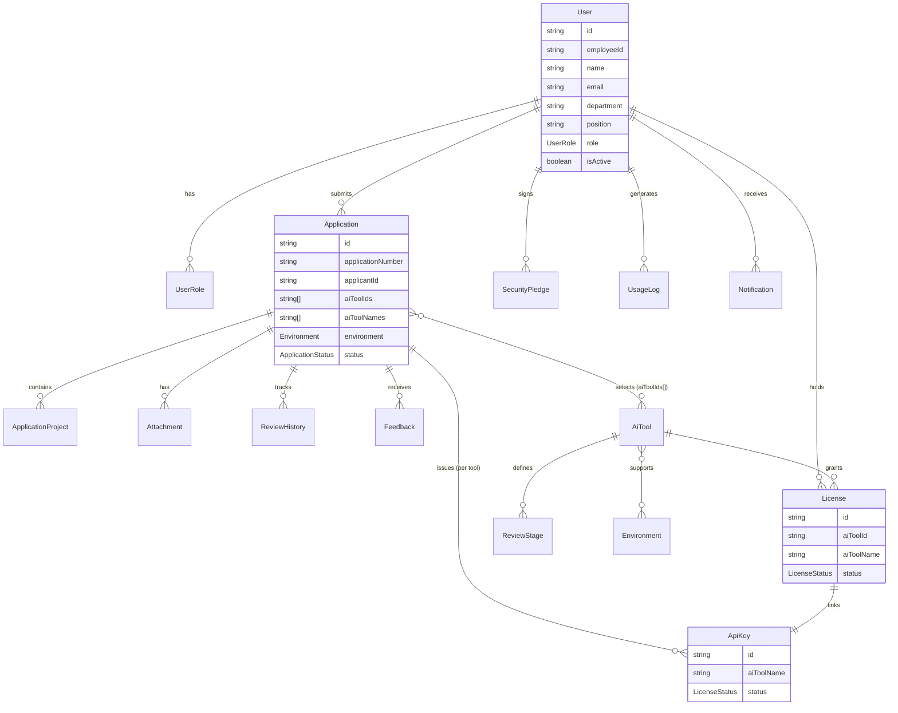
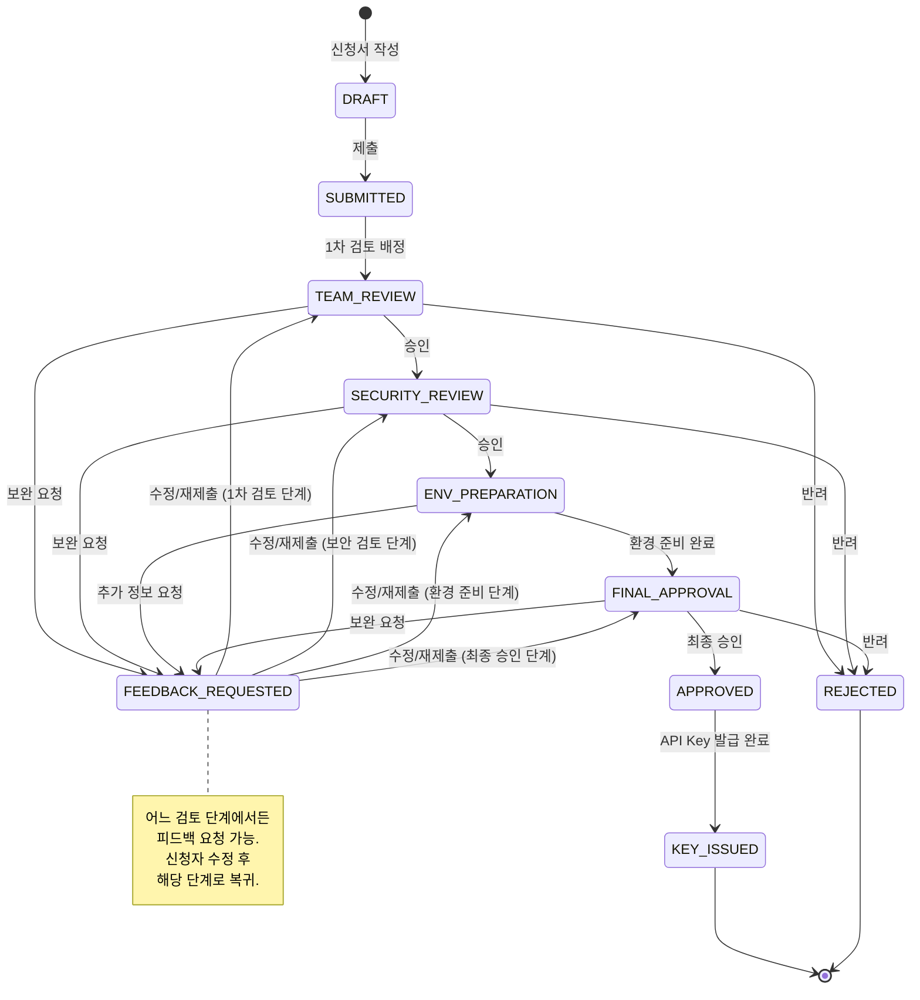
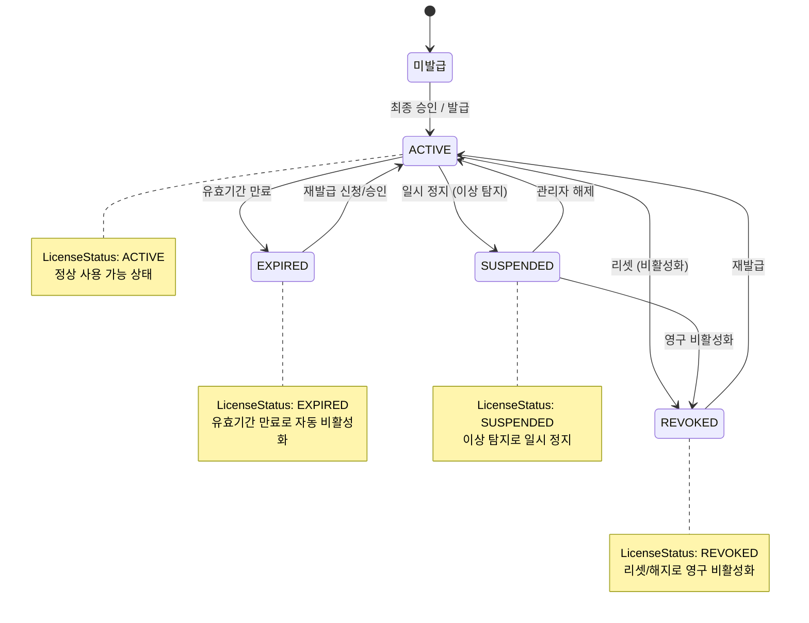

# 요구사항 정의서

## 외부 AI 코딩 도구 도입 신청 관리 시스템 (CodeHub)

| 항목 | 내용 |
|------|------|
| **문서 ID** | RD-CODEHUB-2026-001 |
| **버전** | 1.1 |
| **작성일** | 2026-02-11 |
| **문서 상태** | 업데이트 (Updated) |
| **기밀 등급** | 사내 한정 (Internal) |

---

## 목차

1. [개요](#1-개요)
2. [기능 요구사항](#2-기능-요구사항)
   - 2.1 [사용자 관리](#21-사용자-관리)
   - 2.2 [도구 신청 프로세스](#22-도구-신청-프로세스)
   - 2.3 [검토 워크플로우](#23-검토-워크플로우)
   - 2.4 [API Key 및 라이센스 관리](#24-api-key-및-라이센스-관리)
   - 2.5 [모니터링 및 관리 대시보드](#25-모니터링-및-관리-대시보드)
   - 2.6 [알림 시스템](#26-알림-시스템)
3. [비기능 요구사항](#3-비기능-요구사항)
4. [데이터 요구사항](#4-데이터-요구사항)
5. [인터페이스 요구사항](#5-인터페이스-요구사항)
6. [요구사항 추적 매트릭스](#6-요구사항-추적-매트릭스)

---

## 1. 개요

### 1.1 문서 목적

본 문서는 사내 외부 AI 코딩 도구 도입 신청 관리 시스템(이하 "CodeHub")의 기능 및 비기능 요구사항을 정의한다. 시스템 설계, 개발, 테스트, 검수의 기준 문서로 활용되며, 모든 이해관계자가 시스템의 범위와 기대 동작에 대해 공통된 이해를 갖도록 하는 것을 목적으로 한다.

### 1.2 시스템 범위

CodeHub는 다음 범위의 기능을 포함한다.

- 외부 AI 코딩 도구(Claude Code, Antigravity 등)의 사용 신청 접수 및 처리
- 다단계 검토 워크플로우를 통한 승인 프로세스 관리
- API Key 및 라이센스의 발급/리셋/재발급/갱신/해지 관리
- 사용 현황 모니터링 및 비용 관리 대시보드 제공
- 알림 시스템을 통한 프로세스 진행 상태 공유

### 1.3 용어 정의

| 용어 | 설명 |
|------|------|
| **AI 코딩 도구** | 소프트웨어 개발 생산성 향상을 위해 도입하는 외부 AI 기반 코딩 보조 도구 (Claude Code, Antigravity 등) |
| **신청자** | AI 코딩 도구 사용을 신청하는 임직원 |
| **검토자** | 신청 건을 검토하고 승인/반려하는 담당자 (1차 검토자 `TEAM_LEAD`, 보안 검토자 `SECURITY_REVIEWER`, 환경 담당자 `IT_ADMIN`, 최종 승인자 `SYSTEM_ADMIN`) |
| **관리자** | 시스템 전체를 관리하는 운영 담당자 (`SYSTEM_ADMIN`) |
| **VDI** | Virtual Desktop Infrastructure, 가상 데스크톱 인프라 |
| **API Key** | AI 코딩 도구 사용을 위한 인증 키 |
| **SLA** | Service Level Agreement, 서비스 수준 협약 (검토 단계별 처리 기한) |
| **RBAC** | Role-Based Access Control, 역할 기반 접근 제어 |
| **SSO** | Single Sign-On, 통합 인증 |
| **쿼터(Quota)** | 사용량 한도 (API 호출 수, 토큰 사용량 등) |

### 1.4 요구사항 우선순위 정의

| 우선순위 | 설명 |
|----------|------|
| **필수 (Must)** | 시스템 운영에 반드시 필요한 핵심 요구사항. 1차 릴리스에 포함 |
| **권장 (Should)** | 업무 효율 향상에 중요한 요구사항. 1차 릴리스 목표이나, 일정에 따라 2차로 이관 가능 |
| **선택 (Could)** | 사용자 편의성 향상 요구사항. 2차 이후 릴리스에 포함 가능 |
| **향후 (Won't)** | 현 프로젝트 범위에서 제외하나, 향후 고려 대상 |

---

## 2. 기능 요구사항

### 2.1 사용자 관리

#### 2.1.1 인증 및 로그인

| ID | 요구사항 | 상세 설명 | 우선순위 |
|----|----------|-----------|----------|
| **FR-001** | SSO 연동 로그인 | 사내 SSO(Single Sign-On) 시스템과 연동하여 별도 회원가입 없이 사내 계정으로 로그인할 수 있어야 한다. SAML 2.0 또는 OAuth 2.0/OIDC 프로토콜을 지원한다. | 필수 |
| **FR-002** | 자동 사용자 프로비저닝 | SSO 인증 시 사내 HR 시스템 정보를 기반으로 사용자 계정이 자동 생성되어야 한다. 사번, 이름, 부서, 직급, 이메일, 연락처 등 기본 인적정보가 자동으로 매핑된다. | 필수 |
| **FR-003** | 세션 관리 | 로그인 세션은 보안 정책에 따라 관리되어야 한다. 세션 유효시간 설정(기본 8시간), 비활동 시 자동 로그아웃(기본 30분), 동시 접속 제한 정책을 지원한다. | 필수 |
| **FR-004** | 로그인 이력 관리 | 사용자별 로그인 일시, 접속 IP, 접속 브라우저 등 로그인 이력을 기록하고 조회할 수 있어야 한다. | 권장 |

#### 2.1.2 역할 기반 접근 제어 (RBAC)

| ID | 요구사항 | 상세 설명 | 우선순위 |
|----|----------|-----------|----------|
| **FR-005** | 역할 정의 및 관리 | 시스템은 다음 역할을 기본 제공하고, 관리자가 추가 역할을 정의할 수 있어야 한다. 기본 역할(`UserRole`): `APPLICANT`(신청자), `TEAM_LEAD`(1차 검토자/팀장), `SECURITY_REVIEWER`(보안 검토자), `IT_ADMIN`(IT 인프라 관리자 — 물리 개발환경 VDI/Notebook 관리, ENV_PREPARATION 단계 검토), `SYSTEM_ADMIN`(시스템 관리자 — 전체 신청 프로세스 현황 관리, FINAL_APPROVAL 최종 컨펌 및 라이센스/API Key 발급, 모니터링·비용·도구·사용자·시스템 설정 전체 관리). | 필수 |
| **FR-006** | 역할별 메뉴/기능 접근 제어 | 각 역할별로 접근 가능한 메뉴, 화면, 기능(조회/생성/수정/삭제)을 세분화하여 제어할 수 있어야 한다. 권한 매트릭스 기반으로 관리한다. | 필수 |
| **FR-007** | 다중 역할 부여 | 한 사용자에게 복수의 역할을 부여할 수 있어야 한다. 예: 한 사용자가 신청자이면서 동시에 특정 부서의 1차 검토자일 수 있다. | 필수 |
| **FR-008** | 역할 위임 | 검토자가 부재 시 다른 사용자에게 검토 권한을 일시적으로 위임할 수 있어야 한다. 위임 기간, 위임 대상, 위임 범위를 설정할 수 있다. | 권장 |
| **FR-009** | 조직도 기반 권한 자동 매핑 | HR 시스템의 조직도 정보를 기반으로 1차 검토자(팀장)가 자동으로 매핑되어야 한다. 조직 변경 시 자동 반영된다. | 권장 |

#### 2.1.3 사용자 프로필 관리

| ID | 요구사항 | 상세 설명 | 우선순위 |
|----|----------|-----------|----------|
| **FR-010** | 프로필 조회 | 사용자는 자신의 프로필 정보(인적정보, 소속, 역할, 신청 이력 등)를 조회할 수 있어야 한다. | 필수 |
| **FR-011** | 프로필 수정 | 사용자는 연락처, 알림 설정 등 수정 가능 항목을 변경할 수 있어야 한다. 사번, 이름, 부서 등 HR 연동 항목은 직접 수정이 불가하며 HR 시스템과 동기화된다. | 필수 |
| **FR-012** | 알림 설정 관리 | 사용자는 알림 수신 채널(이메일, 메신저), 알림 유형별 수신 여부를 개별적으로 설정할 수 있어야 한다. | 권장 |
| **FR-013** | 나의 활동 내역 조회 | 사용자는 자신의 신청 내역, 보유 라이센스, API Key 현황, 사용 통계를 한 화면에서 확인할 수 있어야 한다. (마이페이지) | 필수 |

---

### 2.2 도구 신청 프로세스

#### 2.2.1 AI 도구 선택

| ID | 요구사항 | 상세 설명 | 우선순위 |
|----|----------|-----------|----------|
| **FR-014** | AI 도구 목록 조회 | 신청 가능한 AI 코딩 도구 목록을 카드형/리스트형으로 조회할 수 있어야 한다. 각 도구별 설명, 특징, 사용 가이드 링크, 신청 가능 여부를 표시한다. | 필수 |
| **FR-015** | AI 도구 선택 (복수 선택) | 신청자는 사용하고자 하는 AI 도구를 하나 이상 선택할 수 있어야 한다. 하나의 신청서에서 복수의 AI 도구를 동시에 선택할 수 있으며(`aiToolIds: string[]`, `aiToolNames: string[]`), 선택된 도구별로 독립적인 라이센스 및 API Key가 발급된다. | 필수 |
| **FR-016** | AI 도구 관리 (관리자) | 관리자는 AI 도구를 등록/수정/비활성화할 수 있어야 한다. 도구명, 설명, 제공 업체, 요금 체계, 사용 가능 환경, 신청 필수 서류, 보안 등급 등의 정보를 관리한다. 새로운 AI 도구 추가 시 코드 변경 없이 관리 화면에서 설정만으로 가능해야 한다. | 필수 |
| **FR-017** | 도구별 안내 페이지 | 각 AI 도구별 상세 안내 페이지를 제공한다. 도구 소개, 주요 기능, 사용 사례, 보안 유의사항, FAQ, 사용 가이드 문서를 포함한다. | 권장 |

#### 2.2.2 사용 환경 선택

| ID | 요구사항 | 상세 설명 | 우선순위 |
|----|----------|-----------|----------|
| **FR-018** | 사용 환경 선택 | 신청자는 AI 도구를 사용할 환경을 선택할 수 있어야 한다. 선택 가능 환경(`Environment` 타입): `VDI`, `NOTEBOOK`, `OTHER`. 각 환경 유형에 대한 설명과 제약사항을 안내한다. | 필수 |
| **FR-019** | 복수 환경 선택 | 신청자는 하나의 신청서에서 복수의 사용 환경을 선택할 수 있어야 한다. 환경별 추가 정보(VDI ID, 노트북 자산번호 등)를 입력할 수 있다. | 필수 |
| **FR-020** | 도구별 환경 호환성 표시 | 선택한 AI 도구와 호환되는 사용 환경만 선택 가능하도록 필터링하거나, 비호환 환경 선택 시 경고 메시지를 표시한다. | 권장 |
| **FR-021** | 환경 유형 관리 (관리자) | 관리자는 사용 환경 유형을 추가/수정/삭제할 수 있어야 한다. 환경별 필수 입력 항목, 도구 호환성 매핑을 설정할 수 있다. | 필수 |

#### 2.2.3 인적정보 입력

| ID | 요구사항 | 상세 설명 | 우선순위 |
|----|----------|-----------|----------|
| **FR-022** | 인적정보 자동 입력 | 로그인한 사용자의 인적정보(사번, 이름, 부서, 직급, 이메일, 연락처)가 HR 시스템 연동 데이터를 기반으로 자동 입력되어야 한다. | 필수 |
| **FR-023** | 인적정보 추가 입력 | 자동 입력 항목 외에 추가 인적정보를 입력할 수 있어야 한다. 내선번호, 근무 위치(사업장/층/좌석), 비상 연락처 등. | 권장 |
| **FR-024** | 대리 신청 | 관리자 또는 위임받은 사용자가 다른 임직원을 대신하여 신청서를 작성할 수 있어야 한다. 대리 신청 시 실제 사용자 정보와 대리 신청자 정보가 모두 기록된다. | 선택 |

#### 2.2.4 다중 프로젝트 정보 입력

| ID | 요구사항 | 상세 설명 | 우선순위 |
|----|----------|-----------|----------|
| **FR-025** | 프로젝트 정보 입력 | 신청자는 AI 도구를 사용할 프로젝트 정보를 입력할 수 있어야 한다. 필수 항목: 프로젝트명, 프로젝트 코드, 프로젝트 기간(시작일/종료일), 프로젝트 설명. 선택 항목: 신청자의 프로젝트 내 역할, 프로젝트 관리자(PM), 고객사/발주처 정보. | 필수 |
| **FR-026** | 다중 프로젝트 등록 | 하나의 신청서에 복수의 프로젝트를 등록할 수 있어야 한다. 프로젝트별 AI 도구 사용 목적과 예상 사용량을 각각 기재한다. 프로젝트 추가/삭제가 동적으로 가능해야 한다. | 필수 |
| **FR-027** | 프로젝트 코드 연동 | 사내 프로젝트 관리 시스템(PMS)과 연동하여 프로젝트 코드 입력 시 프로젝트명, 기간, PM 정보가 자동으로 조회/입력될 수 있어야 한다. | 권장 |
| **FR-028** | 프로젝트 정보 검증 | 입력된 프로젝트 코드가 유효한지, 프로젝트 기간이 현재 유효한지 실시간 검증하고 결과를 표시한다. | 권장 |

#### 2.2.5 문서 첨부

첨부파일은 두 가지 레벨로 구분된다:
- **프로젝트별 첨부파일**: 각 프로젝트 정보 입력 시 해당 프로젝트와 직접 관련된 문서를 첨부 (Step 4에서 프로젝트 카드 내 업로드)
- **추가 첨부파일**: 특정 프로젝트에 연결되지 않는 공통/추가 문서를 첨부 (Step 5에서 별도 업로드)

| ID | 요구사항 | 상세 설명 | 우선순위 |
|----|----------|-----------|----------|
| **FR-029** | 파일 업로드 | 신청서에 관련 문서를 첨부할 수 있어야 한다. 첨부는 프로젝트별 첨부파일과 추가 첨부파일 두 가지 레벨로 제공된다. 지원 형식: PDF, DOC/DOCX, XLS/XLSX, PPT/PPTX, HWP, PNG/JPG, ZIP. 파일 용량 제한: 단일 파일 최대 50MB, 전체 첨부 최대 200MB. | 필수 |
| **FR-030** | 다중 파일 업로드 | 한 번에 여러 파일을 선택하여 업로드하거나, 드래그 앤 드롭으로 첨부할 수 있어야 한다. 프로젝트별 첨부와 추가 첨부 모두 동일하게 지원한다. | 필수 |
| **FR-031** | 첨부 문서 유형 분류 | 첨부 파일의 문서 유형을 선택할 수 있어야 한다. 분류: 프로젝트 제안서, 보안 검토서, 사용 계획서, 기타. 도구별/환경별로 필수 첨부 문서 유형을 관리자가 설정할 수 있다. | 필수 |
| **FR-032** | 필수 문서 검증 | 제출 시 필수 문서가 모두 첨부되었는지 검증하고, 미첨부 시 안내 메시지를 표시한다. 프로젝트별 첨부파일과 추가 첨부파일을 각각 검증한다. | 필수 |
| **FR-033** | 첨부 파일 미리보기 | 첨부된 파일을 별도 다운로드 없이 웹 뷰어에서 미리보기할 수 있어야 한다. (PDF, 이미지 파일 우선 지원) | 선택 |

#### 2.2.6 보안 서약

| ID | 요구사항 | 상세 설명 | 우선순위 |
|----|----------|-----------|----------|
| **FR-034** | 보안 서약서 표시 | 신청서 제출 전에 AI 코딩 도구 사용에 대한 보안 서약서 전문을 표시하고, 신청자가 내용을 충분히 확인할 수 있도록 스크롤 완료 후 동의 버튼이 활성화되어야 한다. | 필수 |
| **FR-035** | 전자 서약 동의 | 신청자는 보안 서약 내용에 대해 전자적으로 동의(체크박스 + 전자서명)할 수 있어야 한다. 동의 일시, 동의자 정보, IP 주소가 기록된다. | 필수 |
| **FR-036** | 보안 서약서 버전 관리 | 관리자는 보안 서약서 내용을 버전별로 관리할 수 있어야 한다. 서약서 변경 시 기존 동의자에게 재동의를 요청할 수 있다. | 필수 |
| **FR-037** | 서약 이력 관리 | 사용자별 보안 서약 동의 이력(버전, 동의일시, 만료일)을 관리하고 조회할 수 있어야 한다. | 필수 |
| **FR-038** | 주기적 재서약 | 보안 서약의 유효기간(예: 1년)을 설정하고, 만료 전 재서약을 요청하는 알림을 발송할 수 있어야 한다. 미재서약 시 도구 사용을 제한할 수 있다. | 권장 |

#### 2.2.7 신청서 임시저장 및 관리

| ID | 요구사항 | 상세 설명 | 우선순위 |
|----|----------|-----------|----------|
| **FR-039** | 신청서 임시저장 | 신청서 작성 중 언제든지 임시저장할 수 있어야 한다. 임시저장 시 필수 항목 검증은 수행하지 않는다. 자동 임시저장 기능을 지원한다(설정 가능한 주기, 기본 5분). | 필수 |
| **FR-040** | 임시저장 목록 조회 | 신청자는 자신의 임시저장된 신청서 목록을 조회하고, 선택하여 이어서 작성할 수 있어야 한다. | 필수 |
| **FR-041** | 신청서 제출 | 모든 필수 항목 입력 및 필수 문서 첨부, 보안 서약 동의가 완료된 신청서를 제출할 수 있어야 한다. 제출 전 최종 확인 화면을 표시하고, 제출 후 취소가 불가함을 안내한다. | 필수 |
| **FR-042** | 신청서 수정 | 제출 전(임시저장 상태) 신청서는 자유롭게 수정할 수 있다. 제출 후에는 검토자의 피드백에 의한 수정만 가능하며, 수정 이력이 기록된다. | 필수 |
| **FR-043** | 신청서 취소 | 검토 진행 전(검토 대기 상태) 신청서는 신청자가 취소할 수 있어야 한다. 검토가 시작된 건은 관리자만 취소할 수 있다. 취소 사유를 기록한다. | 필수 |
| **FR-044** | 신청서 복사 | 기존 신청서(승인 완료/반려 포함)를 복사하여 새 신청서를 작성할 수 있어야 한다. 인적정보와 프로젝트 정보가 복사되어 수정 후 재제출이 용이하다. | 권장 |

---

### 2.3 검토 워크플로우

#### 2.3.1 검토 단계 정의

| ID | 요구사항 | 상세 설명 | 우선순위 |
|----|----------|-----------|----------|
| **FR-045** | 다단계 검토 프로세스 | 신청서는 다음 순서의 검토 단계를 거쳐야 한다. (1) `SUBMITTED`(제출 완료) → (2) `TEAM_REVIEW`(1차 검토, 팀장/부서장) → (3) `SECURITY_REVIEW`(보안 검토, 정보보안팀) → (4) `ENV_PREPARATION`(환경 준비, 인프라팀) → (5) `FINAL_APPROVAL`(최종 승인) → (6) `APPROVED`(승인 완료) → (7) `KEY_ISSUED`(발급 완료). 각 단계는 순차적으로 진행되며, 이전 단계가 완료되어야 다음 단계로 넘어간다. | 필수 |
| **FR-046** | 검토 단계 커스터마이징 | 관리자는 AI 도구별, 환경별로 검토 단계를 추가/삭제/순서 변경할 수 있어야 한다. 특정 도구는 보안 검토를 건너뛸 수 있도록 설정 가능하다. | 권장 |
| **FR-047** | 단계별 검토자 지정 | 각 검토 단계별로 담당 검토자 또는 검토자 그룹을 지정할 수 있어야 한다. 1차 검토(`TEAM_REVIEW`): 신청자의 직속 상위 조직장(`TEAM_LEAD`, 자동 매핑). 보안 검토(`SECURITY_REVIEW`): 정보보안팀 검토자 풀에서 자동 또는 수동 배정(`SECURITY_REVIEWER`). 환경 준비(`ENV_PREPARATION`): IT 인프라 담당자(`IT_ADMIN`) 자동 배정. 최종 승인(`FINAL_APPROVAL`): 시스템 관리자(`SYSTEM_ADMIN`)가 최종 컨펌 및 라이센스/API Key 발급 실행. | 필수 |
| **FR-048** | 검토 상태 관리 | 신청서의 현재 검토 상태를 명확히 표시해야 한다. `ApplicationStatus` 상태값: `DRAFT`(임시저장), `SUBMITTED`(제출완료), `TEAM_REVIEW`(1차 검토중), `SECURITY_REVIEW`(보안 검토중), `ENV_PREPARATION`(환경 준비중), `FINAL_APPROVAL`(최종 승인 대기), `APPROVED`(승인 완료), `KEY_ISSUED`(발급 완료), `REJECTED`(반려), `FEEDBACK_REQUESTED`(보완 요청). | 필수 |

#### 2.3.2 검토 처리

| ID | 요구사항 | 상세 설명 | 우선순위 |
|----|----------|-----------|----------|
| **FR-049** | 검토 대시보드 | 검토자는 자신에게 배정된 검토 대기/진행 중인 신청 건을 한눈에 확인할 수 있는 대시보드를 사용할 수 있어야 한다. 긴급도, 접수일, SLA 잔여시간 기준 정렬을 지원한다. | 필수 |
| **FR-050** | 검토 승인 | 검토자는 신청서 내용을 확인한 후 해당 단계를 승인할 수 있어야 한다. 승인 시 검토 의견을 작성할 수 있다. 승인 즉시 다음 단계로 자동 전환된다. | 필수 |
| **FR-051** | 검토 반려 | 검토자는 신청서를 반려할 수 있어야 한다. 반려 시 반려 사유(필수)를 작성해야 하며, 반려 시점의 검토 단계가 기록된다. 반려된 신청서는 신청자에게 즉시 알림이 발송된다. | 필수 |
| **FR-052** | 보완 요청 (피드백) | 검토자는 신청서에 대해 보완(수정) 요청을 할 수 있어야 한다. 보완 요청 시 구체적인 보완 사항(필수)을 기술하고, 신청서의 특정 항목을 지정하여 피드백할 수 있다. 보완 요청 건은 신청자에게 즉시 알림이 발송된다. | 필수 |
| **FR-053** | 피드백 기반 수정/재제출 | 보완 요청을 받은 신청자는 피드백 내용을 확인하고, 지적된 항목을 수정하여 재제출할 수 있어야 한다. 수정 사항에 대한 변경 내역이 자동 추적되며, 재제출 시 피드백을 준 검토 단계로 자동 복귀한다. | 필수 |
| **FR-054** | 검토 의견 스레드 | 검토자와 신청자 간 특정 항목에 대해 대화형 의견 교환(스레드)이 가능해야 한다. 이전 피드백과 응답 내역을 시간순으로 조회할 수 있다. | 권장 |
| **FR-055** | 일괄 검토 처리 | 검토자는 복수의 신청 건을 선택하여 일괄 승인할 수 있어야 한다. 일괄 처리 시에도 개별 검토 의견 작성이 가능하다. | 선택 |

#### 2.3.3 SLA 및 이력 관리

| ID | 요구사항 | 상세 설명 | 우선순위 |
|----|----------|-----------|----------|
| **FR-056** | 단계별 SLA 설정 | 관리자는 각 검토 단계별 처리 기한(SLA)을 설정할 수 있어야 한다. 기본값: 1차 검토 2영업일, 보안 검토 3영업일, 환경 준비 5영업일, 최종 승인 1영업일. 영업일/역일(Calendar day) 기준을 선택할 수 있다. | 필수 |
| **FR-057** | SLA 초과 알림 | SLA 잔여시간이 임계치(예: 50%, 80%, 100%)에 도달하면 해당 검토자와 관리자에게 알림을 발송한다. SLA 초과 건은 대시보드에서 강조 표시된다. | 필수 |
| **FR-058** | SLA 자동 에스컬레이션 | SLA 초과 시 자동으로 상위 검토자 또는 관리자에게 에스컬레이션할 수 있어야 한다. 에스컬레이션 조건(초과 시간, 대상)을 관리자가 설정할 수 있다. | 권장 |
| **FR-059** | 검토 이력 관리 | 신청서별 전체 검토 이력(단계 변경, 검토 의견, 피드백, 수정 내역, 처리 일시, 처리자)을 시간순으로 기록하고 조회할 수 있어야 한다. 이력은 감사(Audit) 목적으로 수정/삭제가 불가해야 한다. | 필수 |
| **FR-060** | 검토 통계 | 검토 단계별 평균 처리 시간, SLA 준수율, 반려율, 보완 요청 비율 등의 통계를 조회할 수 있어야 한다. | 권장 |

---

### 2.4 API Key 및 라이센스 관리

#### 2.4.1 API Key 발급

| ID | 요구사항 | 상세 설명 | 우선순위 |
|----|----------|-----------|----------|
| **FR-061** | API Key 자동 발급 | 최종 승인이 완료되면 해당 AI 도구의 API Key가 자동으로 발급되어야 한다. 발급된 API Key는 신청자에게 안전한 채널(암호화된 이메일 또는 시스템 내 보안 영역)을 통해 전달된다. | 필수 |
| **FR-062** | API Key 수동 발급 | 관리자는 승인 프로세스와 별도로 API Key를 수동 발급할 수 있어야 한다. 수동 발급 시에도 사유, 대상자, 도구, 환경 정보를 기록한다. | 필수 |
| **FR-063** | API Key 보안 표시 | 발급된 API Key는 마스킹 처리하여 표시(예: sk-****...****abcd)하고, 전체 키 확인은 추가 인증(비밀번호 재입력) 후 1회성으로만 가능하도록 한다. | 필수 |
| **FR-064** | API Key 복사 기능 | 사용자는 자신의 API Key를 클립보드에 안전하게 복사할 수 있어야 한다. 복사 시 일정 시간 후 클립보드가 자동 초기화됨을 안내한다. | 필수 |

#### 2.4.2 API Key 리셋 및 재발급

| ID | 요구사항 | 상세 설명 | 우선순위 |
|----|----------|-----------|----------|
| **FR-065** | API Key 리셋 | 사용자는 보안 사고 또는 키 유출 의심 시 API Key를 즉시 리셋(비활성화)할 수 있어야 한다. 리셋 시 기존 키는 즉시 무효화되며, 리셋 사유를 기록한다. | 필수 |
| **FR-066** | API Key 재발급 | 리셋된 API Key에 대해 재발급을 신청할 수 있어야 한다. 재발급 시 간소화된 검토 프로세스(관리자 승인만)를 거칠 수 있다. 재발급된 키는 새로운 키값으로 생성된다. | 필수 |
| **FR-067** | 긴급 키 비활성화 | 관리자는 보안 사고 발생 시 특정 사용자 또는 전체 사용자의 API Key를 긴급 비활성화할 수 있어야 한다. 긴급 비활성화 이력이 기록되고, 영향받는 사용자에게 즉시 알림이 발송된다. | 필수 |

#### 2.4.3 라이센스 유효기간 및 쿼터 관리

| ID | 요구사항 | 상세 설명 | 우선순위 |
|----|----------|-----------|----------|
| **FR-068** | 라이센스 유효기간 설정 | 라이센스별 유효기간을 설정할 수 있어야 한다. 기본 유효기간: 신청 시 지정한 프로젝트 기간 또는 관리자 설정 기간. 최대 유효기간 제한을 설정할 수 있다(예: 최대 1년). | 필수 |
| **FR-069** | 유효기간 만료 관리 | 유효기간 만료 예정 라이센스에 대해 사전 알림(30일/14일/7일/1일 전)을 발송하고, 만료 시 API Key를 자동 비활성화한다. | 필수 |
| **FR-070** | 사용량 쿼터 설정 | 관리자는 사용자별/도구별/프로젝트별 사용량 쿼터를 설정할 수 있어야 한다. 쿼터 항목: 월별 API 호출 수, 월별 토큰 사용량, 월별 비용 한도. 쿼터 초과 시 동작(경고/제한/차단)을 설정할 수 있다. | 필수 |
| **FR-071** | 쿼터 사용량 조회 | 사용자는 자신의 쿼터 사용 현황(잔여량, 사용률)을 실시간으로 조회할 수 있어야 한다. 관리자는 전체 사용자의 쿼터 사용 현황을 조회할 수 있다. | 필수 |

#### 2.4.4 라이센스 갱신 및 해지

| ID | 요구사항 | 상세 설명 | 우선순위 |
|----|----------|-----------|----------|
| **FR-072** | 라이센스 갱신 신청 | 유효기간 만료 전 사용자는 라이센스 갱신을 신청할 수 있어야 한다. 갱신 시 간소화된 검토 프로세스를 거친다. 갱신 신청 시 프로젝트 지속 여부, 연장 기간, 사용 실적을 확인한다. | 필수 |
| **FR-073** | 라이센스 자동 갱신 | 관리자 설정에 따라 특정 조건(사용 실적 충족, 프로젝트 지속 등)을 만족하는 라이센스를 자동 갱신할 수 있어야 한다. | 선택 |
| **FR-074** | 라이센스 해지 | 사용자 또는 관리자가 라이센스를 해지할 수 있어야 한다. 해지 시 API Key 즉시 비활성화, 해지 사유 기록, 잔여 기간 정보 보관. 해지 후 일정 기간(유예기간) 내 재활성화가 가능하다. | 필수 |
| **FR-075** | 퇴직/전출자 자동 해지 | HR 시스템 연동을 통해 퇴직/전출자의 라이센스를 자동으로 해지하고 API Key를 비활성화해야 한다. | 필수 |

---

### 2.5 모니터링 및 관리 대시보드

#### 2.5.1 라이센스 발급 현황

| ID | 요구사항 | 상세 설명 | 우선순위 |
|----|----------|-----------|----------|
| **FR-076** | 전체 발급 현황 대시보드 | 관리자는 전체 라이센스 발급 현황을 대시보드에서 확인할 수 있어야 한다. 표시 항목: 총 발급 수, 활성 라이센스 수, 비활성 라이센스 수, 만료 예정 수. 도구별, 부서별, 환경별 분류 보기를 지원한다. | 필수 |
| **FR-077** | 발급 현황 시각화 | 라이센스 발급 현황을 차트(파이차트, 바차트, 라인차트)로 시각화하여 표시한다. 기간별(일/주/월/분기) 발급 추이, 도구별 점유율, 부서별 분포를 시각적으로 확인할 수 있다. | 필수 |
| **FR-078** | 발급 현황 필터링/검색 | 도구, 부서, 환경, 상태, 기간 등 다양한 조건으로 필터링하고 검색할 수 있어야 한다. 검색 결과를 Excel/CSV로 다운로드할 수 있다. | 필수 |

#### 2.5.2 사용 현황 모니터링

| ID | 요구사항 | 상세 설명 | 우선순위 |
|----|----------|-----------|----------|
| **FR-079** | 실시간 사용 현황 | AI 도구의 실시간 사용 현황을 모니터링할 수 있어야 한다. 표시 항목: 현재 활성 사용자 수, 실시간 API 호출 수, 실시간 토큰 사용량. 갱신 주기는 설정 가능하다(기본 5분). | 필수 |
| **FR-080** | 사용자별 사용 현황 | 개별 사용자의 상세 사용 현황을 조회할 수 있어야 한다. API 호출 이력, 토큰 사용량, 사용 패턴(시간대별, 요일별), 주요 사용 기능 등. | 필수 |
| **FR-081** | 도구별 사용 현황 | AI 도구별 전체 사용 현황을 집계하여 표시한다. 도구별 총 호출 수, 총 토큰 사용량, 평균 응답시간, 오류율 등. | 필수 |
| **FR-082** | 미사용 라이센스 감지 | 일정 기간(관리자 설정, 기본 30일) 이상 사용 이력이 없는 라이센스를 자동 감지하고 목록화하여 표시한다. 미사용 라이센스에 대해 사용 독려 알림 또는 자동 해지 정책을 적용할 수 있다. | 권장 |

#### 2.5.3 비용 관리

| ID | 요구사항 | 상세 설명 | 우선순위 |
|----|----------|-----------|----------|
| **FR-083** | 비용 추적 | AI 도구별 사용 비용을 추적하고 집계할 수 있어야 한다. 비용 산출 기준: API 호출 수 기반, 토큰 사용량 기반(도구별 과금 모델에 따라). 사용자별/부서별/프로젝트별/도구별 비용을 분리하여 관리한다. | 필수 |
| **FR-084** | 비용 예산 관리 | 부서별/프로젝트별/전체 비용 예산을 설정하고 집행 현황을 추적할 수 있어야 한다. 예산 소진율이 임계치(50%/80%/90%/100%)에 도달하면 알림을 발송한다. | 필수 |
| **FR-085** | 비용 리포트 생성 | 기간별(월별/분기별/연별) 비용 리포트를 자동 생성할 수 있어야 한다. 리포트 항목: 총 비용, 도구별 비용, 부서별 비용, 전월 대비 증감, 예산 대비 집행률. PDF/Excel 형식으로 다운로드 가능하다. | 필수 |

#### 2.5.4 이상 탐지

| ID | 요구사항 | 상세 설명 | 우선순위 |
|----|----------|-----------|----------|
| **FR-086** | 이상 사용 탐지 규칙 설정 | 관리자는 이상 사용 탐지 규칙을 설정할 수 있어야 한다. 탐지 규칙 예시: 비정상 시간대 대량 호출, 평소 사용량 대비 급격한 증가(N배 초과), 비인가 IP에서의 접근 시도, 단시간 내 다수 API Key 리셋 요청. | 필수 |
| **FR-087** | 이상 탐지 알림 | 이상 사용이 탐지되면 관리자에게 즉시 알림을 발송하고, 대시보드에 경고를 표시한다. 이상 탐지 이벤트를 로그로 기록한다. | 필수 |
| **FR-088** | 자동 차단 정책 | 심각한 이상 사용(예: 키 유출 의심) 탐지 시 해당 API Key를 자동으로 일시 정지하고, 관리자 확인 후 재활성화하는 정책을 설정할 수 있어야 한다. | 권장 |

#### 2.5.5 통계 리포트

| ID | 요구사항 | 상세 설명 | 우선순위 |
|----|----------|-----------|----------|
| **FR-089** | 정기 통계 리포트 | 일별/주별/월별/분기별 통계 리포트를 자동 생성할 수 있어야 한다. 리포트 항목: 신규 신청 건수, 승인/반려 현황, 평균 처리 시간, 활성 라이센스 수, 총 사용량, 총 비용, 도구별/부서별 비교. | 필수 |
| **FR-090** | 맞춤형 리포트 | 관리자가 리포트 항목, 기간, 분류 기준을 선택하여 맞춤형 리포트를 생성할 수 있어야 한다. 생성된 리포트 템플릿을 저장하고 재사용할 수 있다. | 권장 |
| **FR-091** | 리포트 자동 발송 | 정기 리포트를 설정된 수신자(경영진, 부서장 등)에게 이메일로 자동 발송할 수 있어야 한다. 발송 주기, 수신자 목록, 리포트 형식을 설정할 수 있다. | 권장 |

---

### 2.6 알림 시스템

#### 2.6.1 알림 채널

| ID | 요구사항 | 상세 설명 | 우선순위 |
|----|----------|-----------|----------|
| **FR-092** | 이메일 알림 | 시스템 이벤트에 대해 이메일 알림을 발송할 수 있어야 한다. 사내 메일 시스템(SMTP 또는 Exchange)과 연동한다. HTML 형식의 알림 템플릿을 지원하며, 관리자가 템플릿을 수정할 수 있다. | 필수 |
| **FR-093** | 사내 메신저 알림 | 사내 메신저(Slack, Microsoft Teams, 카카오워크 등)와 연동하여 알림을 발송할 수 있어야 한다. Webhook 또는 Bot API를 통해 연동한다. | 필수 |
| **FR-094** | 시스템 내 알림 | 웹 애플리케이션 내에서 알림을 표시할 수 있어야 한다. 알림 벨 아이콘, 알림 목록, 읽음/안읽음 상태 관리, 알림 클릭 시 해당 화면으로 이동. | 필수 |
| **FR-095** | 알림 채널 설정 | 알림 유형별로 발송 채널(이메일/메신저/시스템내)을 설정할 수 있어야 한다. 사용자별 수신 채널 선호도를 설정할 수 있다. | 권장 |

#### 2.6.2 알림 유형

| ID | 요구사항 | 상세 설명 | 우선순위 |
|----|----------|-----------|----------|
| **FR-096** | 검토 단계 변경 알림 | 신청서의 검토 단계가 변경될 때 관련자(신청자, 다음 단계 검토자)에게 알림을 발송한다. 알림 내용: 신청서 번호, 변경된 단계, 처리 결과(승인/반려/보완요청), 다음 처리 기한. | 필수 |
| **FR-097** | 신규 검토 배정 알림 | 검토자에게 새로운 검토 건이 배정되면 알림을 발송한다. 알림 내용: 신청자 정보, 신청 도구, 처리 기한, 바로가기 링크. | 필수 |
| **FR-098** | API Key 만료 사전 알림 | API Key/라이센스 만료 예정 시 사용자에게 사전 알림을 발송한다. 발송 시점: 만료 30일/14일/7일/1일 전(설정 가능). 알림 내용: 만료 예정일, 갱신 방법 안내, 갱신 신청 바로가기. | 필수 |
| **FR-099** | 사용량 임계치 알림 | 사용자의 쿼터 사용량이 임계치(70%/90%/100%)에 도달하면 알림을 발송한다. 알림 내용: 현재 사용량, 잔여 쿼터, 쿼터 증가 신청 안내. | 필수 |
| **FR-100** | SLA 초과 경고 알림 | 검토 처리가 SLA를 초과하거나 초과 임박 시 검토자와 관리자에게 알림을 발송한다. | 필수 |
| **FR-101** | 보안 이벤트 알림 | 이상 사용 탐지, API Key 리셋, 긴급 비활성화 등 보안 관련 이벤트 발생 시 관리자와 해당 사용자에게 알림을 발송한다. | 필수 |
| **FR-102** | 비용 임계치 알림 | 비용 예산 소진율이 임계치에 도달하면 관리자와 해당 부서 담당자에게 알림을 발송한다. | 필수 |
| **FR-103** | 보안 서약 만료 알림 | 보안 서약 유효기간 만료 예정 시 사용자에게 재서약 요청 알림을 발송한다. | 권장 |

---

## 3. 비기능 요구사항

### 3.1 성능

| ID | 요구사항 | 상세 설명 | 우선순위 |
|----|----------|-----------|----------|
| **NFR-001** | 응답 시간 | 일반 페이지 로딩: 평균 2초 이내, 최대 3초 이내. 검색/조회 요청: 평균 3초 이내, 최대 5초 이내. 대시보드 데이터 로딩: 평균 5초 이내, 최대 10초 이내. API 응답 시간: 평균 500ms 이내, 최대 2초 이내. | 필수 |
| **NFR-002** | 동시 접속자 처리 | 최소 500명 동시 접속 처리가 가능해야 한다. 피크 타임(월요일 오전) 1,000명 동시 접속까지 성능 저하 없이 서비스할 수 있어야 한다. | 필수 |
| **NFR-003** | 파일 업로드 성능 | 50MB 단일 파일 업로드 시 30초 이내 완료되어야 한다. 다중 파일 동시 업로드를 지원하며, 업로드 진행률을 표시한다. | 필수 |
| **NFR-004** | 대용량 데이터 처리 | 10만 건 이상의 신청 이력 데이터를 지연 없이 페이징 조회할 수 있어야 한다. 대시보드 통계 집계 시 대용량 데이터 처리가 가능해야 한다. | 권장 |
| **NFR-005** | API 처리량 | 외부 AI 도구 API 중계 시 초당 100건 이상의 동시 요청을 처리할 수 있어야 한다. | 권장 |

### 3.2 보안

| ID | 요구사항 | 상세 설명 | 우선순위 |
|----|----------|-----------|----------|
| **NFR-006** | 통신 암호화 | 모든 통신은 TLS 1.2 이상으로 암호화되어야 한다. 내부 서비스 간 통신도 암호화를 적용한다. | 필수 |
| **NFR-007** | 데이터 암호화 | 민감 데이터(API Key, 개인정보)는 저장 시 AES-256 이상의 암호화를 적용한다. API Key는 단방향 해시 처리하여 저장하고, 원본은 발급 시에만 노출한다. 데이터베이스 컬럼 단위 암호화를 적용한다. | 필수 |
| **NFR-008** | 접근 제어 | RBAC 기반 접근 제어를 적용한다. 모든 API 엔드포인트에 인증 및 인가를 적용한다. OWASP Top 10 취약점에 대한 방어를 구현한다(SQL Injection, XSS, CSRF, 등). | 필수 |
| **NFR-009** | 감사 로그 | 모든 사용자 활동(로그인, 신청, 검토, 발급, 설정 변경 등)에 대한 감사 로그를 기록한다. 로그 항목: 일시, 사용자ID, 사용자IP, 행위, 대상, 변경 전/후 값. 감사 로그는 위변조가 불가능해야 하며, 최소 5년간 보존한다. | 필수 |
| **NFR-010** | 취약점 점검 | 정기적인 보안 취약점 점검 및 모의 해킹 테스트를 수행할 수 있는 환경을 제공한다. 보안 패치 적용을 위한 유지보수 절차를 수립한다. | 필수 |
| **NFR-011** | API Key 보안 | API Key 전송 시 안전한 채널을 사용한다. API Key는 로그, 캐시, URL 파라미터에 노출되지 않아야 한다. API Key 사용 시 Rate Limiting을 적용한다. | 필수 |

### 3.3 가용성

| ID | 요구사항 | 상세 설명 | 우선순위 |
|----|----------|-----------|----------|
| **NFR-012** | 서비스 가용률 | 업무시간(평일 09:00-18:00) 기준 99.9% 이상의 가용률을 보장한다. 연간 계획 다운타임은 8시간 이내로 제한한다. | 필수 |
| **NFR-013** | 장애 복구 | RTO(Recovery Time Objective): 1시간 이내. RPO(Recovery Point Objective): 15분 이내. 자동 장애 감지 및 알림 체계를 구축한다. | 필수 |
| **NFR-014** | 백업 및 복구 | 데이터베이스: 일 1회 전체 백업, 실시간 증분 백업. 첨부 파일: 일 1회 백업. 백업 데이터 보관: 최소 90일. 정기적인 복구 테스트를 수행한다. | 필수 |
| **NFR-015** | 무중단 배포 | 시스템 업데이트/배포 시 서비스 중단 없이 배포할 수 있어야 한다(Blue-Green 또는 Rolling 배포). | 권장 |

### 3.4 확장성

| ID | 요구사항 | 상세 설명 | 우선순위 |
|----|----------|-----------|----------|
| **NFR-016** | AI 도구 확장성 | 새로운 AI 코딩 도구 추가 시 코드 변경 없이 관리 화면의 설정만으로 대응할 수 있어야 한다. 도구별 속성(요금 체계, 인증 방식, API 스펙 등)을 유연하게 정의할 수 있는 메타데이터 구조를 갖춘다. | 필수 |
| **NFR-017** | 검토 프로세스 확장성 | 검토 워크플로우 단계를 관리자가 동적으로 추가/삭제/순서 변경할 수 있어야 한다. 새로운 검토 규칙이나 자동화 조건을 플러그인 방식으로 추가할 수 있다. | 권장 |
| **NFR-018** | 수평 확장 | 사용자 수 및 트래픽 증가에 따라 서버 인스턴스를 수평으로 확장(Scale-Out)할 수 있어야 한다. 세션 관리, 파일 저장 등을 분산 환경에서 지원해야 한다. | 권장 |
| **NFR-019** | 데이터 확장성 | 3년간 운영 데이터(신청 10만 건, 사용 로그 1억 건 이상) 축적 시에도 성능 저하 없이 서비스할 수 있어야 한다. 이력 데이터 아카이빙 정책을 지원한다. | 권장 |

### 3.5 호환성

| ID | 요구사항 | 상세 설명 | 우선순위 |
|----|----------|-----------|----------|
| **NFR-020** | 웹 브라우저 호환성 | 다음 브라우저의 최신 2개 버전을 지원한다: Chrome, Edge, Safari, Firefox. IE(Internet Explorer)는 지원하지 않으며, 접속 시 지원 브라우저 안내 페이지를 표시한다. | 필수 |
| **NFR-021** | 반응형 웹 | 데스크톱(1920x1080 이상), 태블릿(768x1024 이상) 해상도에 최적화된 반응형 레이아웃을 지원한다. 모바일 환경은 주요 기능(신청 현황 조회, 검토 승인/반려)에 대해 지원한다. | 권장 |
| **NFR-022** | 웹 접근성 | WCAG 2.1 AA 수준의 웹 접근성을 준수한다. 키보드 내비게이션, 스크린 리더 지원, 색상 대비 등을 고려한다. | 선택 |
| **NFR-023** | 국제화 기반 | 현재 한국어 UI를 기본으로 하되, 향후 영어 등 다국어 확장이 가능한 국제화(i18n) 기반 구조를 갖춘다. | 선택 |

### 3.6 유지보수성

| ID | 요구사항 | 상세 설명 | 우선순위 |
|----|----------|-----------|----------|
| **NFR-024** | 코드 품질 | 정적 코드 분석 도구(SonarQube 등)를 적용하며, 코드 커버리지 80% 이상을 유지한다. 코딩 컨벤션을 준수하고 자동화된 린트 검사를 수행한다. | 필수 |
| **NFR-025** | API 문서화 | 모든 REST API에 대해 OpenAPI(Swagger) 3.0 기반 API 문서를 자동 생성하고 관리한다. API 변경 이력을 버전별로 관리한다. | 필수 |
| **NFR-026** | 로깅 및 모니터링 | 구조화된 로깅(JSON 형식)을 적용하고, 중앙 집중식 로그 관리 시스템과 연동한다. 애플리케이션 성능 모니터링(APM) 도구를 연동하여 성능 지표를 추적한다. | 필수 |
| **NFR-027** | 설정 외부화 | 환경별(개발/스테이징/운영) 설정을 외부 설정 파일 또는 환경 변수로 관리하며, 코드 변경 없이 설정 변경이 가능해야 한다. | 필수 |
| **NFR-028** | CI/CD 파이프라인 | 자동화된 빌드, 테스트, 배포 파이프라인을 구축한다. 개발/스테이징/운영 환경을 분리하고 각 환경별 배포 절차를 수립한다. | 권장 |

---

## 4. 데이터 요구사항

### 4.1 주요 데이터 엔터티

#### 4.1.1 엔터티 정의

| 엔터티명 | 설명 | 주요 속성 |
|----------|------|-----------|
| **사용자 (User)** | 시스템을 사용하는 임직원 | 사용자ID, 사번, 이름, 부서코드, 직급, 이메일, 연락처, 상태, 역할목록, 생성일시, 수정일시 |
| **역할 (Role)** | 사용자에게 부여되는 접근 권한 단위 | 역할ID, 역할명, 설명, 권한목록, 생성일시 |
| **AI 도구 (AiTool)** | 관리 대상 외부 AI 코딩 도구 | 도구ID, 도구명, 제공업체, 설명, 요금체계, 상태, 보안등급, 지원환경목록, 필수문서유형, 생성일시, 수정일시 |
| **사용 환경 (Environment)** | AI 도구 사용 환경 유형. 코드에서는 `Environment` 타입으로 정의: `VDI`, `NOTEBOOK`, `OTHER` | 환경유형코드(`Environment`), 환경명, 설명, 추가입력항목 |
| **신청서 (Application)** | AI 도구 사용 신청 건 | 신청ID, 신청번호, 신청자ID, 도구ID목록(`aiToolIds: string[]`), 도구명목록(`aiToolNames: string[]`), 사용환경(`environment: Environment`), 사용목적, 상태(`status: ApplicationStatus`), 프로젝트목록, 첨부파일목록, 보안서약, 현재검토단계, 제출일시, 완료일시, 생성일시, 수정일시 |
| **신청 프로젝트 (ApplicationProject)** | 신청서에 연결된 프로젝트 정보 | 프로젝트매핑ID, 신청ID, 프로젝트코드, 프로젝트명, 시작일, 종료일, 설명, 역할, PM명, 예상사용량 |
| **첨부파일 (Attachment)** | 신청서에 첨부된 문서 | 파일ID, 신청ID, 원본파일명, 저장경로, 파일크기, MIME타입, 문서유형, 업로드일시, 업로더ID |
| **보안서약 (SecurityPledge)** | 보안 서약 동의 이력 | 서약ID, 사용자ID, 서약서버전, 동의일시, 만료일시, 동의IP, 상태 |
| **검토단계 (ReviewStage)** | 검토 워크플로우 단계 정의 | 단계ID, 도구ID, 단계순서, 단계명, 검토자유형, SLA시간, 상태 |
| **검토이력 (ReviewHistory)** | 신청서별 검토 처리 이력 | 이력ID, 신청ID, 단계ID, 검토자ID, 처리결과, 검토의견, 처리일시 |
| **피드백 (Feedback)** | 검토 시 보완요청/의견 | 피드백ID, 신청ID, 단계ID, 검토자ID, 대상항목, 피드백내용, 상태, 생성일시 |
| **API Key** | 발급된 AI 도구 인증 키 (도구당 1개) | 키ID, 신청ID, 도구명(`aiToolName: string`), 키접두사, 마스킹키, 환경, 상태(`status: LicenseStatus` - ACTIVE/EXPIRED/REVOKED/SUSPENDED), 발급일시, 만료일시, 사용횟수, 쿼터한도, 쿼터사용량 |
| **라이센스 (License)** | 사용자별 도구 사용 권한 (도구당 1개) | 라이센스ID, 라이센스번호, 사용자ID, 도구ID(`aiToolId: string`), 도구명(`aiToolName: string`), 환경, 상태(`status: LicenseStatus` - ACTIVE/EXPIRED/REVOKED/SUSPENDED), 발급일시, 만료일시, 쿼터한도, 쿼터사용량, 사용율 |
| **사용로그 (UsageLog)** | AI 도구 사용 이력 | 로그ID, 사용자ID, 도구ID, 키ID, API호출정보, 토큰사용량, 비용, 호출일시, 응답시간, 상태코드 |
| **알림 (Notification)** | 시스템 알림 | 알림ID, 수신자ID, 알림유형, 채널, 제목, 내용, 참조URL, 발송일시, 읽음여부 |
| **감사로그 (AuditLog)** | 시스템 감사 추적 | 로그ID, 사용자ID, 행위유형, 대상엔터티, 대상ID, 변경전값, 변경후값, IP주소, 일시 |

#### 4.1.2 엔터티 관계도 (개요)

> **참고**: `Application`은 복수의 AI 도구를 선택할 수 있으며(`aiToolIds: string[]`), 각 도구별로 독립적인 `License`와 `ApiKey`가 발급된다. `License`와 `ApiKey`는 단일 도구에 대한 것이다(`aiToolId: string`).

### 4.2 데이터 보존 정책

| 데이터 구분 | 보존 기간 | 보존 방식 | 비고 |
|-------------|-----------|-----------|------|
| **신청서 및 검토 이력** | 영구 보존 | 온라인(3년) + 아카이브(이후) | 감사 및 이력 추적 목적 |
| **API Key 발급/리셋 이력** | 영구 보존 | 온라인(3년) + 아카이브(이후) | 보안 감사 목적 |
| **사용 로그 (UsageLog)** | 3년 | 온라인(1년) + 아카이브(2년) | 비용 정산 및 분석 목적 |
| **감사 로그 (AuditLog)** | 5년 | 온라인(1년) + 아카이브(4년) | 정보보안 규정 준수 |
| **첨부 파일** | 신청서 보존 기간과 동일 | 온라인(1년) + 아카이브(이후) | 파일 스토리지 용량 관리 필요 |
| **알림 이력** | 1년 | 온라인(3개월) + 아카이브(9개월) | 장기 보존 불필요 |
| **사용자 프로필** | 퇴직 후 3년 | 온라인 | 개인정보보호법 준수 |
| **보안 서약 동의 이력** | 영구 보존 | 온라인(5년) + 아카이브(이후) | 법적 증빙 목적 |
| **임시저장 데이터** | 90일 | 온라인 | 90일 경과 시 자동 삭제 |

### 4.3 개인정보 처리

#### 4.3.1 수집하는 개인정보 항목

| 구분 | 항목 | 수집 근거 | 수집 목적 |
|------|------|-----------|-----------|
| **필수** | 사번, 이름, 부서, 직급, 이메일 | 사내 인사정보 연동 (업무 수행 목적) | 사용자 식별, 신청 처리, 검토자 매핑 |
| **필수** | IP 주소, 접속 로그 | 정보통신망법 (로그 보존 의무) | 보안 감사, 이상 탐지 |
| **선택** | 연락처(내선/휴대폰), 근무 위치 | 사용자 동의 | 긴급 연락, 환경 구성 참고 |

#### 4.3.2 개인정보 보호 조치

| ID | 요구사항 | 상세 설명 |
|----|----------|-----------|
| **DR-001** | 개인정보 암호화 | 개인정보(이름, 연락처 등)는 DB 저장 시 암호화한다. 전송 시 TLS 암호화를 적용한다. |
| **DR-002** | 접근 제한 | 개인정보 조회는 업무 담당자만 가능하도록 접근을 제한한다. 개인정보 조회 이력을 로깅한다. |
| **DR-003** | 목적 외 이용 금지 | 수집된 개인정보는 명시된 목적 외에 사용하지 않는다. |
| **DR-004** | 보존 기간 경과 시 파기 | 보존 기간이 경과한 개인정보는 지체 없이 파기한다. 파기 로그를 기록한다. |
| **DR-005** | 퇴직자 정보 처리 | 퇴직자의 개인정보는 익명화 또는 가명 처리하되, 감사 목적의 최소 정보는 보존 기간까지 유지한다. |
| **DR-006** | 개인정보 처리방침 제공 | 시스템 내에 개인정보 처리방침을 게시하고, 사용자가 확인할 수 있도록 한다. |

---

## 5. 인터페이스 요구사항

### 5.1 외부 시스템 연동 목록

| ID | 연동 시스템 | 연동 방향 | 연동 프로토콜 | 목적 | 우선순위 |
|----|-------------|-----------|--------------|------|----------|
| **IF-001** | 사내 SSO 시스템 | 양방향 | SAML 2.0 / OAuth 2.0 + OIDC | 통합 인증, 사용자 인증 및 세션 관리 | 필수 |
| **IF-002** | HR 시스템 (인사정보) | 단방향 (수신) | REST API / DB 연동 | 사용자 인적정보, 조직도, 직급, 부서정보 동기화 | 필수 |
| **IF-003** | 프로젝트 관리 시스템 (PMS) | 단방향 (수신) | REST API | 프로젝트 코드/명칭/기간/PM 정보 조회 | 권장 |
| **IF-004** | 사내 메일 시스템 | 단방향 (발신) | SMTP / Exchange Web Services | 이메일 알림 발송 | 필수 |
| **IF-005** | 사내 메신저 | 단방향 (발신) | Webhook / Bot API | 메신저 알림 발송 (Slack, Teams, 카카오워크 등) | 필수 |
| **IF-006** | Claude Code API | 양방향 | REST API (HTTPS) | API Key 발급/관리, 사용량 조회, 비용 정보 수집 | 필수 |
| **IF-007** | Antigravity API | 양방향 | REST API (HTTPS) | API Key 발급/관리, 사용량 조회, 비용 정보 수집 | 필수 |
| **IF-008** | VDI 관리 시스템 | 양방향 | REST API / LDAP | VDI 환경 정보 조회, AI 도구 프로비저닝 | 권장 |
| **IF-009** | 자산 관리 시스템 (ITAM) | 단방향 (수신) | REST API | 노트북 자산 정보 조회, 자산번호 검증 | 선택 |
| **IF-010** | 중앙 로그 관리 시스템 | 단방향 (발신) | Syslog / Fluentd / Kafka | 감사 로그, 애플리케이션 로그 전송 | 권장 |
| **IF-011** | 전자결재 시스템 | 양방향 | REST API / Webhook | 기존 전자결재 시스템과 연동한 승인 프로세스 (향후) | 향후 |

### 5.2 연동 인터페이스 상세

#### 5.2.1 IF-001: SSO 시스템 연동

| 항목 | 내용 |
|------|------|
| **연동 방식** | SAML 2.0 SP-Initiated SSO 또는 OAuth 2.0 Authorization Code Flow + OIDC |
| **주요 데이터** | 사용자 인증 토큰, 사용자 속성(사번, 이름, 이메일, 부서코드, 직급) |
| **연동 주기** | 실시간 (로그인/로그아웃 시) |
| **오류 처리** | SSO 시스템 장애 시 대체 로그인 수단 제공 여부 검토. 인증 실패 시 명확한 오류 메시지 표시 |
| **보안 요건** | 인증 토큰 암호화, 세션 하이재킹 방지, CSRF 토큰 적용 |

#### 5.2.2 IF-002: HR 시스템 연동

| 항목 | 내용 |
|------|------|
| **연동 방식** | REST API (Pull 방식) 또는 이벤트 기반 동기화 (Push 방식) |
| **주요 데이터** | 임직원 정보(사번, 이름, 부서, 직급, 이메일, 연락처, 재직상태), 조직도 정보(부서 계층, 부서장) |
| **연동 주기** | 일 1회 전체 동기화 + 실시간 변경 이벤트 수신 (입사/퇴사/전배 등) |
| **오류 처리** | 동기화 실패 시 관리자 알림, 재시도 로직(최대 3회), 마지막 성공 데이터 유지 |
| **보안 요건** | API 인증(API Key 또는 OAuth), 개인정보 전송 시 암호화 |

#### 5.2.3 IF-006/IF-007: AI 도구 API 연동

| 항목 | 내용 |
|------|------|
| **연동 방식** | REST API (HTTPS), 도구별 API 스펙에 따름 |
| **주요 데이터** | API Key 생성/비활성화/삭제 요청, 사용량 통계(호출 수, 토큰 수, 비용), 상태 조회 |
| **연동 주기** | API Key 관리: 실시간. 사용량 통계: 주기적 수집(기본 5분). 비용 정보: 일 1회 정산 |
| **오류 처리** | API 호출 실패 시 재시도(지수 백오프), 서킷 브레이커 패턴 적용, 장애 발생 시 관리자 알림 |
| **보안 요건** | 관리자 API Key(Master Key)의 안전한 관리(Vault 등), API 통신 TLS 암호화 |
| **확장성** | 새로운 AI 도구 추가 시 동일한 인터페이스 패턴을 재사용할 수 있는 어댑터 패턴 적용 |

---

## 6. 요구사항 추적 매트릭스

### 6.1 기능 요구사항 요약

| 분류 | ID 범위 | 요구사항 수 | 필수 | 권장 | 선택 | 향후 |
|------|---------|------------|------|------|------|------|
| 사용자 관리 - 인증/로그인 | FR-001 ~ FR-004 | 4 | 3 | 1 | 0 | 0 |
| 사용자 관리 - RBAC | FR-005 ~ FR-009 | 5 | 3 | 2 | 0 | 0 |
| 사용자 관리 - 프로필 | FR-010 ~ FR-013 | 4 | 2 | 2 | 0 | 0 |
| 도구 신청 - AI 도구 선택 | FR-014 ~ FR-017 | 4 | 3 | 1 | 0 | 0 |
| 도구 신청 - 사용 환경 선택 | FR-018 ~ FR-021 | 4 | 3 | 1 | 0 | 0 |
| 도구 신청 - 인적정보 | FR-022 ~ FR-024 | 3 | 1 | 1 | 1 | 0 |
| 도구 신청 - 다중 프로젝트 | FR-025 ~ FR-028 | 4 | 2 | 2 | 0 | 0 |
| 도구 신청 - 문서 첨부 | FR-029 ~ FR-033 | 5 | 3 | 0 | 2 | 0 |
| 도구 신청 - 보안 서약 | FR-034 ~ FR-038 | 5 | 4 | 1 | 0 | 0 |
| 도구 신청 - 임시저장/관리 | FR-039 ~ FR-044 | 6 | 5 | 1 | 0 | 0 |
| 검토 워크플로우 - 단계 정의 | FR-045 ~ FR-048 | 4 | 3 | 1 | 0 | 0 |
| 검토 워크플로우 - 검토 처리 | FR-049 ~ FR-055 | 7 | 5 | 1 | 1 | 0 |
| 검토 워크플로우 - SLA/이력 | FR-056 ~ FR-060 | 5 | 3 | 2 | 0 | 0 |
| API Key 관리 - 발급 | FR-061 ~ FR-064 | 4 | 4 | 0 | 0 | 0 |
| API Key 관리 - 리셋/재발급 | FR-065 ~ FR-067 | 3 | 3 | 0 | 0 | 0 |
| 라이센스 관리 - 유효기간/쿼터 | FR-068 ~ FR-071 | 4 | 4 | 0 | 0 | 0 |
| 라이센스 관리 - 갱신/해지 | FR-072 ~ FR-075 | 4 | 3 | 0 | 1 | 0 |
| 모니터링 - 발급 현황 | FR-076 ~ FR-078 | 3 | 3 | 0 | 0 | 0 |
| 모니터링 - 사용 현황 | FR-079 ~ FR-082 | 4 | 3 | 1 | 0 | 0 |
| 모니터링 - 비용 | FR-083 ~ FR-085 | 3 | 3 | 0 | 0 | 0 |
| 모니터링 - 이상 탐지 | FR-086 ~ FR-088 | 3 | 2 | 1 | 0 | 0 |
| 모니터링 - 통계 리포트 | FR-089 ~ FR-091 | 3 | 1 | 2 | 0 | 0 |
| 알림 - 채널 | FR-092 ~ FR-095 | 4 | 3 | 1 | 0 | 0 |
| 알림 - 유형 | FR-096 ~ FR-103 | 8 | 7 | 1 | 0 | 0 |
| **합계** | **FR-001 ~ FR-103** | **103** | **75** | **22** | **5** | **1** |

### 6.2 비기능 요구사항 요약

| 분류 | ID 범위 | 요구사항 수 | 필수 | 권장 | 선택 |
|------|---------|------------|------|------|------|
| 성능 | NFR-001 ~ NFR-005 | 5 | 3 | 2 | 0 |
| 보안 | NFR-006 ~ NFR-011 | 6 | 6 | 0 | 0 |
| 가용성 | NFR-012 ~ NFR-015 | 4 | 3 | 1 | 0 |
| 확장성 | NFR-016 ~ NFR-019 | 4 | 1 | 3 | 0 |
| 호환성 | NFR-020 ~ NFR-023 | 4 | 1 | 1 | 2 |
| 유지보수성 | NFR-024 ~ NFR-028 | 5 | 4 | 1 | 0 |
| **합계** | **NFR-001 ~ NFR-028** | **28** | **18** | **8** | **2** |

### 6.3 전체 요약

| 구분 | 총 건수 | 필수 (Must) | 권장 (Should) | 선택 (Could) | 향후 (Won't) |
|------|---------|-------------|---------------|--------------|--------------|
| 기능 요구사항 (FR) | 103 | 75 (72.8%) | 22 (21.4%) | 5 (4.9%) | 1 (0.9%) |
| 비기능 요구사항 (NFR) | 28 | 18 (64.3%) | 8 (28.6%) | 2 (7.1%) | 0 (0%) |
| 데이터 요구사항 (DR) | 6 | 6 (100%) | 0 (0%) | 0 (0%) | 0 (0%) |
| 인터페이스 요구사항 (IF) | 11 | 6 (54.5%) | 3 (27.3%) | 1 (9.1%) | 1 (9.1%) |
| **전체 합계** | **148** | **105 (70.9%)** | **33 (22.3%)** | **8 (5.4%)** | **2 (1.4%)** |

### 6.4 릴리스 계획 매핑

| 릴리스 | 포함 범위 | 주요 기능 |
|--------|-----------|-----------|
| **1차 릴리스 (MVP)** | 필수(Must) 요구사항 전체 | SSO 로그인, RBAC, 신청서 작성/제출, 다단계 검토, 피드백/재제출, API Key 발급/리셋, 기본 모니터링, 알림 |
| **2차 릴리스** | 권장(Should) 요구사항 | 역할 위임, 도구 안내 페이지, PMS 연동, SLA 에스컬레이션, 맞춤형 리포트, 반응형 웹, 자동 차단 정책 |
| **3차 릴리스** | 선택(Could) 요구사항 | 대리 신청, 파일 미리보기, 자동 갱신, 웹 접근성, 국제화 |
| **향후** | 향후(Won't) 요구사항 | 전자결재 시스템 연동 |

---

## 부록

### A. 검토 워크플로우 상태 전이도

> **참고**: `FEEDBACK_REQUESTED` 상태에서 신청자가 수정/재제출하면, 피드백을 요청한 검토 단계로 자동 복귀한다. 반려(`REJECTED`) 시 신청자는 새로운 신청서를 작성할 수 있다.

### B. API Key 생명주기

### C. 변경 이력

| 버전 | 일자 | 작성자 | 변경 내용 |
|------|------|--------|-----------|
| 1.0 | 2026-02-11 | 요구사항 분석팀 | 최초 작성 |
| 1.1 | 2026-02-11 | 요구사항 분석팀 | ASCII 다이어그램을 Mermaid로 변환, 역할 정의를 코드 기반(`UserRole`: APPLICANT, TEAM_LEAD, SECURITY_REVIEWER, IT_ADMIN, SYSTEM_ADMIN)으로 업데이트, 상태값을 코드 기반(`ApplicationStatus`: DRAFT, SUBMITTED, TEAM_REVIEW, SECURITY_REVIEW, ENV_PREPARATION, FINAL_APPROVAL, APPROVED, KEY_ISSUED, REJECTED, FEEDBACK_REQUESTED)으로 업데이트, AI 도구 다중 선택(`aiToolIds: string[]`) 반영, 데이터 엔터티 정의를 현재 타입 코드와 일치하도록 업데이트 |
| 1.2 | 2026-02-12 | 요구사항 분석팀 | IT_ADMIN/SYSTEM_ADMIN 역할 명확 분리: IT_ADMIN은 물리 개발환경(VDI/Notebook) 관리 및 ENV_PREPARATION 검토로 한정, SYSTEM_ADMIN은 FINAL_APPROVAL 최종 컨펌 및 라이센스/API Key 발급, 전체 신청 프로세스 현황 관리, 모니터링·비용·도구·사용자·시스템 설정 전체 관리로 확장. FR-005, FR-047 업데이트 |
