# 시스템 아키텍처 설계서

## AI 코딩도구 도입 신청 관리 시스템 (CodeHub Manage AI Tool)

| 항목 | 내용 |
|------|------|
| 문서 버전 | v1.0 |
| 작성일 | 2026-02-11 |
| 작성자 | 시스템 아키텍처팀 |
| 문서 상태 | 초안 |

---

## 목차

1. [시스템 아키텍처 개요](#1-시스템-아키텍처-개요)
2. [프론트엔드 아키텍처](#2-프론트엔드-아키텍처)
3. [백엔드 아키텍처](#3-백엔드-아키텍처)
4. [데이터베이스 설계](#4-데이터베이스-설계)
5. [워크플로우 엔진 설계](#5-워크플로우-엔진-설계)
6. [보안 아키텍처](#6-보안-아키텍처)
7. [외부 시스템 연동](#7-외부-시스템-연동)
8. [인프라 및 배포](#8-인프라-및-배포)
9. [API 설계](#9-api-설계)

---

## 1. 시스템 아키텍처 개요

### 1.1 전체 시스템 구성도

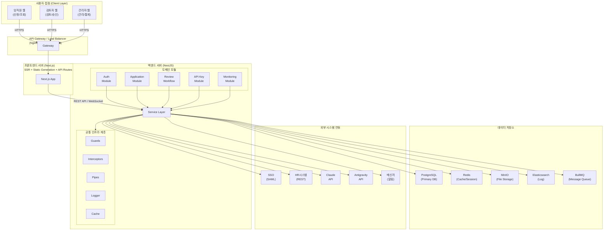

### 1.2 기술 스택 선정 및 근거

| 계층 | 기술 | 버전 | 선정 근거 |
|------|------|------|-----------|
| **프론트엔드** | Next.js | 14.x | App Router 기반 SSR/SSG 지원, React Server Components로 성능 최적화, 사내 표준 프레임워크 |
| **프론트엔드 상태관리** | Zustand | 4.x | 경량 상태관리, Redux 대비 보일러플레이트 최소화, TypeScript 친화적 |
| **UI 컴포넌트** | shadcn/ui + Tailwind CSS | - | 커스터마이징 자유도, 디자인 시스템 구축 용이, 접근성(a11y) 내장 |
| **백엔드** | NestJS | 10.x | TypeScript 네이티브, 모듈화된 아키텍처, DI 컨테이너, 엔터프라이즈급 구조화 |
| **ORM** | Prisma | 5.x | 타입 안전한 쿼리, 마이그레이션 자동화, 스키마 기반 개발 |
| **데이터베이스** | PostgreSQL | 16.x | ACID 트랜잭션, JSON 지원, 확장성, 사내 표준 RDBMS |
| **캐시** | Redis | 7.x | 인메모리 캐시, 세션 관리, Bull MQ 백엔드, Pub/Sub |
| **파일 저장소** | MinIO | - | S3 호환 오브젝트 스토리지, 온프레미스 배포 가능, 첨부파일 관리 |
| **메시지 큐** | BullMQ | 5.x | Redis 기반, NestJS 통합 용이, 지연 작업/재시도/스케줄링 |
| **로그 수집** | Elasticsearch + Kibana | 8.x | 감사 로그 검색, 대시보드 시각화, 사내 표준 로그 인프라 |
| **컨테이너** | Docker + Kubernetes | - | 컨테이너 오케스트레이션, 무중단 배포, 오토스케일링 |
| **CI/CD** | GitLab CI | - | 사내 GitLab 인프라 활용, 파이프라인 자동화 |
| **모니터링** | Prometheus + Grafana | - | 메트릭 수집 및 시각화, 알림 설정 |

### 1.3 아키텍처 설계 원칙

| 원칙 | 설명 |
|------|------|
| **모듈화(Modularity)** | 도메인별 독립 모듈로 분리하여 변경 영향 최소화 |
| **확장성(Scalability)** | 새로운 AI 도구 추가 시 플러그인 방식으로 확장 가능 |
| **보안 우선(Security First)** | API Key 암호화, 감사 로그, RBAC 기반 접근 제어 |
| **관심사 분리(SoC)** | Controller-Service-Repository 3계층 분리 |
| **이벤트 기반(Event-Driven)** | 워크플로우 상태 변경 시 이벤트 발행으로 느슨한 결합 유지 |

---

## 2. 프론트엔드 아키텍처

### 2.1 Next.js App Router 기반 설계

Next.js 14의 App Router를 사용하여 서버 컴포넌트와 클라이언트 컴포넌트를 적절히 분리하고, 서버 사이드 렌더링(SSR)을 통해 초기 로딩 성능을 최적화한다.

### 2.2 디렉토리 구조

```
frontend/
├── public/                          # 정적 파일
│   ├── images/
│   └── fonts/
├── src/
│   ├── app/                         # App Router 라우트
│   │   ├── (auth)/                  # 인증 그룹 레이아웃
│   │   │   ├── login/
│   │   │   │   └── page.tsx
│   │   │   └── layout.tsx
│   │   ├── (dashboard)/             # 대시보드 그룹 레이아웃
│   │   │   ├── layout.tsx
│   │   │   ├── page.tsx             # 메인 대시보드
│   │   │   ├── applications/        # 신청 관리
│   │   │   │   ├── page.tsx         # 신청 목록
│   │   │   │   ├── new/
│   │   │   │   │   └── page.tsx     # 신규 신청
│   │   │   │   └── [id]/
│   │   │   │       ├── page.tsx     # 신청 상세
│   │   │   │       └── edit/
│   │   │   │           └── page.tsx # 신청 수정
│   │   │   ├── reviews/             # 검토 관리
│   │   │   │   ├── page.tsx         # 검토 목록
│   │   │   │   └── [id]/
│   │   │   │       └── page.tsx     # 검토 상세
│   │   │   ├── api-keys/            # API Key 관리
│   │   │   │   └── page.tsx
│   │   │   ├── monitoring/          # 모니터링
│   │   │   │   ├── page.tsx
│   │   │   │   ├── licenses/
│   │   │   │   │   └── page.tsx
│   │   │   │   ├── usage/
│   │   │   │   │   └── page.tsx
│   │   │   │   └── costs/
│   │   │   │       └── page.tsx
│   │   │   └── admin/               # 관리자 페이지
│   │   │       ├── page.tsx
│   │   │       ├── users/
│   │   │       ├── tools/
│   │   │       └── settings/
│   │   ├── api/                     # Next.js API Routes (BFF)
│   │   │   └── [...proxy]/
│   │   │       └── route.ts
│   │   ├── layout.tsx               # 루트 레이아웃
│   │   ├── not-found.tsx
│   │   └── error.tsx
│   ├── components/                  # 공용 컴포넌트
│   │   ├── ui/                      # shadcn/ui 기반 기본 컴포넌트
│   │   │   ├── button.tsx
│   │   │   ├── input.tsx
│   │   │   ├── dialog.tsx
│   │   │   ├── table.tsx
│   │   │   ├── form.tsx
│   │   │   ├── select.tsx
│   │   │   ├── badge.tsx
│   │   │   ├── toast.tsx
│   │   │   └── ...
│   │   ├── layout/                  # 레이아웃 컴포넌트
│   │   │   ├── header.tsx
│   │   │   ├── sidebar.tsx
│   │   │   ├── footer.tsx
│   │   │   └── breadcrumb.tsx
│   │   ├── application/             # 신청 도메인 컴포넌트
│   │   │   ├── application-form.tsx
│   │   │   ├── application-list.tsx
│   │   │   ├── application-detail.tsx
│   │   │   ├── project-form.tsx
│   │   │   ├── security-agreement.tsx
│   │   │   └── file-upload.tsx
│   │   ├── review/                  # 검토 도메인 컴포넌트
│   │   │   ├── review-panel.tsx
│   │   │   ├── review-timeline.tsx
│   │   │   ├── feedback-form.tsx
│   │   │   └── stage-indicator.tsx
│   │   ├── monitoring/              # 모니터링 컴포넌트
│   │   │   ├── license-chart.tsx
│   │   │   ├── usage-dashboard.tsx
│   │   │   └── cost-summary.tsx
│   │   └── common/                  # 범용 공통 컴포넌트
│   │       ├── data-table.tsx
│   │       ├── pagination.tsx
│   │       ├── search-bar.tsx
│   │       ├── status-badge.tsx
│   │       ├── loading-spinner.tsx
│   │       └── error-boundary.tsx
│   ├── hooks/                       # 커스텀 훅
│   │   ├── use-auth.ts
│   │   ├── use-application.ts
│   │   ├── use-review.ts
│   │   ├── use-api-key.ts
│   │   ├── use-debounce.ts
│   │   └── use-pagination.ts
│   ├── stores/                      # Zustand 스토어
│   │   ├── auth-store.ts
│   │   ├── application-store.ts
│   │   ├── notification-store.ts
│   │   └── ui-store.ts
│   ├── lib/                         # 유틸리티
│   │   ├── api-client.ts            # Axios 인스턴스 + 인터셉터
│   │   ├── auth.ts                  # 인증 유틸
│   │   ├── utils.ts                 # 공통 유틸
│   │   └── constants.ts             # 상수 정의
│   ├── types/                       # TypeScript 타입 정의
│   │   ├── application.ts
│   │   ├── review.ts
│   │   ├── user.ts
│   │   ├── api-key.ts
│   │   └── common.ts
│   └── styles/                      # 스타일
│       └── globals.css
├── next.config.js
├── tailwind.config.ts
├── tsconfig.json
└── package.json
```

### 2.3 상태관리 전략

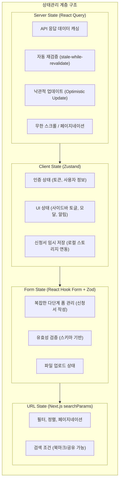

### 2.4 컴포넌트 설계 원칙

| 원칙 | 설명 |
|------|------|
| **Atomic Design 참고** | atoms(ui/) -> molecules(common/) -> organisms(domain/) -> templates(layout/) -> pages(app/) |
| **서버/클라이언트 분리** | 데이터 fetch는 서버 컴포넌트, 인터랙션은 클라이언트 컴포넌트로 분리 |
| **Colocation** | 관련 컴포넌트, 훅, 타입을 도메인 폴더에 함께 배치 |
| **합성(Composition)** | 상속 대신 합성 패턴으로 컴포넌트 재사용성 극대화 |

---

## 3. 백엔드 아키텍처

### 3.1 NestJS 모듈 구조

```
backend/
├── src/
│   ├── main.ts                      # 앱 엔트리포인트
│   ├── app.module.ts                # 루트 모듈
│   ├── common/                      # 공통 모듈
│   │   ├── decorators/              # 커스텀 데코레이터
│   │   │   ├── current-user.decorator.ts
│   │   │   ├── roles.decorator.ts
│   │   │   └── api-paginated.decorator.ts
│   │   ├── guards/                  # 인증/인가 가드
│   │   │   ├── jwt-auth.guard.ts
│   │   │   ├── roles.guard.ts
│   │   │   └── throttle.guard.ts
│   │   ├── interceptors/            # 인터셉터
│   │   │   ├── logging.interceptor.ts
│   │   │   ├── transform.interceptor.ts
│   │   │   └── timeout.interceptor.ts
│   │   ├── pipes/                   # 유효성 검증 파이프
│   │   │   └── validation.pipe.ts
│   │   ├── filters/                 # 예외 필터
│   │   │   ├── http-exception.filter.ts
│   │   │   └── all-exceptions.filter.ts
│   │   ├── dto/                     # 공통 DTO
│   │   │   ├── pagination.dto.ts
│   │   │   └── api-response.dto.ts
│   │   └── utils/                   # 유틸리티
│   │       ├── crypto.util.ts
│   │       └── date.util.ts
│   │
│   ├── modules/
│   │   ├── auth/                    # 인증 모듈
│   │   │   ├── auth.module.ts
│   │   │   ├── auth.controller.ts
│   │   │   ├── auth.service.ts
│   │   │   ├── strategies/
│   │   │   │   ├── jwt.strategy.ts
│   │   │   │   └── saml.strategy.ts
│   │   │   └── dto/
│   │   │       ├── login.dto.ts
│   │   │       └── token-response.dto.ts
│   │   │
│   │   ├── users/                   # 사용자 모듈
│   │   │   ├── users.module.ts
│   │   │   ├── users.controller.ts
│   │   │   ├── users.service.ts
│   │   │   └── dto/
│   │   │       ├── create-user.dto.ts
│   │   │       └── update-user.dto.ts
│   │   │
│   │   ├── applications/            # 신청 모듈
│   │   │   ├── applications.module.ts
│   │   │   ├── applications.controller.ts
│   │   │   ├── applications.service.ts
│   │   │   └── dto/
│   │   │       ├── create-application.dto.ts
│   │   │       ├── update-application.dto.ts
│   │   │       └── application-query.dto.ts
│   │   │
│   │   ├── projects/                # 프로젝트 모듈
│   │   │   ├── projects.module.ts
│   │   │   ├── projects.controller.ts
│   │   │   ├── projects.service.ts
│   │   │   └── dto/
│   │   │
│   │   ├── reviews/                 # 검토 워크플로우 모듈
│   │   │   ├── reviews.module.ts
│   │   │   ├── reviews.controller.ts
│   │   │   ├── reviews.service.ts
│   │   │   ├── workflow-engine.service.ts
│   │   │   └── dto/
│   │   │       ├── create-review.dto.ts
│   │   │       ├── submit-feedback.dto.ts
│   │   │       └── stage-transition.dto.ts
│   │   │
│   │   ├── api-keys/                # API Key 모듈
│   │   │   ├── api-keys.module.ts
│   │   │   ├── api-keys.controller.ts
│   │   │   ├── api-keys.service.ts
│   │   │   └── dto/
│   │   │       ├── issue-api-key.dto.ts
│   │   │       └── reset-api-key.dto.ts
│   │   │
│   │   ├── licenses/                # 라이센스 모듈
│   │   │   ├── licenses.module.ts
│   │   │   ├── licenses.controller.ts
│   │   │   ├── licenses.service.ts
│   │   │   └── dto/
│   │   │
│   │   ├── monitoring/              # 모니터링 모듈
│   │   │   ├── monitoring.module.ts
│   │   │   ├── monitoring.controller.ts
│   │   │   ├── monitoring.service.ts
│   │   │   └── dto/
│   │   │       ├── usage-query.dto.ts
│   │   │       └── cost-report.dto.ts
│   │   │
│   │   ├── notifications/           # 알림 모듈
│   │   │   ├── notifications.module.ts
│   │   │   ├── notifications.controller.ts
│   │   │   ├── notifications.service.ts
│   │   │   ├── channels/
│   │   │   │   ├── email.channel.ts
│   │   │   │   ├── messenger.channel.ts
│   │   │   │   └── in-app.channel.ts
│   │   │   └── templates/
│   │   │
│   │   ├── attachments/             # 첨부파일 모듈
│   │   │   ├── attachments.module.ts
│   │   │   ├── attachments.controller.ts
│   │   │   ├── attachments.service.ts
│   │   │   └── storage/
│   │   │       └── minio.service.ts
│   │   │
│   │   └── audit/                   # 감사 로그 모듈
│   │       ├── audit.module.ts
│   │       ├── audit.service.ts
│   │       └── audit.interceptor.ts
│   │
│   ├── config/                      # 설정
│   │   ├── app.config.ts
│   │   ├── database.config.ts
│   │   ├── redis.config.ts
│   │   ├── minio.config.ts
│   │   └── jwt.config.ts
│   │
│   └── prisma/                      # Prisma ORM
│       ├── schema.prisma
│       ├── migrations/
│       └── seed.ts
│
├── test/                            # 테스트
│   ├── unit/
│   ├── integration/
│   └── e2e/
├── nest-cli.json
├── tsconfig.json
└── package.json
```

### 3.2 모듈 간 의존관계

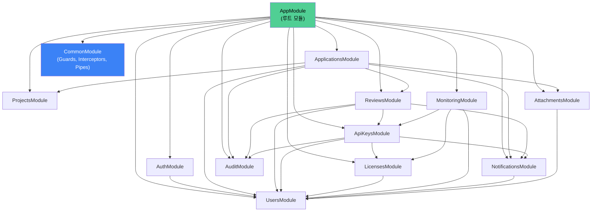

### 3.3 서비스 계층 설계

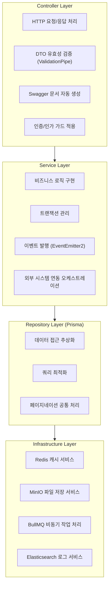

### 3.4 이벤트 기반 비동기 처리

주요 비즈니스 이벤트 목록:

| 이벤트명 | 트리거 시점 | 처리 내용 |
|----------|------------|-----------|
| `application.submitted` | 신청서 제출 | 1차 검토자에게 알림 발송, 감사 로그 기록 |
| `review.stage.completed` | 검토 단계 완료 | 다음 단계 검토자에게 알림, 상태 전이 |
| `review.feedback.created` | 피드백 작성 | 신청자에게 알림, 재제출 요청 |
| `review.approved` | 최종 승인 | API Key 발급 프로세스 시작, 환경 준비 요청 |
| `apikey.issued` | API Key 발급 | 사용자에게 발급 알림, 라이센스 활성화 |
| `apikey.reset` | API Key 리셋 | 기존 키 무효화, 신규 키 생성, 사용자 알림 |
| `license.expired` | 라이센스 만료 | 사용자/관리자 알림, 키 비활성화 |

#### 이벤트 기반 비동기 처리 흐름 (Sequence Diagram)

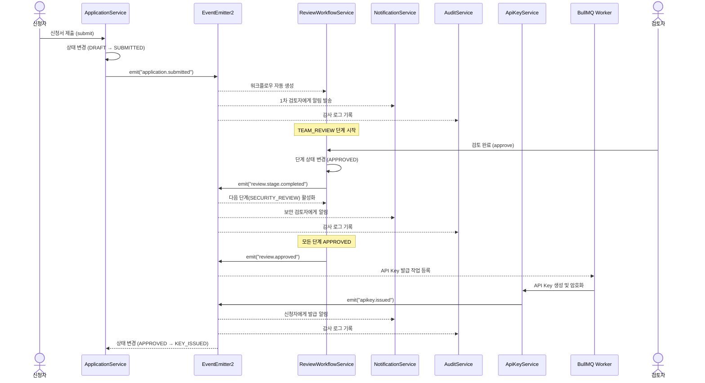

---

## 4. 데이터베이스 설계

### 4.1 ERD (Entity Relationship Diagram)

```mermaid
erDiagram
    users {
        UUID id PK
        VARCHAR employee_id UK
        VARCHAR name
        VARCHAR email UK
        VARCHAR department
        VARCHAR position
        VARCHAR phone
        UserRole role "APPLICANT | TEAM_LEAD | SECURITY_REVIEWER | IT_ADMIN | SYSTEM_ADMIN"
        BOOLEAN is_active
        TIMESTAMP last_login_at
        TIMESTAMP created_at
        TIMESTAMP updated_at
    }

    ai_tools {
        UUID id PK
        VARCHAR name UK
        VARCHAR vendor
        TEXT description
        VARCHAR api_base_url
        JSONB config_schema
        BOOLEAN is_active
        TIMESTAMP created_at
        TIMESTAMP updated_at
    }

    environments {
        UUID id PK
        VARCHAR name UK "VDI | NOTEBOOK | OTHER"
        TEXT description
        TEXT setup_instructions
        BOOLEAN is_active
        TIMESTAMP created_at
    }

    applications {
        UUID id PK
        VARCHAR application_no UK
        UUID user_id FK
        UUID environment_id FK
        TEXT purpose
        VARCHAR expected_duration
        ApplicationStatus status "DRAFT | SUBMITTED | TEAM_REVIEW | SECURITY_REVIEW | ENV_PREPARATION | FINAL_APPROVAL | APPROVED | KEY_ISSUED | REJECTED | FEEDBACK_REQUESTED"
        TIMESTAMP submitted_at
        TIMESTAMP created_at
        TIMESTAMP updated_at
    }

    application_ai_tools {
        UUID id PK
        UUID application_id FK
        UUID ai_tool_id FK
    }

    projects {
        UUID id PK
        UUID user_id FK
        VARCHAR name
        VARCHAR code UK
        TEXT description
        VARCHAR department
        DATE start_date
        DATE end_date
        BOOLEAN is_active
        TIMESTAMP created_at
        TIMESTAMP updated_at
    }

    application_projects {
        UUID id PK
        UUID application_id FK
        UUID project_id FK
    }

    review_workflows {
        UUID id PK
        UUID application_id FK "UNIQUE"
        INTEGER current_stage_order
        VARCHAR status "PENDING | IN_PROGRESS | COMPLETED | CANCELLED"
        TIMESTAMP started_at
        TIMESTAMP completed_at
        TIMESTAMP created_at
        TIMESTAMP updated_at
    }

    review_stages {
        UUID id PK
        UUID workflow_id FK
        VARCHAR stage_type "TEAM_REVIEW | SECURITY_REVIEW | ENV_PREPARATION | FINAL_APPROVAL | KEY_ISSUED"
        INTEGER stage_order
        UUID reviewer_id FK
        VARCHAR status "PENDING | IN_PROGRESS | APPROVED | REJECTED | FEEDBACK_REQUESTED | SKIPPED"
        TEXT comment
        JSONB checklist "ReviewChecklistItem[]"
        TIMESTAMP started_at
        TIMESTAMP completed_at
        TIMESTAMP created_at
        TIMESTAMP updated_at
    }

    review_feedbacks {
        UUID id PK
        UUID stage_id FK
        UUID reviewer_id FK
        TEXT content
        VARCHAR action "APPROVE | REJECT | REQUEST_REVISION | COMMENT"
        TIMESTAMP created_at
    }

    api_keys {
        UUID id PK
        UUID application_id FK
        UUID user_id FK
        UUID ai_tool_id FK "단일 도구"
        VARCHAR key_hash
        VARCHAR key_prefix
        TEXT encrypted_key
        LicenseStatus status "ACTIVE | EXPIRED | REVOKED | SUSPENDED"
        TIMESTAMP issued_at
        TIMESTAMP expires_at
        TIMESTAMP last_used_at
        INTEGER reset_count
        INTEGER usage_count
        INTEGER quota_limit
        INTEGER quota_used
        TIMESTAMP created_at
        TIMESTAMP updated_at
    }

    licenses {
        UUID id PK
        UUID application_id FK
        UUID user_id FK
        UUID ai_tool_id FK "단일 도구"
        VARCHAR license_type "INDIVIDUAL | TEAM | ENTERPRISE"
        LicenseStatus status "ACTIVE | EXPIRED | REVOKED | SUSPENDED"
        BIGINT max_tokens_per_month
        DECIMAL max_cost_per_month
        TIMESTAMP issued_at
        TIMESTAMP expires_at
        TIMESTAMP revoked_at
        TIMESTAMP created_at
        TIMESTAMP updated_at
    }

    security_agreements {
        UUID id PK
        UUID application_id FK
        UUID user_id FK
        VARCHAR agreement_version
        TEXT agreement_content
        TIMESTAMP agreed_at
        INET ip_address
        TEXT user_agent
        TEXT signature_data
        TIMESTAMP created_at
    }

    attachments {
        UUID id PK
        UUID application_id FK
        UUID uploaded_by FK
        VARCHAR file_name
        VARCHAR file_path
        BIGINT file_size
        VARCHAR mime_type
        VARCHAR category "PROJECT_DOC | SECURITY_DOC | APPROVAL_DOC | OTHER"
        TIMESTAMP uploaded_at
        BOOLEAN is_deleted
    }

    usage_logs {
        UUID id PK
        UUID user_id FK
        UUID api_key_id FK
        UUID ai_tool_id FK
        VARCHAR action
        VARCHAR model
        INTEGER input_tokens
        INTEGER output_tokens
        INTEGER total_tokens
        DECIMAL cost
        INTEGER response_time_ms
        INTEGER status_code
        TEXT error_message
        TIMESTAMP requested_at
    }

    notifications {
        UUID id PK
        UUID user_id FK
        VARCHAR type
        VARCHAR title
        TEXT content
        VARCHAR link_url
        BOOLEAN is_read
        TIMESTAMP read_at
        VARCHAR channel "IN_APP | EMAIL | MESSENGER | ALL"
        TIMESTAMP sent_at
        TIMESTAMP created_at
    }

    audit_logs {
        UUID id PK
        UUID user_id FK
        VARCHAR action
        VARCHAR entity_type
        UUID entity_id
        JSONB old_values
        JSONB new_values
        INET ip_address
        TEXT user_agent
        JSONB metadata
        TIMESTAMP created_at
    }

    monitoring_stats {
        INTEGER total_api_calls
        INTEGER total_tokens_used
        DECIMAL total_cost
        INTEGER active_users
        INTEGER total_users
        JSONB change_percent
    }

    daily_usage {
        DATE date
        INTEGER tokens
        DECIMAL cost
        INTEGER api_calls
    }

    anomaly_alerts {
        UUID id PK
        UUID user_id FK
        VARCHAR type
        TEXT description
        VARCHAR severity "LOW | MEDIUM | HIGH | CRITICAL"
        TIMESTAMP detected_at
        BOOLEAN resolved
    }

    users ||--o{ applications : "신청"
    users ||--o{ projects : "등록"
    users ||--o{ api_keys : "보유"
    users ||--o{ licenses : "보유"
    users ||--o{ security_agreements : "동의"
    users ||--o{ usage_logs : "사용"
    users ||--o{ notifications : "수신"
    users ||--o{ audit_logs : "행위"
    users ||--o{ anomaly_alerts : "감지대상"

    applications ||--o{ application_ai_tools : "신청 도구 (복수)"
    ai_tools ||--o{ application_ai_tools : "신청 대상"
    environments ||--o{ applications : "사용 환경"
    applications ||--o{ application_projects : "연결 프로젝트"
    projects ||--o{ application_projects : "연결 신청"

    applications ||--o| review_workflows : "검토 워크플로우"
    review_workflows ||--o{ review_stages : "검토 단계"
    review_stages ||--o{ review_feedbacks : "피드백"
    users ||--o{ review_stages : "검토자"
    users ||--o{ review_feedbacks : "피드백 작성자"

    applications ||--o{ api_keys : "발급"
    applications ||--o{ licenses : "라이센스"
    applications ||--o{ security_agreements : "보안 서약"
    applications ||--o{ attachments : "첨부파일"

    ai_tools ||--o{ api_keys : "도구별 키 (단일)"
    ai_tools ||--o{ licenses : "도구별 라이센스 (단일)"
    ai_tools ||--o{ usage_logs : "사용 대상"

    api_keys ||--o{ usage_logs : "사용 기록"
```

> **참고**: 현재 프론트엔드 코드에서 `Application`은 `aiToolIds: string[]`, `aiToolNames: string[]`로 복수 AI 도구를 지원하며, `application_ai_tools` 중간 테이블을 통해 다대다 관계를 구현한다. 반면 `License`와 `ApiKey`는 단일 도구(`aiToolId: string`, `aiToolName: string`)에 매핑된다.

### 4.2 테이블 상세 정의

#### 4.2.1 users (사용자)

| 컬럼명 | 타입 | 제약조건 | 설명 |
|--------|------|----------|------|
| id | UUID | PK, DEFAULT gen_random_uuid() | 사용자 고유 식별자 |
| employee_id | VARCHAR(20) | UNIQUE, NOT NULL | 사번 |
| name | VARCHAR(50) | NOT NULL | 이름 |
| email | VARCHAR(100) | UNIQUE, NOT NULL | 이메일 |
| department | VARCHAR(100) | NOT NULL | 부서명 |
| team | VARCHAR(100) | NULL | 팀명 |
| position | VARCHAR(50) | NOT NULL | 직급 |
| phone | VARCHAR(20) | NULL | 전화번호 |
| role | ENUM('USER','REVIEWER','SECURITY_REVIEWER','ADMIN','SUPER_ADMIN') | NOT NULL, DEFAULT 'USER' | 시스템 역할 |
| is_active | BOOLEAN | NOT NULL, DEFAULT true | 활성 상태 |
| last_login_at | TIMESTAMP | NULL | 최종 로그인 시각 |
| created_at | TIMESTAMP | NOT NULL, DEFAULT NOW() | 생성 시각 |
| updated_at | TIMESTAMP | NOT NULL, DEFAULT NOW() | 수정 시각 |

#### 4.2.2 ai_tools (AI 도구)

| 컬럼명 | 타입 | 제약조건 | 설명 |
|--------|------|----------|------|
| id | UUID | PK, DEFAULT gen_random_uuid() | AI 도구 고유 식별자 |
| name | VARCHAR(100) | UNIQUE, NOT NULL | 도구명 (예: Claude Code, Antigravity) |
| vendor | VARCHAR(100) | NOT NULL | 공급사 |
| description | TEXT | NULL | 도구 설명 |
| api_base_url | VARCHAR(500) | NULL | API Base URL |
| config_schema | JSONB | NULL | 도구별 설정 스키마 (JSON Schema) |
| is_active | BOOLEAN | NOT NULL, DEFAULT true | 활성 상태 |
| created_at | TIMESTAMP | NOT NULL, DEFAULT NOW() | 생성 시각 |
| updated_at | TIMESTAMP | NOT NULL, DEFAULT NOW() | 수정 시각 |

#### 4.2.3 environments (사용 환경)

| 컬럼명 | 타입 | 제약조건 | 설명 |
|--------|------|----------|------|
| id | UUID | PK, DEFAULT gen_random_uuid() | 환경 고유 식별자 |
| name | VARCHAR(50) | UNIQUE, NOT NULL | 환경명 (VDI, Notebook 등) |
| description | TEXT | NULL | 환경 설명 |
| setup_instructions | TEXT | NULL | 환경 셋업 가이드 |
| is_active | BOOLEAN | NOT NULL, DEFAULT true | 활성 상태 |
| created_at | TIMESTAMP | NOT NULL, DEFAULT NOW() | 생성 시각 |

#### 4.2.4 applications (신청서)

| 컬럼명 | 타입 | 제약조건 | 설명 |
|--------|------|----------|------|
| id | UUID | PK, DEFAULT gen_random_uuid() | 신청 고유 식별자 |
| application_no | VARCHAR(20) | UNIQUE, NOT NULL | 신청번호 (예: APP-20260211-001) |
| user_id | UUID | FK(users.id), NOT NULL | 신청자 ID |
| environment_id | UUID | FK(environments.id), NOT NULL | 사용 환경 ID |
| purpose | TEXT | NOT NULL | 사용 목적 |
| expected_duration | VARCHAR(50) | NULL | 예상 사용 기간 |
| status | ENUM('DRAFT','SUBMITTED','TEAM_REVIEW','SECURITY_REVIEW','ENV_PREPARATION','FINAL_APPROVAL','APPROVED','KEY_ISSUED','REJECTED','FEEDBACK_REQUESTED') | NOT NULL, DEFAULT 'DRAFT' | 신청 상태 |
| submitted_at | TIMESTAMP | NULL | 제출 시각 |
| completed_at | TIMESTAMP | NULL | 완료 시각 |
| created_at | TIMESTAMP | NOT NULL, DEFAULT NOW() | 생성 시각 |
| updated_at | TIMESTAMP | NOT NULL, DEFAULT NOW() | 수정 시각 |

> **변경 사항**: `ai_tool_id` FK가 제거되고, `application_ai_tools` 중간 테이블을 통해 복수 AI 도구를 지원한다. `status` ENUM 값이 현재 프론트엔드 `ApplicationStatus` 타입에 맞게 업데이트되었다.

#### 4.2.4a application_ai_tools (신청-AI도구 매핑)

| 컬럼명 | 타입 | 제약조건 | 설명 |
|--------|------|----------|------|
| id | UUID | PK, DEFAULT gen_random_uuid() | 매핑 고유 식별자 |
| application_id | UUID | FK(applications.id), NOT NULL | 신청 ID |
| ai_tool_id | UUID | FK(ai_tools.id), NOT NULL | AI 도구 ID |
| created_at | TIMESTAMP | NOT NULL, DEFAULT NOW() | 생성 시각 |

> UNIQUE 제약: (application_id, ai_tool_id)

#### 4.2.5 projects (프로젝트)

| 컬럼명 | 타입 | 제약조건 | 설명 |
|--------|------|----------|------|
| id | UUID | PK, DEFAULT gen_random_uuid() | 프로젝트 고유 식별자 |
| user_id | UUID | FK(users.id), NOT NULL | 프로젝트 등록자 ID |
| name | VARCHAR(200) | NOT NULL | 프로젝트명 |
| code | VARCHAR(50) | UNIQUE, NOT NULL | 프로젝트 코드 |
| description | TEXT | NULL | 프로젝트 설명 |
| department | VARCHAR(100) | NULL | 주관 부서 |
| start_date | DATE | NULL | 시작일 |
| end_date | DATE | NULL | 종료일 |
| is_active | BOOLEAN | NOT NULL, DEFAULT true | 활성 상태 |
| created_at | TIMESTAMP | NOT NULL, DEFAULT NOW() | 생성 시각 |
| updated_at | TIMESTAMP | NOT NULL, DEFAULT NOW() | 수정 시각 |

#### 4.2.6 application_projects (신청-프로젝트 매핑)

| 컬럼명 | 타입 | 제약조건 | 설명 |
|--------|------|----------|------|
| id | UUID | PK, DEFAULT gen_random_uuid() | 매핑 고유 식별자 |
| application_id | UUID | FK(applications.id), NOT NULL | 신청 ID |
| project_id | UUID | FK(projects.id), NOT NULL | 프로젝트 ID |
| created_at | TIMESTAMP | NOT NULL, DEFAULT NOW() | 생성 시각 |

> UNIQUE 제약: (application_id, project_id)

#### 4.2.7 review_workflows (검토 워크플로우)

| 컬럼명 | 타입 | 제약조건 | 설명 |
|--------|------|----------|------|
| id | UUID | PK, DEFAULT gen_random_uuid() | 워크플로우 고유 식별자 |
| application_id | UUID | FK(applications.id), UNIQUE, NOT NULL | 대상 신청 ID |
| current_stage_order | INTEGER | NOT NULL, DEFAULT 1 | 현재 진행 단계 순번 |
| status | ENUM('PENDING','IN_PROGRESS','COMPLETED','CANCELLED') | NOT NULL, DEFAULT 'PENDING' | 워크플로우 상태 |
| started_at | TIMESTAMP | NULL | 시작 시각 |
| completed_at | TIMESTAMP | NULL | 완료 시각 |
| created_at | TIMESTAMP | NOT NULL, DEFAULT NOW() | 생성 시각 |
| updated_at | TIMESTAMP | NOT NULL, DEFAULT NOW() | 수정 시각 |

#### 4.2.8 review_stages (검토 단계)

| 컬럼명 | 타입 | 제약조건 | 설명 |
|--------|------|----------|------|
| id | UUID | PK, DEFAULT gen_random_uuid() | 단계 고유 식별자 |
| workflow_id | UUID | FK(review_workflows.id), NOT NULL | 워크플로우 ID |
| stage_type | ENUM('FIRST_REVIEW','SECURITY_REVIEW','ENV_PREPARATION','FINAL_APPROVAL','ISSUANCE') | NOT NULL | 단계 유형 |
| stage_order | INTEGER | NOT NULL | 단계 순번 |
| reviewer_id | UUID | FK(users.id), NULL | 검토자 ID |
| status | ENUM('PENDING','IN_PROGRESS','APPROVED','REJECTED','REVISION_REQUESTED','SKIPPED') | NOT NULL, DEFAULT 'PENDING' | 단계 상태 |
| comment | TEXT | NULL | 검토 의견 |
| started_at | TIMESTAMP | NULL | 시작 시각 |
| completed_at | TIMESTAMP | NULL | 완료 시각 |
| created_at | TIMESTAMP | NOT NULL, DEFAULT NOW() | 생성 시각 |
| updated_at | TIMESTAMP | NOT NULL, DEFAULT NOW() | 수정 시각 |

> UNIQUE 제약: (workflow_id, stage_order)

#### 4.2.9 review_feedbacks (검토 피드백)

| 컬럼명 | 타입 | 제약조건 | 설명 |
|--------|------|----------|------|
| id | UUID | PK, DEFAULT gen_random_uuid() | 피드백 고유 식별자 |
| stage_id | UUID | FK(review_stages.id), NOT NULL | 검토 단계 ID |
| reviewer_id | UUID | FK(users.id), NOT NULL | 피드백 작성자 ID |
| content | TEXT | NOT NULL | 피드백 내용 |
| action | ENUM('APPROVE','REJECT','REQUEST_REVISION','COMMENT') | NOT NULL | 피드백 액션 |
| created_at | TIMESTAMP | NOT NULL, DEFAULT NOW() | 생성 시각 |

#### 4.2.10 api_keys (API 키)

| 컬럼명 | 타입 | 제약조건 | 설명 |
|--------|------|----------|------|
| id | UUID | PK, DEFAULT gen_random_uuid() | API Key 고유 식별자 |
| application_id | UUID | FK(applications.id), NOT NULL | 신청 ID |
| user_id | UUID | FK(users.id), NOT NULL | 사용자 ID |
| ai_tool_id | UUID | FK(ai_tools.id), NOT NULL | AI 도구 ID |
| key_hash | VARCHAR(256) | NOT NULL | API Key 해시값 (SHA-256) |
| key_prefix | VARCHAR(10) | NOT NULL | API Key 앞 8자리 (식별용) |
| encrypted_key | TEXT | NOT NULL | AES-256-GCM 암호화된 원문 키 |
| status | ENUM('ACTIVE','INACTIVE','REVOKED','EXPIRED') | NOT NULL, DEFAULT 'ACTIVE' | 키 상태 |
| issued_at | TIMESTAMP | NOT NULL, DEFAULT NOW() | 발급 시각 |
| expires_at | TIMESTAMP | NOT NULL | 만료 시각 |
| last_used_at | TIMESTAMP | NULL | 최근 사용 시각 |
| reset_count | INTEGER | NOT NULL, DEFAULT 0 | 리셋 횟수 |
| created_at | TIMESTAMP | NOT NULL, DEFAULT NOW() | 생성 시각 |
| updated_at | TIMESTAMP | NOT NULL, DEFAULT NOW() | 수정 시각 |

#### 4.2.11 licenses (라이센스)

| 컬럼명 | 타입 | 제약조건 | 설명 |
|--------|------|----------|------|
| id | UUID | PK, DEFAULT gen_random_uuid() | 라이센스 고유 식별자 |
| application_id | UUID | FK(applications.id), NOT NULL | 신청 ID |
| user_id | UUID | FK(users.id), NOT NULL | 사용자 ID |
| ai_tool_id | UUID | FK(ai_tools.id), NOT NULL | AI 도구 ID |
| license_type | ENUM('INDIVIDUAL','TEAM','ENTERPRISE') | NOT NULL, DEFAULT 'INDIVIDUAL' | 라이센스 유형 |
| status | ENUM('ACTIVE','SUSPENDED','EXPIRED','REVOKED') | NOT NULL, DEFAULT 'ACTIVE' | 라이센스 상태 |
| max_tokens_per_month | BIGINT | NULL | 월간 최대 토큰 수 |
| max_cost_per_month | DECIMAL(12,2) | NULL | 월간 최대 비용 (USD) |
| issued_at | TIMESTAMP | NOT NULL, DEFAULT NOW() | 발급 시각 |
| expires_at | TIMESTAMP | NOT NULL | 만료 시각 |
| revoked_at | TIMESTAMP | NULL | 해지 시각 |
| created_at | TIMESTAMP | NOT NULL, DEFAULT NOW() | 생성 시각 |
| updated_at | TIMESTAMP | NOT NULL, DEFAULT NOW() | 수정 시각 |

#### 4.2.12 security_agreements (보안 서약)

| 컬럼명 | 타입 | 제약조건 | 설명 |
|--------|------|----------|------|
| id | UUID | PK, DEFAULT gen_random_uuid() | 서약 고유 식별자 |
| application_id | UUID | FK(applications.id), NOT NULL | 신청 ID |
| user_id | UUID | FK(users.id), NOT NULL | 서약자 ID |
| agreement_version | VARCHAR(20) | NOT NULL | 서약서 버전 |
| agreement_content | TEXT | NOT NULL | 서약서 내용 |
| agreed_at | TIMESTAMP | NOT NULL, DEFAULT NOW() | 동의 시각 |
| ip_address | INET | NOT NULL | 동의 시 IP 주소 |
| user_agent | TEXT | NULL | 동의 시 User Agent |
| signature_data | TEXT | NULL | 전자 서명 데이터 (Base64) |
| created_at | TIMESTAMP | NOT NULL, DEFAULT NOW() | 생성 시각 |

#### 4.2.13 attachments (첨부파일)

| 컬럼명 | 타입 | 제약조건 | 설명 |
|--------|------|----------|------|
| id | UUID | PK, DEFAULT gen_random_uuid() | 첨부파일 고유 식별자 |
| application_id | UUID | FK(applications.id), NOT NULL | 신청 ID |
| uploaded_by | UUID | FK(users.id), NOT NULL | 업로더 ID |
| file_name | VARCHAR(255) | NOT NULL | 원본 파일명 |
| file_path | VARCHAR(500) | NOT NULL | 저장 경로 (MinIO Object Key) |
| file_size | BIGINT | NOT NULL | 파일 크기 (bytes) |
| mime_type | VARCHAR(100) | NOT NULL | MIME 타입 |
| category | ENUM('PROJECT_DOC','SECURITY_DOC','APPROVAL_DOC','OTHER') | NOT NULL, DEFAULT 'OTHER' | 파일 분류 |
| uploaded_at | TIMESTAMP | NOT NULL, DEFAULT NOW() | 업로드 시각 |
| is_deleted | BOOLEAN | NOT NULL, DEFAULT false | 삭제 여부 (소프트 삭제) |

#### 4.2.14 usage_logs (사용 로그)

| 컬럼명 | 타입 | 제약조건 | 설명 |
|--------|------|----------|------|
| id | UUID | PK, DEFAULT gen_random_uuid() | 로그 고유 식별자 |
| user_id | UUID | FK(users.id), NOT NULL | 사용자 ID |
| api_key_id | UUID | FK(api_keys.id), NOT NULL | API Key ID |
| ai_tool_id | UUID | FK(ai_tools.id), NOT NULL | AI 도구 ID |
| action | VARCHAR(100) | NOT NULL | 요청 액션 (예: chat, code_completion) |
| model | VARCHAR(100) | NULL | 사용 모델명 |
| input_tokens | INTEGER | NOT NULL, DEFAULT 0 | 입력 토큰 수 |
| output_tokens | INTEGER | NOT NULL, DEFAULT 0 | 출력 토큰 수 |
| total_tokens | INTEGER | NOT NULL, DEFAULT 0 | 총 토큰 수 |
| cost | DECIMAL(10,6) | NOT NULL, DEFAULT 0 | 비용 (USD) |
| response_time_ms | INTEGER | NULL | 응답 시간 (ms) |
| status_code | INTEGER | NULL | HTTP 상태 코드 |
| error_message | TEXT | NULL | 에러 메시지 |
| requested_at | TIMESTAMP | NOT NULL, DEFAULT NOW() | 요청 시각 |

#### 4.2.15 notifications (알림)

| 컬럼명 | 타입 | 제약조건 | 설명 |
|--------|------|----------|------|
| id | UUID | PK, DEFAULT gen_random_uuid() | 알림 고유 식별자 |
| user_id | UUID | FK(users.id), NOT NULL | 수신자 ID |
| type | ENUM('APPLICATION_SUBMITTED','REVIEW_ASSIGNED','FEEDBACK_RECEIVED','REVISION_REQUESTED','APPROVED','REJECTED','KEY_ISSUED','KEY_EXPIRING','LICENSE_ALERT') | NOT NULL | 알림 유형 |
| title | VARCHAR(200) | NOT NULL | 알림 제목 |
| content | TEXT | NOT NULL | 알림 내용 |
| link_url | VARCHAR(500) | NULL | 관련 페이지 링크 |
| is_read | BOOLEAN | NOT NULL, DEFAULT false | 읽음 여부 |
| read_at | TIMESTAMP | NULL | 읽은 시각 |
| channel | ENUM('IN_APP','EMAIL','MESSENGER','ALL') | NOT NULL, DEFAULT 'IN_APP' | 알림 채널 |
| sent_at | TIMESTAMP | NULL | 발송 시각 |
| created_at | TIMESTAMP | NOT NULL, DEFAULT NOW() | 생성 시각 |

#### 4.2.16 audit_logs (감사 로그)

| 컬럼명 | 타입 | 제약조건 | 설명 |
|--------|------|----------|------|
| id | UUID | PK, DEFAULT gen_random_uuid() | 로그 고유 식별자 |
| user_id | UUID | FK(users.id), NULL | 행위자 ID (시스템 작업 시 NULL) |
| action | VARCHAR(100) | NOT NULL | 행위 (예: CREATE, UPDATE, DELETE, LOGIN) |
| entity_type | VARCHAR(100) | NOT NULL | 대상 엔티티 타입 (예: application, api_key) |
| entity_id | UUID | NULL | 대상 엔티티 ID |
| old_values | JSONB | NULL | 변경 전 값 |
| new_values | JSONB | NULL | 변경 후 값 |
| ip_address | INET | NULL | 클라이언트 IP |
| user_agent | TEXT | NULL | User Agent |
| metadata | JSONB | NULL | 추가 메타데이터 |
| created_at | TIMESTAMP | NOT NULL, DEFAULT NOW() | 생성 시각 |

### 4.3 인덱싱 전략

#### 4.3.1 Primary Key / Unique 인덱스

모든 테이블의 PK(id)는 자동으로 B-tree 인덱스가 생성된다. UNIQUE 제약 조건이 있는 컬럼에도 자동 인덱스가 생성된다.

#### 4.3.2 외래키 인덱스

모든 FK 컬럼에 인덱스를 생성하여 JOIN 성능을 보장한다.

#### 4.3.3 조회 성능 최적화 인덱스

```sql
-- applications: 상태별 조회 (가장 빈번한 쿼리)
CREATE INDEX idx_applications_status ON applications(status);
CREATE INDEX idx_applications_user_status ON applications(user_id, status);
CREATE INDEX idx_applications_submitted_at ON applications(submitted_at DESC);
CREATE INDEX idx_applications_no ON applications(application_no);

-- review_stages: 검토자별 대기 목록
CREATE INDEX idx_review_stages_reviewer_status ON review_stages(reviewer_id, status);
CREATE INDEX idx_review_stages_workflow_order ON review_stages(workflow_id, stage_order);

-- api_keys: 키 조회 (해시 기반)
CREATE INDEX idx_api_keys_key_hash ON api_keys(key_hash);
CREATE INDEX idx_api_keys_user_status ON api_keys(user_id, status);
CREATE INDEX idx_api_keys_expires_at ON api_keys(expires_at) WHERE status = 'ACTIVE';

-- licenses: 활성 라이센스 조회
CREATE INDEX idx_licenses_user_status ON licenses(user_id, status);
CREATE INDEX idx_licenses_expires_at ON licenses(expires_at) WHERE status = 'ACTIVE';

-- usage_logs: 사용량 집계 (시계열 조회)
CREATE INDEX idx_usage_logs_user_requested ON usage_logs(user_id, requested_at DESC);
CREATE INDEX idx_usage_logs_tool_requested ON usage_logs(ai_tool_id, requested_at DESC);
CREATE INDEX idx_usage_logs_requested_at ON usage_logs(requested_at DESC);

-- notifications: 사용자별 미읽음 알림
CREATE INDEX idx_notifications_user_unread ON notifications(user_id, is_read)
  WHERE is_read = false;

-- audit_logs: 감사 로그 검색
CREATE INDEX idx_audit_logs_entity ON audit_logs(entity_type, entity_id);
CREATE INDEX idx_audit_logs_user_action ON audit_logs(user_id, action);
CREATE INDEX idx_audit_logs_created_at ON audit_logs(created_at DESC);
```

#### 4.3.4 파티셔닝 전략

대용량 테이블에 대해 시간 기반 파티셔닝을 적용한다.

| 테이블 | 파티셔닝 키 | 전략 | 보존 기간 |
|--------|------------|------|-----------|
| usage_logs | requested_at | 월별 Range 파티셔닝 | 24개월 |
| audit_logs | created_at | 월별 Range 파티셔닝 | 36개월 |
| notifications | created_at | 월별 Range 파티셔닝 | 12개월 |

---

## 5. 워크플로우 엔진 설계

### 5.1 상태 머신 다이어그램

#### 5.1.1 신청서 상태 머신

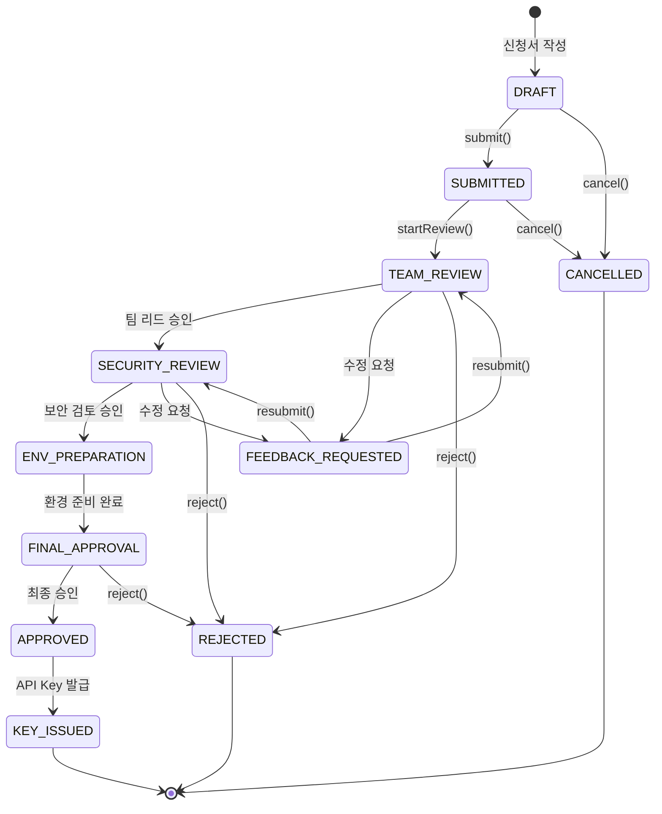

> **참고**: 현재 프론트엔드 코드의 `ApplicationStatus`는 `DRAFT | SUBMITTED | TEAM_REVIEW | SECURITY_REVIEW | ENV_PREPARATION | FINAL_APPROVAL | APPROVED | KEY_ISSUED | REJECTED | FEEDBACK_REQUESTED`로 정의되어 있다.

#### 5.1.2 검토 워크플로우 상태 머신

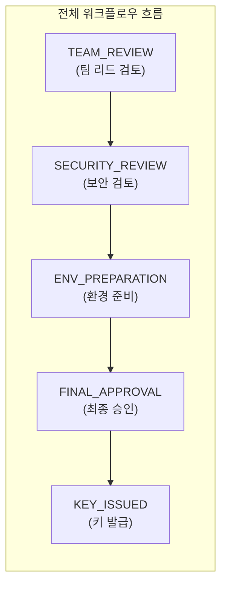

각 단계 내부 상태:

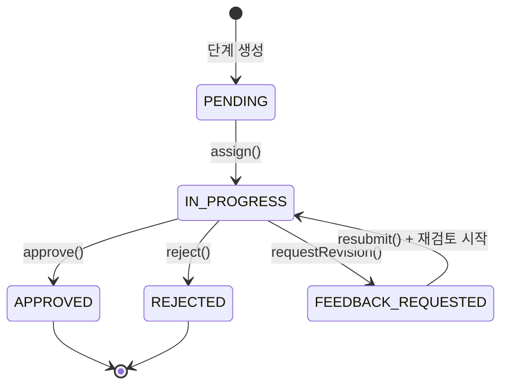

### 5.2 상태 전이 규칙

#### 5.2.1 신청서 상태 전이 규칙

| 현재 상태 | 이벤트 | 다음 상태 | 조건 | 부수 효과 |
|-----------|--------|-----------|------|-----------|
| DRAFT | submit | SUBMITTED | 필수 필드 모두 입력, 보안 서약 동의 완료 | 워크플로우 자동 생성, 1차 검토자에게 알림 |
| SUBMITTED | startReview | IN_REVIEW | 검토 워크플로우 존재 | 워크플로우 상태를 IN_PROGRESS로 변경 |
| IN_REVIEW | requestRevision | REVISION_REQUESTED | 검토자가 수정 요청 피드백 제출 | 신청자에게 수정 요청 알림 |
| REVISION_REQUESTED | resubmit | IN_REVIEW | 신청자가 수정 완료 | 해당 단계 재검토 시작, 검토자에게 알림 |
| IN_REVIEW | approve | APPROVED | 모든 검토 단계 APPROVED | API Key 발급 프로세스 시작 |
| IN_REVIEW | reject | REJECTED | 검토자가 반려 피드백 제출 | 신청자에게 반려 알림 |
| DRAFT/SUBMITTED | cancel | CANCELLED | 신청자 본인 또는 관리자 | 워크플로우 취소 |

#### 5.2.2 검토 단계 전이 규칙

| 현재 상태 | 이벤트 | 다음 상태 | 조건 |
|-----------|--------|-----------|------|
| PENDING | assign | IN_PROGRESS | 이전 단계가 APPROVED 또는 첫 번째 단계 |
| IN_PROGRESS | approve | APPROVED | 검토자가 승인 피드백 제출 |
| IN_PROGRESS | reject | REJECTED | 검토자가 반려 피드백 제출 |
| IN_PROGRESS | requestRevision | REVISION_REQUESTED | 검토자가 수정 요청 피드백 제출 |
| REVISION_REQUESTED | resubmit | IN_PROGRESS | 신청자가 수정사항 반영 후 재제출 |

### 5.3 피드백 루프 설계

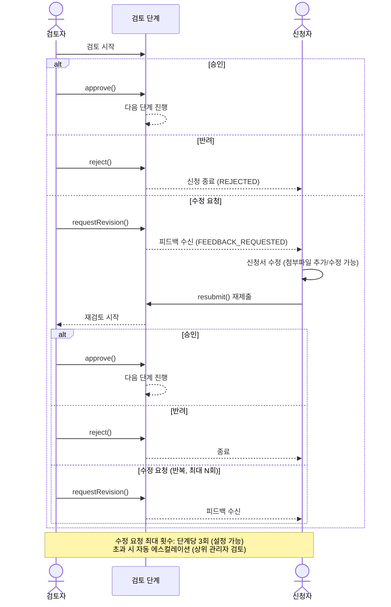

### 5.4 워크플로우 엔진 구현 설계

```typescript
// 상태 전이 인터페이스
interface StateTransition {
  from: StageStatus;
  to: StageStatus;
  event: ReviewEvent;
  guard?: (context: ReviewContext) => boolean;
  action?: (context: ReviewContext) => Promise<void>;
}

// 워크플로우 엔진 핵심 로직
class WorkflowEngine {
  private transitions: StateTransition[] = [
    {
      from: 'PENDING',
      to: 'IN_PROGRESS',
      event: 'ASSIGN',
      guard: (ctx) => ctx.previousStageApproved || ctx.isFirstStage,
      action: async (ctx) => {
        await this.notifyReviewer(ctx.stage.reviewerId);
        await this.auditLog('STAGE_STARTED', ctx);
      },
    },
    {
      from: 'IN_PROGRESS',
      to: 'APPROVED',
      event: 'APPROVE',
      action: async (ctx) => {
        await this.advanceWorkflow(ctx);
        await this.notifyApplicant(ctx, 'STAGE_APPROVED');
        await this.auditLog('STAGE_APPROVED', ctx);
      },
    },
    {
      from: 'IN_PROGRESS',
      to: 'REVISION_REQUESTED',
      event: 'REQUEST_REVISION',
      guard: (ctx) => ctx.revisionCount < ctx.maxRevisions,
      action: async (ctx) => {
        await this.notifyApplicant(ctx, 'REVISION_REQUESTED');
        await this.auditLog('REVISION_REQUESTED', ctx);
      },
    },
    // ... 추가 전이 규칙
  ];

  async processEvent(event: ReviewEvent, context: ReviewContext): Promise<void> {
    const transition = this.findTransition(context.currentStatus, event);
    if (!transition) throw new InvalidTransitionError();
    if (transition.guard && !transition.guard(context)) {
      throw new TransitionGuardError();
    }
    await this.executeTransition(transition, context);
  }
}
```

---

## 6. 보안 아키텍처

### 6.1 인증 체계

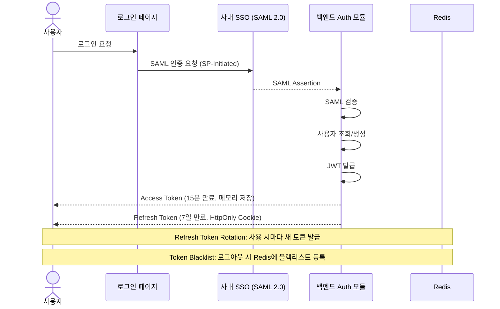

### 6.2 인가 체계 (RBAC)

#### 6.2.1 역할 정의

| 역할 | 코드 | 설명 |
|------|------|------|
| 일반 사용자 | USER | AI 도구 사용 신청, 본인 신청 조회/수정 |
| 1차 검토자 | REVIEWER | 신청서 1차 검토, 피드백 작성 |
| 보안 검토자 | SECURITY_REVIEWER | 보안 검토 수행, 보안 관련 피드백 |
| 관리자 | ADMIN | 사용자 관리, AI 도구 관리, 모니터링, 최종 승인 |
| 최고 관리자 | SUPER_ADMIN | 시스템 전체 설정, 역할 관리, 감사 로그 전체 조회 |

#### 6.2.2 권한 매트릭스

| 기능 | USER | REVIEWER | SECURITY_REVIEWER | ADMIN | SUPER_ADMIN |
|------|:----:|:--------:|:-----------------:|:-----:|:-----------:|
| 신청서 작성 | O | O | - | O | O |
| 본인 신청 조회 | O | O | O | O | O |
| 전체 신청 조회 | - | O (배정건) | O (배정건) | O | O |
| 1차 검토 수행 | - | O | - | O | O |
| 보안 검토 수행 | - | - | O | O | O |
| 최종 승인 | - | - | - | O | O |
| API Key 발급 | - | - | - | O | O |
| 사용자 관리 | - | - | - | O | O |
| AI 도구 관리 | - | - | - | O | O |
| 사용량 모니터링 | O (본인) | - | - | O | O |
| 비용 관리 | - | - | - | O | O |
| 감사 로그 조회 | - | - | - | O (제한) | O |
| 시스템 설정 | - | - | - | - | O |

### 6.3 API Key 보안

```mermaid
flowchart TD
    subgraph KeyGen["1. 키 생성"]
        RAW["Raw Key: sk-codehub-xxxxxxxxxxxxxxxx<br/>(crypto.randomBytes(32).toString('hex'))"]
        RAW --> HASH["key_hash<br/>SHA-256 해시<br/>(검증용, DB 저장)"]
        RAW --> ENC["encrypted_key<br/>AES-256-GCM 암호화<br/>(복호화용, DB 저장)"]
    end

    subgraph KeyDisplay["2. 키 표시"]
        D1["최초 발급 시에만 전체 키 1회 표시"]
        D2["이후에는 key_prefix(앞 8자) + 마스킹만 표시"]
        D3["예: sk-codeh****************************"]
        D1 --> D2 --> D3
    end

    subgraph KeyValidation["3. 키 검증 흐름"]
        V1["Request Header"] --> V2["Extract Key"]
        V2 --> V3["SHA-256 Hash"]
        V3 --> V4["DB에서 key_hash 조회"]
        V4 --> V5["상태 확인 (ACTIVE/만료)"]
        V5 --> V6["사용 로그 기록"]
        V6 --> V7["last_used_at 갱신"]
    end

    subgraph KeyManagement["4. 키 암호화 키 관리"]
        K1["Master Key<br/>(환경변수 또는 HashiCorp Vault)"]
        K1 --> K2["Key Encryption Key (KEK)<br/>Master Key에서 파생"]
        K2 --> K3["Data Encryption Key (DEK)<br/>개별 API Key 암호화"]
        K4["Key Rotation: 분기별 KEK 갱신"]
    end
```

### 6.4 감사 로그 정책

| 항목 | 정책 |
|------|------|
| **기록 대상** | 모든 데이터 변경(CUD), 로그인/로그아웃, 검토 행위, API Key 관련 모든 작업, 관리자 작업 |
| **기록 내용** | 행위자, 행위, 대상, 변경 전/후 값, IP 주소, User Agent, 타임스탬프 |
| **저장소** | PostgreSQL(audit_logs) + Elasticsearch(검색/분석용) |
| **보존 기간** | PostgreSQL: 36개월, Elasticsearch: 12개월 |
| **접근 권한** | ADMIN: 제한적 조회, SUPER_ADMIN: 전체 조회 |
| **위변조 방지** | 감사 로그 테이블에 대한 UPDATE/DELETE 권한 제거, 해시 체인 방식 무결성 검증 |

### 6.5 추가 보안 조치

| 영역 | 조치 |
|------|------|
| **통신 보안** | 모든 통신 TLS 1.3, HSTS 적용 |
| **입력 검증** | 모든 API 입력에 대해 DTO 스키마 검증 (class-validator) |
| **SQL 인젝션** | Prisma ORM 사용으로 파라미터 바인딩 자동 적용 |
| **XSS 방지** | CSP 헤더, React의 기본 이스케이핑, DOMPurify 적용 |
| **CSRF 방지** | SameSite=Strict 쿠키, CSRF 토큰 |
| **Rate Limiting** | IP 기반 + 사용자 기반 요청 제한 (NestJS Throttle) |
| **파일 업로드** | 파일 타입 화이트리스트, 크기 제한(10MB), 바이러스 스캔 연동 |
| **세션 관리** | Redis 기반 세션, 동시 로그인 제한, 비활동 30분 타임아웃 |

---

## 7. 외부 시스템 연동

### 7.1 연동 시스템 구성도

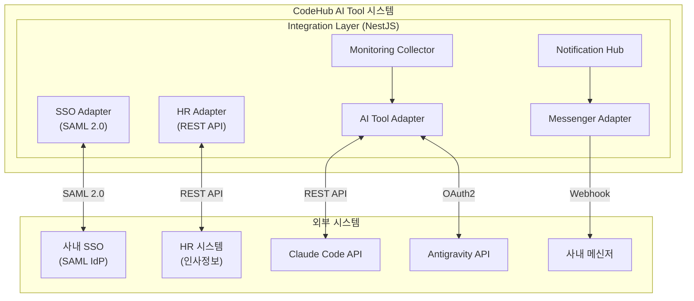

### 7.2 연동 인터페이스 상세

#### 7.2.1 SSO 연동 (SAML 2.0)

| 항목 | 내용 |
|------|------|
| **프로토콜** | SAML 2.0 SP-Initiated SSO |
| **IdP** | 사내 SSO 시스템 |
| **속성 매핑** | employeeId, name, email, department, position |
| **세션 관리** | SAML 로그인 후 JWT로 전환, SLO(Single Logout) 지원 |
| **장애 대응** | SSO 장애 시 로컬 인증 폴백 (관리자 계정만) |

#### 7.2.2 HR 시스템 연동

| 항목 | 내용 |
|------|------|
| **방식** | REST API 호출 |
| **동기화** | 일 1회 배치 동기화 + 실시간 조회 (Fallback 캐시) |
| **동기화 대상** | 사번, 이름, 부서, 팀, 직급, 재직 상태 |
| **인증** | API Key 또는 OAuth2 Client Credentials |
| **에러 처리** | 재시도(3회), Circuit Breaker, 캐시 데이터 사용 |

#### 7.2.3 AI 도구 API 연동

**Claude Code API:**

| 항목 | 내용 |
|------|------|
| **기능** | API Key 발급/해지, 사용량 조회, 비용 조회 |
| **인증** | Admin API Key (Master Key) |
| **Rate Limit** | 분당 60회 |
| **데이터 수집** | 토큰 사용량, 비용, 요청 횟수, 에러율 |

**Antigravity API:**

| 항목 | 내용 |
|------|------|
| **기능** | 라이센스 발급/관리, 사용량 조회 |
| **인증** | OAuth2 Client Credentials |
| **Rate Limit** | 분당 100회 |
| **데이터 수집** | 라이센스 상태, 사용 통계, 비용 |

> AI 도구 연동은 Adapter 패턴을 사용하여 공통 인터페이스(`AiToolAdapter`)로 추상화하고, 새로운 AI 도구 추가 시 해당 Adapter만 구현하면 되도록 설계한다.

```typescript
// AI 도구 어댑터 인터페이스
interface AiToolAdapter {
  issueApiKey(userId: string, config: ToolConfig): Promise<ApiKeyResult>;
  revokeApiKey(keyId: string): Promise<void>;
  resetApiKey(keyId: string): Promise<ApiKeyResult>;
  getUsage(keyId: string, period: DateRange): Promise<UsageData>;
  getCost(keyId: string, period: DateRange): Promise<CostData>;
  validateApiKey(key: string): Promise<boolean>;
}
```

#### 7.2.4 메신저 연동

| 항목 | 내용 |
|------|------|
| **대상** | 사내 메신저 (Webhook 방식) |
| **알림 유형** | 신청 접수, 검토 요청, 피드백 수신, 승인/반려, Key 발급 |
| **메시지 포맷** | 구조화된 카드 형태 (제목, 내용, 액션 버튼) |
| **장애 대응** | 메신저 장애 시 이메일 폴백, 재시도 큐 |

---

## 8. 인프라 및 배포

### 8.1 컨테이너 아키텍처

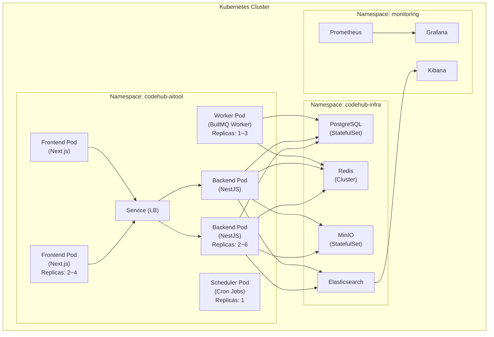

### 8.2 Docker 이미지 구성

```dockerfile
# Frontend Dockerfile (multi-stage build)
FROM node:20-alpine AS builder
WORKDIR /app
COPY package*.json ./
RUN npm ci
COPY . .
RUN npm run build

FROM node:20-alpine AS runner
WORKDIR /app
COPY --from=builder /app/.next/standalone ./
COPY --from=builder /app/.next/static ./.next/static
COPY --from=builder /app/public ./public
EXPOSE 3000
CMD ["node", "server.js"]

# Backend Dockerfile (multi-stage build)
FROM node:20-alpine AS builder
WORKDIR /app
COPY package*.json ./
RUN npm ci
COPY . .
RUN npx prisma generate
RUN npm run build

FROM node:20-alpine AS runner
WORKDIR /app
COPY --from=builder /app/dist ./dist
COPY --from=builder /app/node_modules ./node_modules
COPY --from=builder /app/prisma ./prisma
COPY --from=builder /app/package*.json ./
EXPOSE 4000
CMD ["node", "dist/main.js"]
```

### 8.3 CI/CD 파이프라인

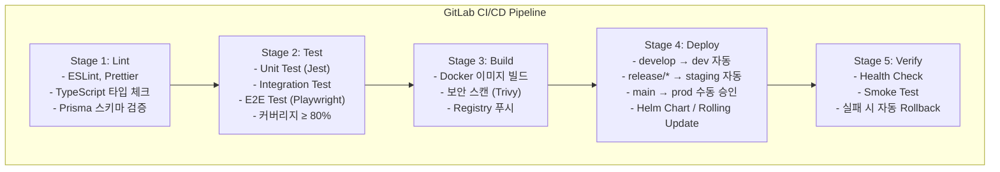

### 8.4 환경 구성

| 환경 | 목적 | 브랜치 | 배포 방식 | 인프라 규모 |
|------|------|--------|-----------|------------|
| **dev** | 개발/통합 테스트 | develop | 자동 | 최소 (Pod 각 1개) |
| **staging** | QA/UAT | release/* | 자동 | 운영 동일 |
| **production** | 운영 | main | 수동 승인 | 확장 가능 (HPA) |

### 8.5 모니터링 및 알림

| 모니터링 대상 | 도구 | 알림 조건 |
|-------------|------|-----------|
| 서버 리소스 (CPU, Memory, Disk) | Prometheus + Grafana | CPU > 80%, Memory > 85% |
| 애플리케이션 에러율 | Prometheus + Grafana | 5xx 에러율 > 1% |
| API 응답 시간 | Prometheus + Grafana | P95 > 2초 |
| 데이터베이스 커넥션 | Prometheus (pg_exporter) | Active Connection > 80% |
| Redis 메모리 | Prometheus (redis_exporter) | Memory Usage > 80% |
| 비즈니스 메트릭 | Grafana Dashboard | 일일 신청 건수, 검토 대기 건수, API Key 발급 현황 |
| 로그 이상 탐지 | Elasticsearch + Kibana | ERROR 로그 급증, 비정상 접근 패턴 |
| 인증서 만료 | Prometheus | 만료 30일 전 |

---

## 9. API 설계

### 9.1 API 설계 원칙

| 원칙 | 적용 |
|------|------|
| **RESTful 설계** | 리소스 중심 URL, HTTP 메서드 활용, 적절한 상태 코드 |
| **버전 관리** | URL Path 방식 (`/api/v1/...`) |
| **일관된 응답 형식** | 모든 API 응답을 `ApiResponse<T>` 래퍼로 통일 |
| **페이지네이션** | Cursor 기반 (목록 조회), Offset 기반 (관리자 페이지) |
| **에러 처리** | RFC 7807 Problem Details 형식 |
| **문서화** | Swagger/OpenAPI 3.0 자동 생성 |

### 9.2 공통 응답 형식

```json
// 성공 응답
{
  "success": true,
  "data": { ... },
  "meta": {
    "timestamp": "2026-02-11T09:00:00Z",
    "requestId": "req-uuid-xxx"
  }
}

// 목록 조회 응답
{
  "success": true,
  "data": [ ... ],
  "pagination": {
    "page": 1,
    "limit": 20,
    "totalCount": 150,
    "totalPages": 8
  },
  "meta": {
    "timestamp": "2026-02-11T09:00:00Z",
    "requestId": "req-uuid-xxx"
  }
}

// 에러 응답
{
  "success": false,
  "error": {
    "code": "VALIDATION_ERROR",
    "message": "입력값이 올바르지 않습니다.",
    "details": [
      {
        "field": "purpose",
        "message": "사용 목적은 필수 입력 항목입니다."
      }
    ]
  },
  "meta": {
    "timestamp": "2026-02-11T09:00:00Z",
    "requestId": "req-uuid-xxx"
  }
}
```

### 9.3 주요 API 엔드포인트

#### 9.3.1 인증 API

| Method | Endpoint | 설명 | 인증 |
|--------|----------|------|------|
| POST | `/api/v1/auth/saml/login` | SAML SSO 로그인 | - |
| POST | `/api/v1/auth/saml/callback` | SAML 콜백 처리 | - |
| POST | `/api/v1/auth/refresh` | Access Token 갱신 | Refresh Token |
| POST | `/api/v1/auth/logout` | 로그아웃 | JWT |
| GET | `/api/v1/auth/me` | 현재 사용자 정보 | JWT |

#### 9.3.2 신청 API

| Method | Endpoint | 설명 | 권한 |
|--------|----------|------|------|
| POST | `/api/v1/applications` | 신청서 생성 (임시저장) | USER |
| GET | `/api/v1/applications` | 신청 목록 조회 | USER (본인), ADMIN (전체) |
| GET | `/api/v1/applications/:id` | 신청 상세 조회 | USER (본인), REVIEWER (배정건) |
| PUT | `/api/v1/applications/:id` | 신청서 수정 | USER (본인, DRAFT/REVISION_REQUESTED) |
| POST | `/api/v1/applications/:id/submit` | 신청서 제출 | USER (본인) |
| POST | `/api/v1/applications/:id/cancel` | 신청 취소 | USER (본인), ADMIN |
| POST | `/api/v1/applications/:id/resubmit` | 수정 후 재제출 | USER (본인) |
| GET | `/api/v1/applications/:id/timeline` | 신청 진행 타임라인 | USER (본인), REVIEWER, ADMIN |

**신청서 생성 요청/응답 예시:**

```json
// POST /api/v1/applications
// Request Body
{
  "aiToolId": "uuid-claude-code",
  "environmentId": "uuid-vdi",
  "purpose": "신규 프로젝트 코드 개발 생산성 향상을 위한 AI 코딩 어시스턴트 활용",
  "expectedDuration": "6개월",
  "projectIds": [
    "uuid-project-1",
    "uuid-project-2"
  ]
}

// Response (201 Created)
{
  "success": true,
  "data": {
    "id": "uuid-app-001",
    "applicationNo": "APP-20260211-001",
    "status": "DRAFT",
    "aiTool": {
      "id": "uuid-claude-code",
      "name": "Claude Code"
    },
    "environment": {
      "id": "uuid-vdi",
      "name": "VDI"
    },
    "purpose": "신규 프로젝트 코드 개발 생산성 향상을 위한 AI 코딩 어시스턴트 활용",
    "expectedDuration": "6개월",
    "projects": [
      { "id": "uuid-project-1", "name": "차세대 시스템 구축", "code": "PRJ-2026-001" },
      { "id": "uuid-project-2", "name": "모바일 앱 개발", "code": "PRJ-2026-002" }
    ],
    "createdAt": "2026-02-11T09:00:00Z"
  },
  "meta": {
    "timestamp": "2026-02-11T09:00:00Z",
    "requestId": "req-uuid-xxx"
  }
}
```

#### 9.3.3 프로젝트 API

| Method | Endpoint | 설명 | 권한 |
|--------|----------|------|------|
| POST | `/api/v1/projects` | 프로젝트 등록 | USER |
| GET | `/api/v1/projects` | 프로젝트 목록 조회 | USER |
| GET | `/api/v1/projects/:id` | 프로젝트 상세 조회 | USER |
| PUT | `/api/v1/projects/:id` | 프로젝트 수정 | USER (등록자) |
| GET | `/api/v1/projects/search` | 프로젝트 검색 | USER |

#### 9.3.4 검토 API

| Method | Endpoint | 설명 | 권한 |
|--------|----------|------|------|
| GET | `/api/v1/reviews` | 배정된 검토 목록 | REVIEWER |
| GET | `/api/v1/reviews/:workflowId` | 워크플로우 상세 | REVIEWER, ADMIN |
| GET | `/api/v1/reviews/:workflowId/stages` | 검토 단계 목록 | REVIEWER, ADMIN |
| POST | `/api/v1/reviews/:workflowId/stages/:stageId/feedback` | 피드백 제출 | REVIEWER (배정자) |
| GET | `/api/v1/reviews/:workflowId/feedbacks` | 피드백 이력 조회 | USER (신청자), REVIEWER, ADMIN |

**피드백 제출 요청/응답 예시:**

```json
// POST /api/v1/reviews/:workflowId/stages/:stageId/feedback
// Request Body
{
  "action": "REQUEST_REVISION",
  "content": "보안 서약서의 3항 관련 추가 설명이 필요합니다. 프로젝트 코드에 대한 AI 도구 사용 범위를 구체적으로 명시해주세요."
}

// Response (201 Created)
{
  "success": true,
  "data": {
    "id": "uuid-feedback-001",
    "stageId": "uuid-stage-002",
    "reviewerId": "uuid-reviewer-001",
    "action": "REQUEST_REVISION",
    "content": "보안 서약서의 3항 관련 추가 설명이 필요합니다...",
    "createdAt": "2026-02-11T10:30:00Z",
    "stage": {
      "status": "REVISION_REQUESTED"
    },
    "application": {
      "status": "REVISION_REQUESTED"
    }
  },
  "meta": {
    "timestamp": "2026-02-11T10:30:00Z",
    "requestId": "req-uuid-xxx"
  }
}
```

#### 9.3.5 API Key 관리 API

| Method | Endpoint | 설명 | 권한 |
|--------|----------|------|------|
| GET | `/api/v1/api-keys` | 내 API Key 목록 | USER |
| GET | `/api/v1/api-keys/:id` | API Key 상세 (마스킹) | USER (본인) |
| POST | `/api/v1/api-keys/:id/reset` | API Key 리셋 | USER (본인) |
| POST | `/api/v1/api-keys/:id/revoke` | API Key 폐기 | USER (본인), ADMIN |
| GET | `/api/v1/api-keys/:id/usage` | API Key 사용량 조회 | USER (본인), ADMIN |

**API Key 리셋 응답 예시:**

```json
// POST /api/v1/api-keys/:id/reset
// Response (200 OK)
{
  "success": true,
  "data": {
    "id": "uuid-key-001",
    "keyPrefix": "sk-codeh",
    "rawKey": "sk-codehub-a1b2c3d4e5f6g7h8i9j0k1l2m3n4o5p6",
    "status": "ACTIVE",
    "issuedAt": "2026-02-11T11:00:00Z",
    "expiresAt": "2026-08-11T11:00:00Z",
    "resetCount": 2,
    "warning": "이 키는 이 화면에서만 확인 가능합니다. 안전한 곳에 보관하세요."
  },
  "meta": {
    "timestamp": "2026-02-11T11:00:00Z",
    "requestId": "req-uuid-xxx"
  }
}
```

#### 9.3.6 모니터링 API

| Method | Endpoint | 설명 | 권한 |
|--------|----------|------|------|
| GET | `/api/v1/monitoring/licenses` | 라이센스 현황 | ADMIN |
| GET | `/api/v1/monitoring/licenses/summary` | 라이센스 요약 통계 | ADMIN |
| GET | `/api/v1/monitoring/usage` | 전체 사용량 현황 | ADMIN |
| GET | `/api/v1/monitoring/usage/by-user` | 사용자별 사용량 | ADMIN |
| GET | `/api/v1/monitoring/usage/by-tool` | 도구별 사용량 | ADMIN |
| GET | `/api/v1/monitoring/usage/by-department` | 부서별 사용량 | ADMIN |
| GET | `/api/v1/monitoring/costs` | 비용 현황 | ADMIN |
| GET | `/api/v1/monitoring/costs/forecast` | 비용 예측 | ADMIN |
| GET | `/api/v1/monitoring/dashboard` | 대시보드 통합 데이터 | ADMIN |
| GET | `/api/v1/monitoring/my-usage` | 내 사용량 조회 | USER |

**대시보드 응답 예시:**

```json
// GET /api/v1/monitoring/dashboard
// Response
{
  "success": true,
  "data": {
    "overview": {
      "totalApplications": 245,
      "pendingReviews": 12,
      "activeLicenses": 180,
      "activeApiKeys": 175
    },
    "applicationsByStatus": {
      "DRAFT": 8,
      "SUBMITTED": 5,
      "IN_REVIEW": 12,
      "REVISION_REQUESTED": 3,
      "APPROVED": 210,
      "REJECTED": 7
    },
    "licensesByTool": [
      { "toolName": "Claude Code", "active": 120, "total": 130 },
      { "toolName": "Antigravity", "active": 60, "total": 65 }
    ],
    "monthlyCost": {
      "currentMonth": 15420.50,
      "previousMonth": 12380.00,
      "changePercent": 24.56
    },
    "topUsers": [
      { "userName": "홍길동", "department": "개발1팀", "totalTokens": 1250000, "cost": 125.00 }
    ]
  },
  "meta": {
    "timestamp": "2026-02-11T09:00:00Z",
    "requestId": "req-uuid-xxx"
  }
}
```

#### 9.3.7 알림 API

| Method | Endpoint | 설명 | 권한 |
|--------|----------|------|------|
| GET | `/api/v1/notifications` | 알림 목록 | USER |
| GET | `/api/v1/notifications/unread-count` | 미읽음 알림 수 | USER |
| PUT | `/api/v1/notifications/:id/read` | 알림 읽음 처리 | USER |
| PUT | `/api/v1/notifications/read-all` | 전체 읽음 처리 | USER |

#### 9.3.8 첨부파일 API

| Method | Endpoint | 설명 | 권한 |
|--------|----------|------|------|
| POST | `/api/v1/attachments/upload` | 파일 업로드 | USER |
| GET | `/api/v1/attachments/:id/download` | 파일 다운로드 | USER (관련자) |
| DELETE | `/api/v1/attachments/:id` | 파일 삭제 | USER (업로더) |

#### 9.3.9 관리자 API

| Method | Endpoint | 설명 | 권한 |
|--------|----------|------|------|
| GET | `/api/v1/admin/users` | 사용자 목록 | ADMIN |
| PUT | `/api/v1/admin/users/:id/role` | 사용자 역할 변경 | SUPER_ADMIN |
| GET | `/api/v1/admin/ai-tools` | AI 도구 목록 | ADMIN |
| POST | `/api/v1/admin/ai-tools` | AI 도구 등록 | ADMIN |
| PUT | `/api/v1/admin/ai-tools/:id` | AI 도구 수정 | ADMIN |
| GET | `/api/v1/admin/environments` | 환경 목록 | ADMIN |
| POST | `/api/v1/admin/environments` | 환경 등록 | ADMIN |
| GET | `/api/v1/admin/audit-logs` | 감사 로그 조회 | ADMIN |
| GET | `/api/v1/admin/settings` | 시스템 설정 조회 | SUPER_ADMIN |
| PUT | `/api/v1/admin/settings` | 시스템 설정 변경 | SUPER_ADMIN |

### 9.4 WebSocket 이벤트 (실시간 알림)

| 이벤트 | 방향 | 설명 |
|--------|------|------|
| `notification:new` | Server -> Client | 새 알림 수신 |
| `application:status-changed` | Server -> Client | 신청 상태 변경 |
| `review:assigned` | Server -> Client | 검토 배정 알림 |
| `notification:read` | Client -> Server | 알림 읽음 처리 |

---

## 부록

### A. 용어 정의

| 용어 | 정의 |
|------|------|
| AI 코딩도구 | Claude Code, Antigravity 등 코드 작성을 보조하는 AI 도구 |
| 신청서(Application) | 임직원이 AI 도구 사용을 요청하는 문서 |
| 검토 워크플로우 | 신청서에 대한 다단계 검토/승인 절차 |
| API Key | AI 도구 접근을 위한 인증 키 |
| 라이센스 | AI 도구 사용 권한 및 사용량 제한 정보 |
| 보안 서약 | AI 도구 사용 시 준수 사항에 대한 서약 |

### B. 참고 문서

| 문서 | 설명 |
|------|------|
| 01_기획안.md | 프로젝트 기획안 |
| 02_요구사항_정의서.md | 기능/비기능 요구사항 |
| 04_UI_UX_설계서.md | 화면 설계 및 사용자 경험 |

---

> **문서 이력**
>
> | 버전 | 일자 | 작성자 | 변경 내용 |
> |------|------|--------|-----------|
> | v1.0 | 2026-02-11 | 시스템 아키텍처팀 | 초안 작성 |
