# UI/UX 설계서

## CodeHub AI Tool Manager - 외부 AI 코딩도구 도입 신청 웹서비스

| 항목 | 내용 |
|------|------|
| 문서명 | UI/UX 설계서 |
| 버전 | 2.1 |
| 작성일 | 2026-02-13 |
| 프로젝트명 | CodeHub AI Tool Manager |

---

## 목차

1. [디자인 원칙 및 가이드라인](#1-디자인-원칙-및-가이드라인)
2. [사용자 페르소나](#2-사용자-페르소나)
3. [사용자 플로우](#3-사용자-플로우)
4. [화면 구성 - 공통](#4-화면-구성---공통)
5. [화면 구성 - 신청자](#5-화면-구성---신청자)
6. [화면 구성 - 검토자](#6-화면-구성---검토자)
7. [화면 구성 - 관리자](#7-화면-구성---관리자)
8. [인터랙션 디자인](#8-인터랙션-디자인)
9. [반응형 디자인](#9-반응형-디자인)
10. [재사용 컴포넌트 목록](#10-재사용-컴포넌트-목록)

---

## 1. 디자인 원칙 및 가이드라인

### 1.1 디자인 철학

본 서비스의 디자인은 다음 4가지 핵심 원칙을 따릅니다:

| 원칙 | 설명 |
|------|------|
| **명확성 (Clarity)** | 복잡한 신청/검토 프로세스를 직관적으로 이해할 수 있도록 시각적 계층 구조를 명확히 합니다 |
| **효율성 (Efficiency)** | 최소한의 클릭으로 목표를 달성할 수 있도록 설계합니다. 위자드 패턴으로 단계별 안내를 제공합니다 |
| **일관성 (Consistency)** | 전체 서비스에서 동일한 컴포넌트, 색상, 타이포그래피를 사용하여 학습 비용을 최소화합니다 |
| **접근성 (Accessibility)** | WCAG 2.1 AA 기준을 준수하여 다양한 환경과 사용자를 지원합니다 |

### 1.2 디자인 시스템

#### 색상 팔레트 및 타이포그래피

디자인 시스템은 OKLCH 색상 공간 기반의 CSS 변수로 정의됩니다. Tailwind CSS v4와 shadcn/ui 컴포넌트를 사용합니다.

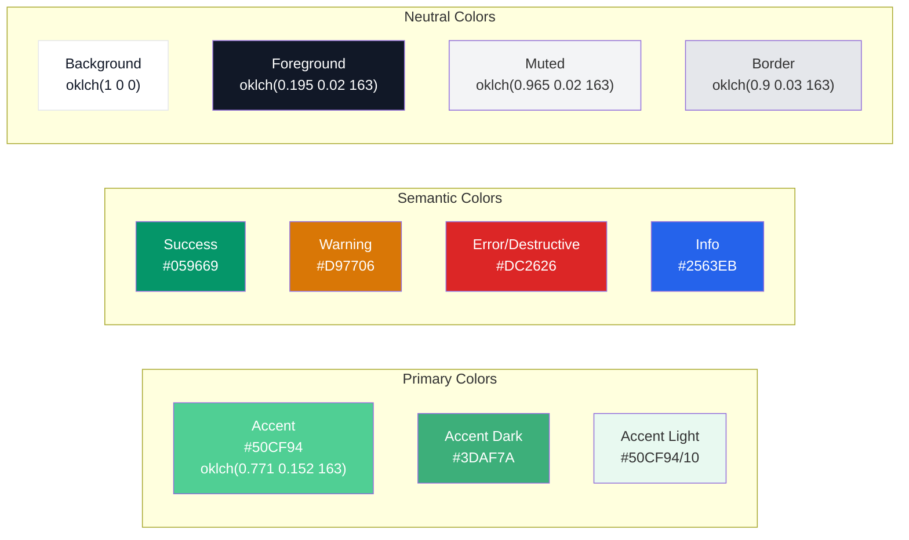

#### 색상 정의 상세

> **참고**: 프로젝트는 Tailwind CSS v4 + OKLCH 기반 CSS 변수를 사용합니다. 아래 HEX 코드는 참조용이며, 실제 구현은 `globals.css`의 OKLCH 변수로 관리됩니다. 테마 Accent Color는 `#50CF94`입니다.

| 용도 | 색상명 | 값 | CSS 변수 | 사용 처 |
|------|--------|-----|----------|---------|
| Primary (Accent) | Green | `#50CF94` | `--primary: oklch(0.771 0.152 163)` | 주요 버튼, 링크, 강조 요소, 사이드바 활성 항목 |
| Primary Light | Accent/10 | `#50CF94/10` | `--accent: oklch(0.93 0.05 163)` | 선택 상태 배경, 사이드바 활성 배경 |
| Secondary | Yellow-ish | - | `--secondary: oklch(0.999 0.012 105)` | 보조 버튼, 태그 |
| Success | Emerald 600 | `#059669` | 직접 사용 | 승인, 완료 상태, 성공 알림 |
| Warning | Amber 600 | `#D97706` | 직접 사용 | 주의 상태, 경고 알림 |
| Error | Red 600 | `#DC2626` | `--destructive` | 반려, 에러 상태, 필수 표시 |
| Info | Blue 600 | `#2563EB` | 직접 사용 | 정보 알림, 도움말 |
| Background | White | `#FFFFFF` | `--background: oklch(1 0 0)` | 페이지 배경 |
| Surface | White | `#FFFFFF` | `--card: oklch(1 0 0)` | 카드, 모달 배경 |
| Text Primary | Gray 900 | `#111827` | `--foreground: oklch(0.195 0.02 163)` | 본문 텍스트 |
| Text Secondary | Gray 500 | `#6B7280` | `--muted-foreground` | 보조 텍스트, 플레이스홀더 |
| Border | Gray 200 | `#E5E7EB` | `--border: oklch(0.9 0.03 163)` | 구분선, 카드 보더 |

#### 타이포그래피 체계

| 레벨 | 크기 | 굵기 | 행간 | 용도 |
|------|------|------|------|------|
| Display | 36px | Bold (700) | 1.2 | 페이지 메인 타이틀 |
| Heading 1 | 30px | Bold (700) | 1.3 | 섹션 타이틀 |
| Heading 2 | 24px | SemiBold (600) | 1.3 | 서브 섹션 타이틀 |
| Heading 3 | 20px | SemiBold (600) | 1.4 | 카드 타이틀 |
| Body Large | 18px | Regular (400) | 1.6 | 강조 본문 |
| Body | 16px | Regular (400) | 1.6 | 기본 본문 |
| Body Small | 14px | Regular (400) | 1.5 | 보조 텍스트, 테이블 |
| Caption | 12px | Regular (400) | 1.4 | 라벨, 캡션, 도움말 |

- **한국어 폰트**: Pretendard (Google Fonts)
- **영문/숫자 폰트**: Geist Sans (`--font-geist-sans`)
- **코드 폰트**: Geist Mono (`--font-geist-mono`)

#### 간격 체계 (4px Grid)

| 토큰 | 값 | 용도 |
|------|-----|------|
| spacing-1 | 4px | 아이콘-텍스트 간격 |
| spacing-2 | 8px | 관련 요소 간 간격 |
| spacing-3 | 12px | 폼 요소 내부 패딩 |
| spacing-4 | 16px | 카드 내부 패딩, 리스트 항목 간격 |
| spacing-6 | 24px | 섹션 내 그룹 간격 |
| spacing-8 | 32px | 섹션 간 간격 |
| spacing-12 | 48px | 대형 섹션 간격 |
| spacing-16 | 64px | 페이지 상하 패딩 |

#### 그림자 (Elevation)

| 레벨 | 값 | 용도 |
|------|-----|------|
| shadow-sm | `0 1px 2px rgba(0,0,0,0.05)` | 버튼, 인풋 |
| shadow-md | `0 4px 6px rgba(0,0,0,0.07)` | 카드, 드롭다운 |
| shadow-lg | `0 10px 15px rgba(0,0,0,0.1)` | 모달, 팝오버 |
| shadow-xl | `0 20px 25px rgba(0,0,0,0.15)` | 다이얼로그 |

#### 보더 라운딩

| 토큰 | 값 | CSS 변수 | 용도 |
|------|-----|----------|------|
| rounded-sm | `calc(var(--radius) - 4px)` | `--radius-sm` | 뱃지, 태그 |
| rounded-md | `calc(var(--radius) - 2px)` | `--radius-md` | 버튼, 인풋 |
| rounded-lg | `var(--radius)` (0.625rem) | `--radius-lg` | 카드 |
| rounded-xl | `calc(var(--radius) + 4px)` | `--radius-xl` | 모달, 대형 카드 |
| rounded-full | 9999px | - | 아바타, 원형 버튼 |

---

## 2. 사용자 페르소나

### 2.1 페르소나 A: 김개발 (신청자 - 백엔드 개발자)

| 항목 | 내용 |
|------|------|
| **이름** | 김개발 |
| **직책** | 백엔드 개발자 (4년차) |
| **나이** | 29세 |
| **부서** | 플랫폼개발팀 |
| **기술 수준** | 상 (웹 서비스에 매우 익숙) |

**목표:**
- Claude Code를 활용하여 코드 리뷰, 리팩토링, 테스트 코드 작성 생산성을 높이고 싶음
- 신청 프로세스를 빠르게 완료하고 바로 도구를 사용하고 싶음
- 현재 2개 프로젝트를 동시에 수행 중이며, 두 프로젝트 모두에서 AI 도구를 활용하고 싶음

**불만사항:**
- 기존의 사내 도구 신청이 이메일과 결재 시스템으로 분산되어 있어 번거로움
- 신청 후 현재 어느 단계인지 알 수 없어 답답함
- 반려 시 무엇을 수정해야 하는지 명확하지 않음

**사용 시나리오:**
> 김개발은 점심시간에 Claude Code와 Antigravity 두 가지 도구 사용 신청을 시작합니다. VDI 환경에서 사용할 예정이며, 현재 수행 중인 '결제 시스템 리뉴얼'과 '내부 API 게이트웨이' 두 프로젝트 정보를 등록합니다. 프로젝트 제안서를 첨부하고 보안 서약에 서명한 뒤 제출합니다. 다음날 보안 검토에서 보완 요청이 와서 추가 설명을 작성하여 재제출하고, 이후 승인되어 API Key를 발급받습니다.

### 2.2 페르소나 B: 이팀장 (검토자 - 개발팀 팀장)

| 항목 | 내용 |
|------|------|
| **이름** | 이팀장 |
| **직책** | 개발팀 팀장 (12년차) |
| **나이** | 38세 |
| **부서** | 플랫폼개발팀 |
| **기술 수준** | 중상 (관리 업무 위주) |

**목표:**
- 팀원들의 AI 도구 신청을 신속하게 검토/승인하고 싶음
- 팀 전체의 AI 도구 사용 현황을 파악하고 싶음
- 비용 효율적으로 팀 리소스를 관리하고 싶음

**불만사항:**
- 검토해야 할 건들이 쌓이면 놓치기 쉬움
- 각 신청의 적절성을 판단할 근거 자료를 찾기 어려움
- 검토 완료 후 다음 단계 진행 상황을 알기 어려움

**사용 시나리오:**
> 이팀장은 아침에 출근하여 검토 대시보드를 확인합니다. 새로운 신청 3건이 대기 중입니다. 각 신청의 프로젝트 정보와 사용 목적을 확인하고, 적절하다고 판단되는 2건은 승인하고, 1건은 프로젝트 설명이 부족하여 보완 요청 피드백을 작성합니다.

### 2.3 페르소나 C: 박보안 (보안 검토자)

| 항목 | 내용 |
|------|------|
| **이름** | 박보안 |
| **직책** | 정보보안팀 담당자 (7년차) |
| **나이** | 35세 |
| **부서** | 정보보안팀 |
| **기술 수준** | 중 (보안 관련 시스템에 익숙) |

**목표:**
- 외부 AI 도구 사용이 보안 정책을 준수하는지 확인하고 싶음
- 보안 서약 이행 여부를 추적하고 싶음
- 민감 데이터 유출 위험이 있는 프로젝트를 식별하고 싶음

**불만사항:**
- 보안 관점에서 필요한 정보가 신청서에 누락되는 경우가 많음
- 보안 서약 관리가 수동으로 이루어져 비효율적임
- 보안 사고 발생 시 추적이 어려움

**사용 시나리오:**
> 박보안은 보안 검토 대기 목록에서 팀장 승인이 완료된 신청을 검토합니다. 보안 서약 서명 여부를 확인하고, 프로젝트의 보안 등급과 첨부 문서를 검토하여 외부 AI 도구에 민감 정보가 전송될 위험이 없는지 판단합니다.

### 2.4 페르소나 D: 최관리 (시스템 관리자)

| 항목 | 내용 |
|------|------|
| **이름** | 최관리 |
| **직책** | IT인프라팀 관리자 (15년차) |
| **나이** | 42세 |
| **부서** | IT인프라팀 |
| **기술 수준** | 상 (시스템 관리 전문) |

**목표:**
- 전사 AI 도구 라이센스와 비용을 효율적으로 관리하고 싶음
- 이상 사용 패턴을 조기에 탐지하고 싶음
- 경영진에게 AI 도구 도입 효과를 데이터로 보고하고 싶음

**불만사항:**
- 여러 AI 도구의 라이센스를 일괄 관리하기 어려움
- 사용량 데이터가 각 도구 공급사에 분산되어 있어 통합 조회가 불가능
- 예산 초과를 사전에 예방하기 어려움

**사용 시나리오:**
> 최관리는 월초에 관리자 대시보드에서 전월 AI 도구 사용 현황을 확인합니다. 부서별 사용량, 비용, 활성 라이센스 수를 분석하고, 사용률이 낮은 부서에 리소스 재배분을 검토합니다. 월간 리포트를 PDF로 다운로드하여 경영진에게 보고합니다.

---

## 3. 사용자 플로우

### 3.1 신청자 플로우

신청자의 전체 사용 흐름을 나타냅니다. 로그인부터 API Key 수령까지의 전 과정을 포함합니다.

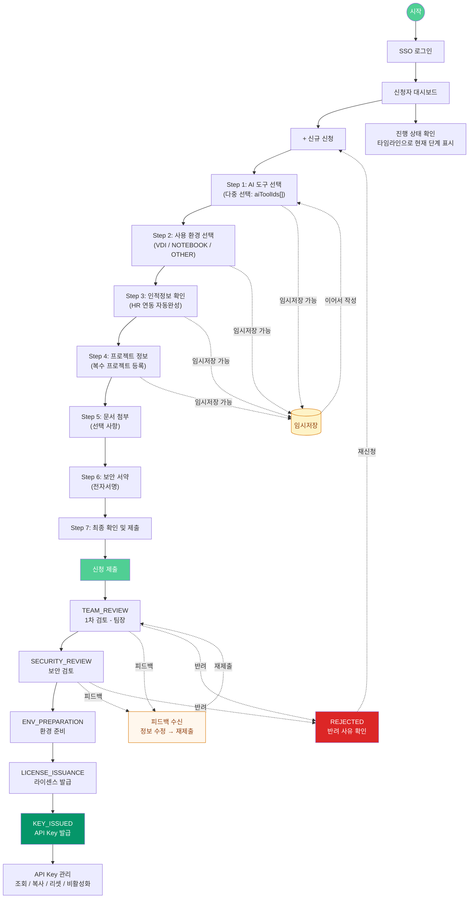

**주요 분기점:**
- 임시저장 후 나중에 이어서 작성 가능 (Zustand persist로 클라이언트 저장)
- 각 검토 단계에서 피드백 수신 시 해당 정보 수정 후 재제출
- 반려 시 사유 확인 후 재신청 또는 취소 선택
- 다중 AI 도구 선택 가능 (`aiToolIds: string[]`)

### 3.2 검토자 플로우

검토자(TEAM_LEAD, SECURITY_REVIEWER)의 사용 흐름입니다.

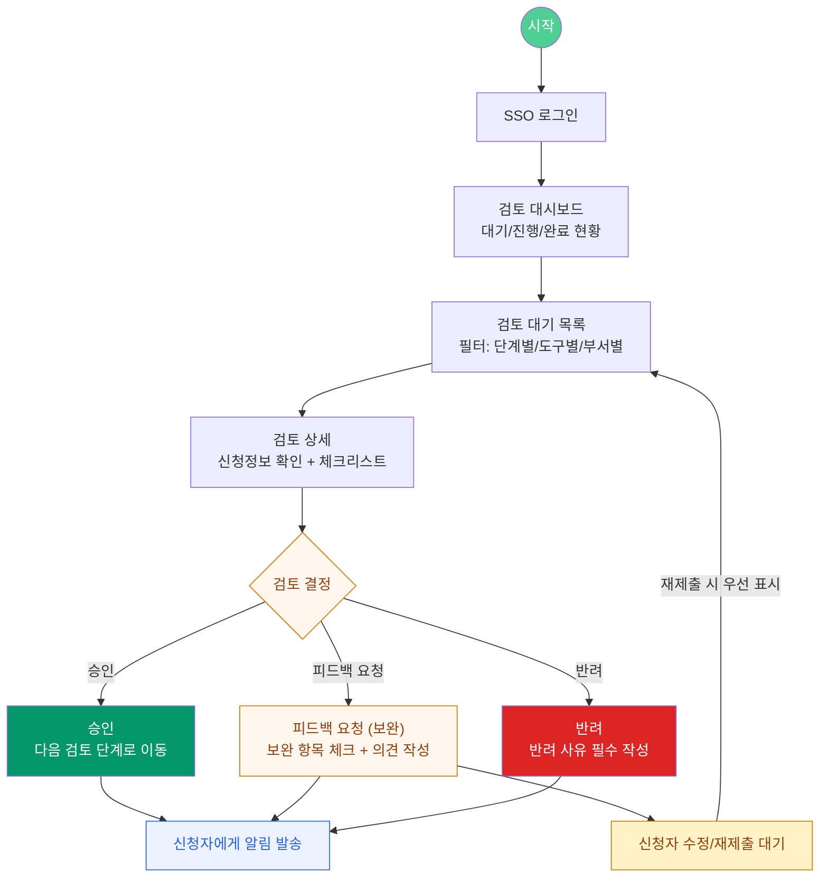

**주요 분기점:**
- 검토 결과: 승인 / 피드백(보완 요청) / 반려 3가지 선택
- 피드백 시 구체적 보완 사항 기재 필수
- 재제출된 건은 우선 표시
- SLA 상태: `NORMAL` / `WARNING` / `OVERDUE`

### 3.3 관리자 플로우

시스템 관리자(`SYSTEM_ADMIN`)의 사용 흐름입니다. `IT_ADMIN`은 ENV_PREPARATION 검토 + 환경 관리(VDI/Notebook)만 담당합니다. `LICENSE_MANAGER`는 LICENSE_ISSUANCE 검토 + 라이센스/API Key 관리를 담당합니다.

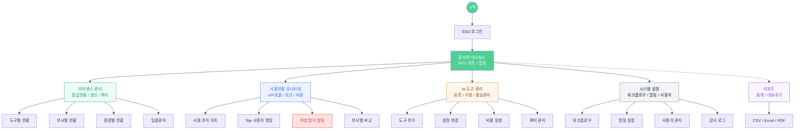

**주요 기능 영역:**
- 대시보드: 전사 현황 한눈에 파악
- 라이센스/API Key: 발급, 리셋, 해지 등 직접 관리
- 모니터링: 사용량, 비용, 이상 탐지
- 설정: 도구 관리, 워크플로우 커스터마이징

---

## 4. 화면 구성 - 공통

### 4.1 레이아웃 구조

전체 레이아웃은 사이드바 + 메인 콘텐츠 영역으로 구성됩니다. 상단에 Header, 하단에 Footer가 고정됩니다. 사이드바는 역할 기반 네비게이션을 제공합니다.

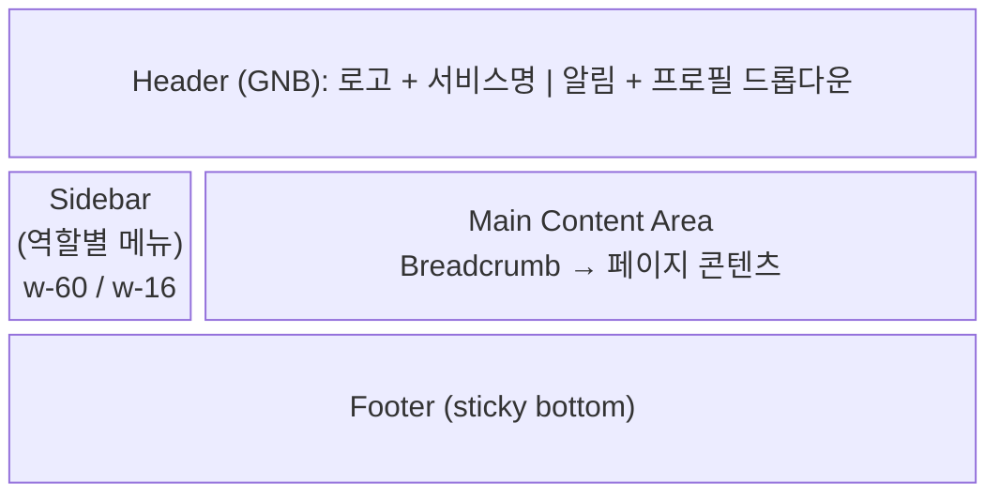

**사이드바 역할별 메뉴 구성** (구현: `components/layout/sidebar.tsx`):

| 역할 | 메뉴 항목 |
|------|-----------|
| **APPLICANT** | 대시보드, 신규 신청, 내 신청, API Key 관리 |
| **TEAM_LEAD** | 대시보드, 검토 목록, 검토 이력 |
| **SECURITY_REVIEWER** | 대시보드, 검토 목록, 검토 이력 |
| **IT_ADMIN** | 대시보드, 검토 목록(ENV_PREPARATION), 검토 이력, 환경 관리(VDI/Notebook 현황+통계) |
| **LICENSE_MANAGER** | 대시보드, 검토 목록(LICENSE_ISSUANCE), 검토 이력, 라이센스 관리, API Key 관리 |
| **SYSTEM_ADMIN** | 대시보드, 전체 신청 현황, 검토 이력, 라이센스 관리, 사용 현황, 비용 관리, 도구 관리, 사용자 관리, 시스템 설정, 감사 로그 |

**Header 구성 요소:**
- **좌측**: 로고(#50CF94 배경 + "C") + 서비스명 ("CodeHub")
- **우측**: 알림 아이콘(미읽음 뱃지) + 사용자 프로필 드롭다운(이름, 역할, 설정, 로그아웃)

### 4.2 로그인 페이지

SSO 연동 로그인 페이지입니다. (구현: `app/(auth)/login/page.tsx`)

```mermaid
block-beta
    columns 3
    space:1 LoginCard["로그인 카드"]:1 space:1

    block:LoginCard:1
        Logo["CodeHub 로고<br/>(#50CF94 배경)"]
        Title["CodeHub AI Tool Manager"]
        Desc["사내 AI 코딩도구 도입 신청 플랫폼"]
        SSOBtn["SSO 로그인 버튼<br/>(사내 통합인증)"]
        Help["도움말 링크<br/>(문의처, 이용 안내)"]
    end
```

**구성 요소:**
- 서비스 로고 및 서비스명
- SSO 로그인 버튼 (사내 통합인증)
- 서비스 간단 소개 텍스트
- 하단 도움말 링크 (문의처, 이용 안내)

---

## 5. 화면 구성 - 신청자

### 5.1 신청자 대시보드

로그인 후 신청자(APPLICANT)가 처음 보게 되는 메인 대시보드입니다. (구현: `components/application/applicant-dashboard.tsx`)

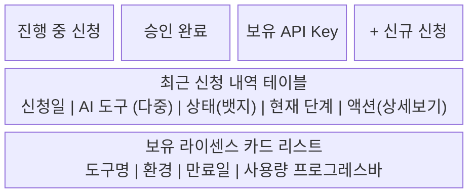

**구성 요소:**
- **상단 요약 카드 (3개)**: 진행 중 신청 수 / 승인 완료 수 / 보유 API Key 수
- **빠른 액션**: [+ 신규 신청] 버튼
- **최근 신청 내역 테이블**: 신청일, AI 도구(다중 표시: `aiToolNames: string[]`), 상태(뱃지), 현재 단계, 액션(상세보기)
- **보유 라이센스 카드 리스트**: 도구명, 환경, 만료일, 사용량 프로그레스바

### 5.2 신규 신청 위자드

7단계 Step-by-Step 위자드로 구성됩니다. (구현: `components/application/application-wizard.tsx`, `stores/application-store.ts`)

상단에 스텝 인디케이터가 표시되며, 하단에 이전/다음/임시저장 버튼이 있습니다. 위자드 상태는 Zustand store에서 관리하며, `zustand/middleware` persist로 브라우저 저장됩니다.

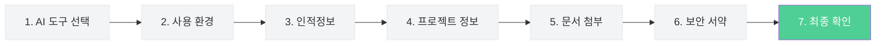

#### Step 1: AI 도구 선택

구현: `components/application/wizard-step1-tool.tsx`

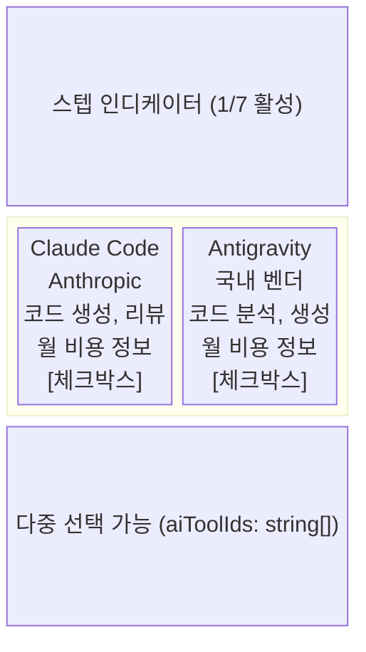

**구성 요소:**
- 스텝 인디케이터 (1/7 활성)
- AI 도구 카드 리스트 (카드당: 도구 아이콘, 이름, 벤더명, 주요 특징 태그, 월 비용 정보)
- **다중 선택 가능** (체크박스 기반, `aiToolIds: string[]`로 관리)
- 기본 도구: Claude Code, Antigravity
- 선택 시 카드 하이라이트 (Accent 보더 #50CF94)
- 도구 상세 정보 펼침 (Accordion)

#### Step 2: 사용 환경 선택

구현: `components/application/wizard-step2-env.tsx`

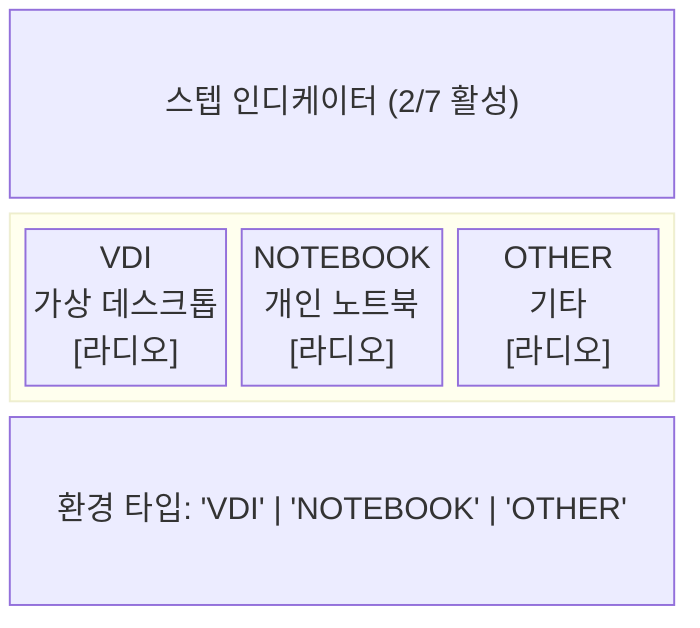

**구성 요소:**
- 스텝 인디케이터 (2/7 활성)
- 환경 카드 (라디오 버튼, `Environment` 타입): VDI (가상 데스크톱), NOTEBOOK (개인 노트북), OTHER (기타)
- 각 환경별 요구사항 안내 텍스트
- "기타" 선택 시 추가 설명 입력 필드 노출

#### Step 3: 인적정보 확인

구현: `components/application/wizard-step3-personal.tsx`

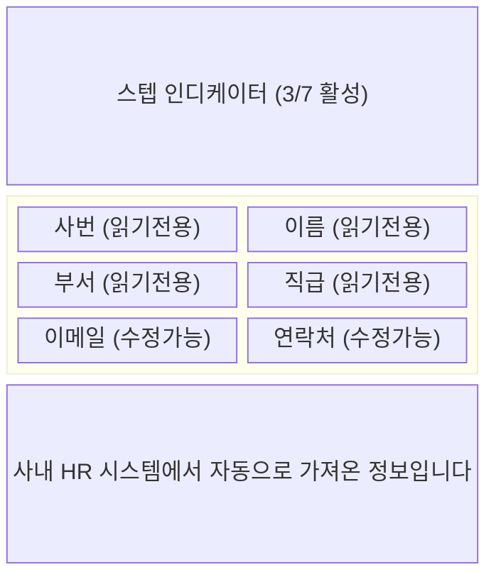

**구성 요소:**
- 스텝 인디케이터 (3/7 활성)
- HR 연동 자동완성된 폼 필드: 사번(읽기전용), 이름(읽기전용), 부서(읽기전용), 직급(읽기전용), 이메일(수정가능), 연락처(수정가능)
- 자동완성 안내 텍스트
- 정보 수정 요청 링크 (HR 시스템으로 이동)

#### Step 4: 프로젝트 정보 입력

구현: `components/application/wizard-step4-project.tsx`

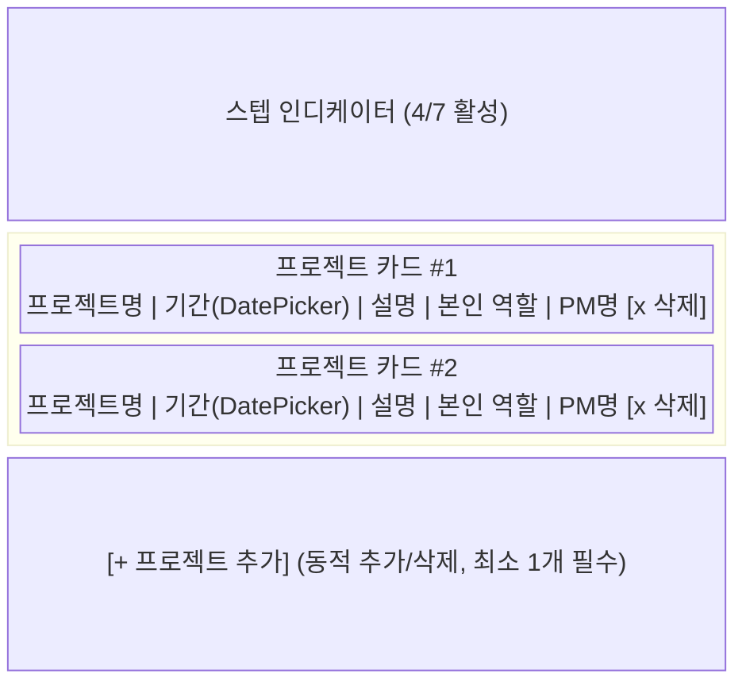

**구성 요소:**
- 스텝 인디케이터 (4/7 활성)
- 프로젝트 카드 리스트 (동적 추가/삭제, `Project[]` 타입)
- 각 프로젝트 카드 필드: 프로젝트명(`name`), 기간(`startDate`~`endDate` DatePicker), 프로젝트 설명(`description`), 본인 역할(`role`), PM명(`pmName`)
- [+ 프로젝트 추가] 버튼
- 프로젝트 카드 우상단 삭제(x) 버튼
- 최소 1개 프로젝트 필수 안내

#### Step 5: 문서 첨부

구현: `components/application/wizard-step5-docs.tsx`

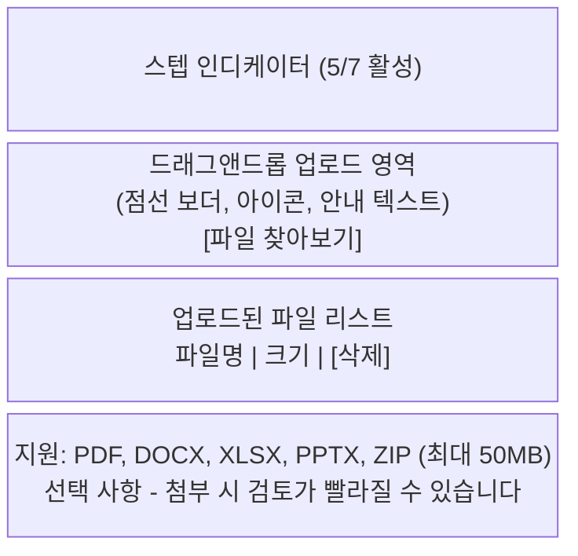

**구성 요소:**
- 스텝 인디케이터 (5/7 활성)
- 드래그앤드롭 업로드 영역 (점선 보더, 아이콘, 안내 텍스트)
- 파일 찾아보기 버튼
- 업로드된 파일 리스트 (파일명, 크기, 삭제 버튼)
- 지원 파일 형식 안내 (PDF, DOCX, XLSX, PPTX, ZIP / 최대 50MB)
- 선택 사항 안내

#### Step 6: 보안 서약

구현: `components/application/wizard-step6-security.tsx`

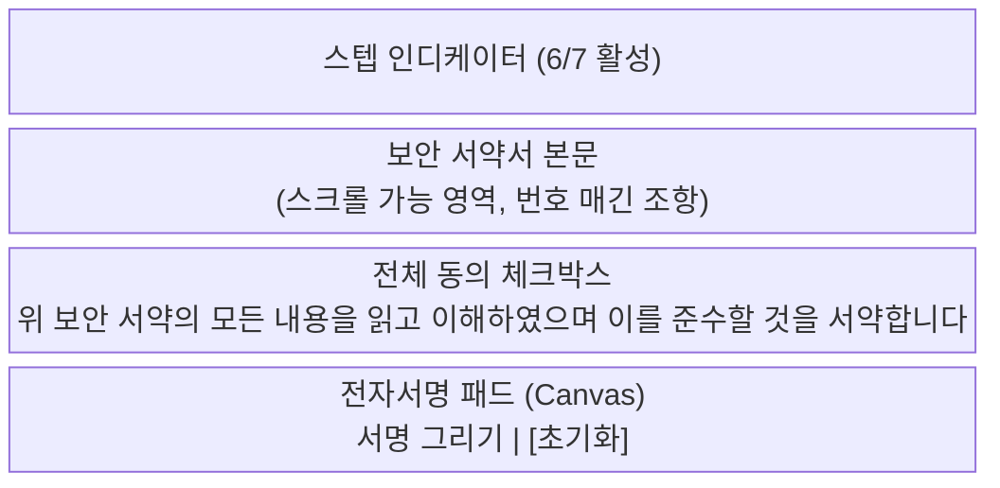

**구성 요소:**
- 스텝 인디케이터 (6/7 활성)
- 보안 서약서 본문 (스크롤 가능 영역, 번호 매긴 조항)
- 전체 동의 체크박스
- 전자서명 패드 (Canvas 영역, 서명 그리기)
- 서명 초기화 버튼
- 서약 동의 및 서명 필수 안내

#### Step 7: 최종 확인 및 제출

구현: `components/application/wizard-step7-confirm.tsx`

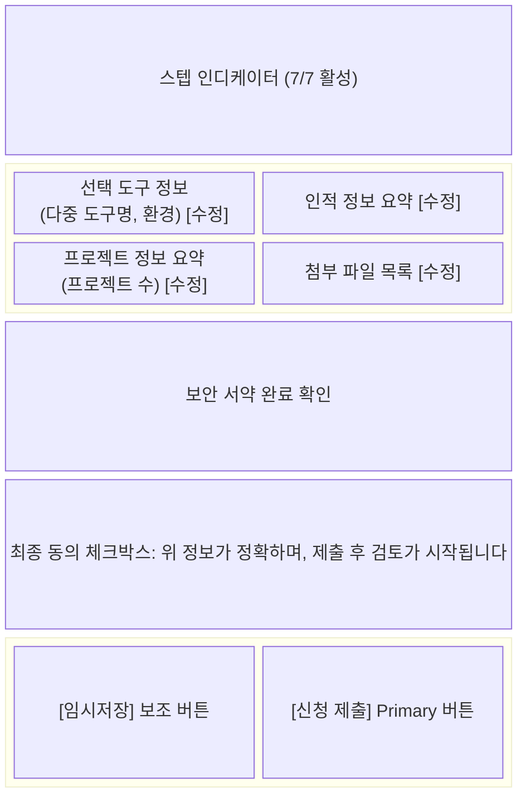

**구성 요소:**
- 스텝 인디케이터 (7/7 활성)
- 입력 정보 요약 카드들:
  - 선택 도구 정보 (다중 도구명: `aiToolNames[]`, 환경) + [수정] 링크
  - 인적 정보 요약 + [수정] 링크
  - 프로젝트 정보 요약 (프로젝트 수) + [수정] 링크
  - 첨부 파일 목록 + [수정] 링크
  - 보안 서약 완료 확인
- 최종 동의 체크박스
- **[신청 제출]** 주요 버튼 (Primary)
- [임시저장] 보조 버튼

### 5.3 신청 상세 / 진행 상태 페이지

신청 건의 상세 정보와 검토 진행 단계를 타임라인으로 표시합니다. (구현: `app/(dashboard)/applications/[id]/page.tsx`)

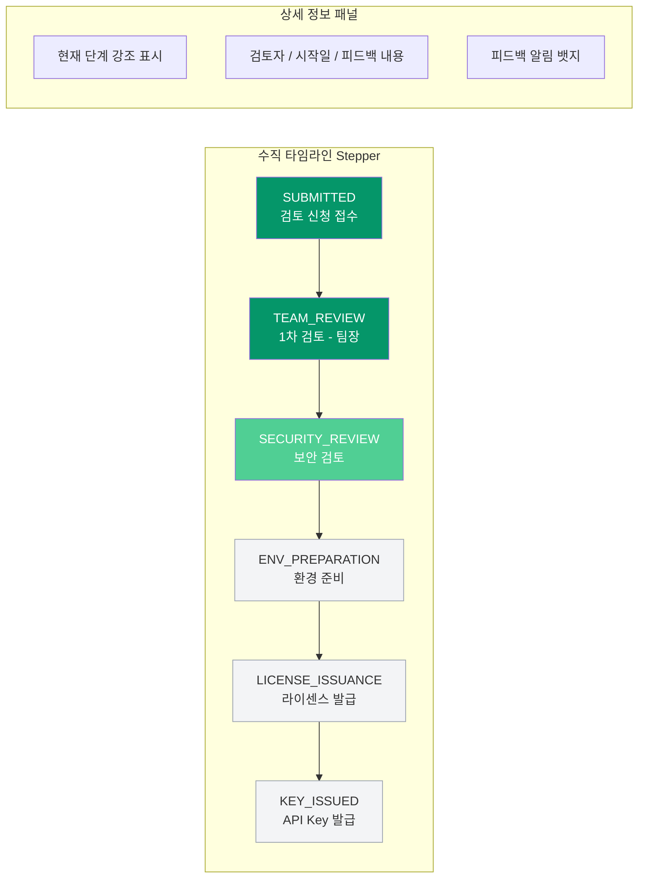

**타임라인 상태 표시:**

| 상태 | 표현 | 색상 |
|------|------|------|
| 완료 | 체크 아이콘 + 날짜 + 검토자명 | Success (#059669) |
| 진행 중 | 점 아이콘 + 펄스 애니메이션 | Primary (#50CF94) |
| 피드백 대기 | 경고 아이콘 | Warning (#D97706) |
| 반려 | X 아이콘 | Error (#DC2626) |
| 대기 | 빈 원 아이콘 | Gray (#9CA3AF) |

### 5.4 피드백 확인 및 수정/재제출 페이지

검토자로부터 피드백을 받았을 때 수정하여 재제출하는 페이지입니다. (구현: `app/(dashboard)/applications/[id]/edit/page.tsx`)

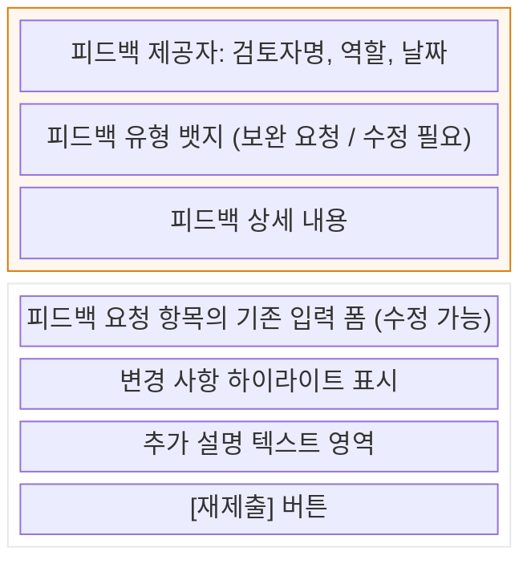

**구성 요소:**
- **피드백 영역** (상단, 경고색 배경 카드):
  - 피드백 제공자 (검토자명, 역할, 날짜)
  - 피드백 유형 뱃지 (보완 요청 / 수정 필요)
  - 피드백 상세 내용
- **수정 영역** (하단):
  - 피드백에서 요청한 항목의 기존 입력 폼 (수정 가능 상태)
  - 변경 사항 하이라이트 표시
  - 추가 설명 텍스트 영역
  - [재제출] 버튼

### 5.5 API Key 관리 페이지

발급된 API Key를 조회하고 관리하는 페이지입니다.

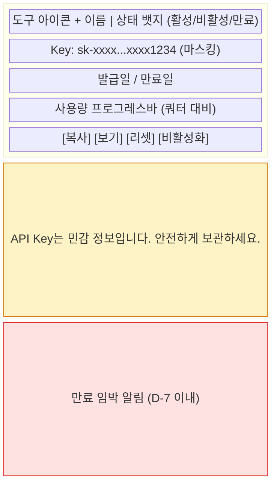

**구성 요소:**
- API Key 카드 리스트:
  - 도구 아이콘 + 이름 (라이센스/API Key는 단일 도구: `aiToolId: string`, `aiToolName: string`)
  - Key 값 (마스킹 표시: `sk-xxxx...xxxx1234`)
  - 상태 뱃지 (`LicenseStatus`: ACTIVE/EXPIRED/REVOKED/SUSPENDED)
  - 발급일 / 만료일
  - 사용량 프로그레스바 (쿼터 대비)
  - 액션 버튼: [복사] [보기(마스킹 해제)] [리셋] [비활성화]
- Key 보안 안내 텍스트
- 만료 임박 알림 (D-7 이내)

---

## 6. 화면 구성 - 검토자

### 6.1 검토자 대시보드

검토자(TEAM_LEAD, SECURITY_REVIEWER)가 로그인 후 보는 대시보드입니다. (구현: `components/review/reviewer-dashboard.tsx`)

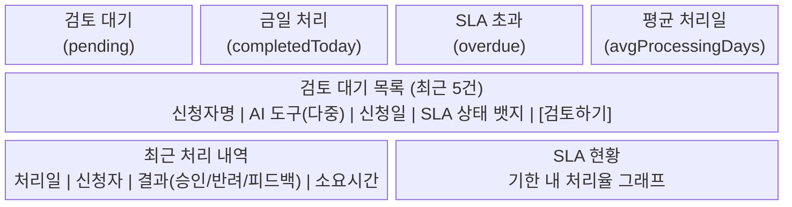

**구성 요소:**
- **요약 카드 (4개)**: 검토 대기(`pending`) / 금일 처리(`completedToday`) / SLA 초과(`overdue`) / 평균 처리일(`avgProcessingDays`) - `ReviewStats` 타입
- **검토 대기 목록 (최근 5건)**: 신청자명, AI 도구(다중: `aiToolNames[]`), 신청일, SLA 상태 뱃지, [검토하기] 버튼
- **최근 처리 내역**: 처리일, 신청자, 결과(APPROVED/REJECTED/FEEDBACK_REQUESTED), 소요시간
- **SLA 현황**: 기한 내 처리율 그래프

### 6.2 검토 대기 목록

검토할 신청 목록을 필터링하고 조회하는 페이지입니다. (구현: `app/(dashboard)/reviews/page.tsx`, `components/review/review-list-filters.tsx`)

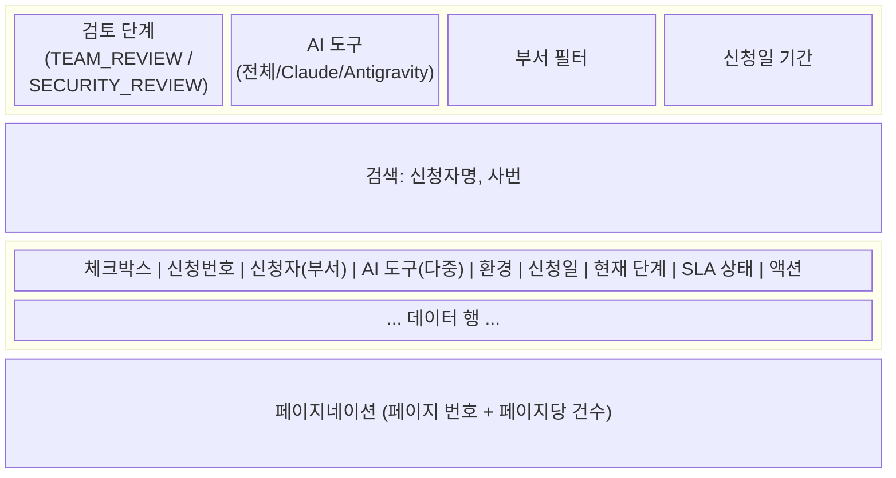

**구성 요소:**
- **필터바**: 검토 단계(`stageName`), AI 도구, 부서, 신청일 기간 - `FilterState` 타입
- **검색바**: 신청자명, 사번 검색
- **정렬**: 신청일순, SLA 마감순
- **테이블 컬럼**: 체크박스, 신청번호, 신청자(부서), AI 도구(`aiToolNames[]`), 환경, 신청일, 현재 단계, SLA 상태(`slaStatus`), 액션
- **SLA 뱃지 색상**: NORMAL(회색), WARNING(주황), OVERDUE(빨강)
- **페이지네이션**: `PaginatedResponse<ReviewListItem>` 기반

### 6.3 검토 상세 페이지

개별 신청 건을 상세 검토하고 피드백을 입력하는 페이지입니다. (구현: `app/(dashboard)/reviews/[id]/page.tsx`)

```mermaid
block-beta
    columns 2

    block:LeftPanel["좌측: 신청 정보"]:1
        columns 1
        BasicInfo["신청 기본 정보<br/>신청번호 | 신청자 | 부서 | 신청일"]
        ToolEnv["선택 도구(다중) 및 환경 정보"]
        Projects["프로젝트 정보 (아코디언)<br/>Project[] 데이터"]
        Docs["첨부 문서 (다운로드)"]
        Security["보안 서약 확인<br/>(서명일, 서명 이미지)"]
        History["이전 검토 이력 타임라인<br/>ReviewStage[] → allStages"]
    end

    block:RightPanel["우측: 검토 액션"]:1
        columns 1
        Comment["검토 의견 작성"]
        Checklist["체크리스트<br/>ReviewChecklistItem[]"]
        Actions["[승인] #059669<br/>[피드백 요청] #D97706<br/>[반려] #DC2626"]
        Modal["검토 완료 확인 모달"]
    end
```

**구성 요소:**
- **좌측 패널 (신청 정보 요약):**
  - 신청 기본 정보 카드 (신청번호, 신청자, 부서, 신청일)
  - 선택 도구(다중: `aiToolNames[]`) 및 환경 정보
  - 프로젝트 정보 (아코디언 - `Project[]`)
  - 첨부 문서 목록 (`Attachment[]`, 다운로드 가능)
  - 보안 서약 확인 (`SecurityAgreement`: 서명일, 서명 이미지 미리보기)
  - 이전 검토 이력 타임라인 (`ReviewStage[]`)
- **우측 패널 (검토 액션):**
  - 검토 의견 작성 텍스트 영역
  - 체크리스트 (`ReviewChecklistItem[]`)
  - **액션 버튼 그룹**:
    - [승인] (`APPROVED`, 초록색)
    - [피드백 요청] (`FEEDBACK_REQUESTED`, 주황색)
    - [반려] (`REJECTED`, 빨간색, 반려 사유 필수)
  - 검토 완료 확인 모달

---

## 7. 화면 구성 - 관리자

### 7.1 관리자 대시보드

전사 AI 도구 현황을 한눈에 파악할 수 있는 대시보드입니다. (구현: `components/monitoring/admin-dashboard.tsx`)

```mermaid
block-beta
    columns 4
    KPI1["총 활성 라이센스<br/>(전월 대비 증감)"]:1
    KPI2["활성 사용자 수<br/>(전월 대비 증감)"]:1
    KPI3["이번 달 총 비용<br/>(예산 대비 비율)"]:1
    KPI4["평균 처리 시간<br/>(SLA 달성율)"]:1

    DonutChart["도구별 라이센스 분포<br/>(도넛 차트)"]:2
    LineChart["월별 사용 추이<br/>(라인 차트, 최근 6개월)"]:2

    ActivityFeed["최근 활동 피드<br/>(신규 신청, 승인, 발급 등)"]:2
    AlertPanel["알림/이슈 패널<br/>(만료 임박, 이상 사용, SLA 초과)"]:2
```

**구성 요소:**
- **KPI 카드 (4개)** (`components/monitoring/kpi-card.tsx`):
  - 총 활성 라이센스 수 (전월 대비 증감)
  - 활성 사용자 수 (전월 대비 증감)
  - 이번 달 총 비용 (예산 대비 비율)
  - 평균 처리 시간 (SLA 달성율)
- **차트 영역 (2개)**:
  - 도구별 라이센스 분포 (도넛 차트)
  - 월별 사용 추이 (라인 차트, `components/monitoring/monthly-trend-chart.tsx`)
- **최근 활동 피드** (신규 신청, 승인, 발급 등)
- **알림/이슈 패널** (`components/monitoring/anomaly-alerts.tsx`: 만료 임박, 이상 사용, SLA 초과)

### 7.2 라이센스 발급 현황

라이센스 발급 및 관리 현황을 조회하는 페이지입니다. (구현: `components/monitoring/license-table.tsx`)

```mermaid
block-beta
    columns 1

    block:Filters:1
        columns 5
        Period["기간"]
        Tool["AI 도구"]
        Dept["부서"]
        Env["환경"]
        Status["상태<br/>(ACTIVE/EXPIRED/<br/>REVOKED/SUSPENDED)"]
    end

    block:Charts:1
        columns 3
        BarChart["도구별 발급 현황<br/>(바 차트)"]
        PieChart["부서별 분포<br/>(파이 차트)"]
        DonutChart["환경별 분포<br/>(도넛 차트)"]
    end

    block:Table:1
        columns 1
        TableContent["라이센스ID | 사용자 | 부서 | 도구(aiToolName) | 환경 | 상태 | 발급일 | 만료일 | 사용량 | 액션"]
    end

    block:Actions:1
        columns 2
        Batch["체크박스 선택 + 일괄 액션(갱신/해지)"]
        Export["내보내기: CSV, Excel, PDF"]
    end
```

**구성 요소:**
- **필터 영역**: 기간, AI 도구, 부서, 환경(`Environment`), 상태(`LicenseStatus`)
- **시각화 영역**:
  - 도구별 발급 현황 (바 차트, `components/monitoring/department-bar-chart.tsx`)
  - 부서별 라이센스 분포 (파이 차트)
  - 환경별 분포 (도넛 차트)
- **상세 테이블**: 라이센스ID, 사용자, 부서, 도구(`aiToolName` - 단일), 환경, 상태, 발급일, 만료일, 사용량, 액션
- **일괄 관리**: 체크박스 선택 + 일괄 액션(갱신/해지)
- **데이터 내보내기**: CSV, Excel, PDF 버튼

### 7.3 사용 현황 모니터링

AI 도구의 실시간 사용 현황을 모니터링하는 페이지입니다. (구현: `app/(dashboard)/monitoring/costs/page.tsx`, `components/monitoring/usage-trend-chart.tsx`)

```mermaid
block-beta
    columns 1

    block:Controls:1
        columns 2
        PeriodFilter["기간: 오늘 / 7일 / 30일 / 사용자 지정"]
        ToolTabs["도구 탭: 전체 / Claude Code / Antigravity"]
    end

    block:KPIs:1
        columns 4
        API["총 API 호출 수"]
        Token["총 토큰 사용량"]
        Cost["총 비용"]
        Users["활성 사용자"]
    end

    TrendChart["사용량 추이 차트 (라인, 일별/주별/월별)"]:1
    TopUsers["Top 사용자 랭킹 테이블 (상위 10명)"]:1
    AnomalyList["이상 사용 탐지 알림 목록 (임계치 초과 건)"]:1
    DeptCompare["부서별 사용 비교 (그룹 바 차트)"]:1
```

**구성 요소:**
- **기간 필터**: 오늘 / 7일 / 30일 / 사용자 지정 기간
- **도구 탭**: 전체 / Claude Code / Antigravity
- **핵심 지표 카드**: 총 API 호출 수 / 총 토큰 사용량 / 총 비용 / 활성 사용자
- **사용량 추이 차트** (라인 차트 - 일별/주별/월별)
- **Top 사용자 랭킹 테이블** (상위 10명)
- **이상 사용 탐지 알림 목록** (임계치 초과 건)
- **부서별 사용 비교** (그룹 바 차트)

### 7.4 AI 도구 관리

시스템에 등록된 AI 도구를 관리하는 페이지입니다. (구현: `app/(dashboard)/admin/tools/page.tsx`)

```mermaid
block-beta
    columns 1

    block:ToolCards:1
        columns 2
        Tool1["Claude Code<br/>Anthropic<br/>상태: 활성<br/>활성 라이센스: N개<br/>월 비용 요약<br/>[설정] [비활성화]"]
        Tool2["Antigravity<br/>국내 벤더<br/>상태: 활성<br/>활성 라이센스: N개<br/>월 비용 요약<br/>[설정] [비활성화]"]
    end

    AddBtn["[+ 새 도구 추가]"]

    block:AddModal:1
        columns 1
        ModalTitle["도구 추가/수정 모달"]
        Fields["도구명 | 벤더 | 설명 | API Endpoint URL<br/>인증 방식 (API_KEY/OAUTH/TOKEN) | 토큰당 비용(tokenCost)<br/>기본 쿼터(defaultQuota) | 활성 여부(isActive) | 아이콘 업로드"]
    end

    style AddModal fill:#F3F4F6,stroke:#E5E7EB
```

**구성 요소:**
- **도구 카드 리스트** (`AiTool` 타입):
  - 도구 아이콘/로고 (`iconUrl`)
  - 도구명(`name`), 벤더명(`vendor`)
  - 상태 뱃지 (`isActive`: 활성/비활성)
  - 활성 라이센스 수
  - 월 비용 요약
  - [설정] [비활성화] 버튼
- **[+ 새 도구 추가]** 버튼
- **도구 추가/수정 모달**:
  - 도구명, 벤더, 설명
  - API Endpoint URL (`apiEndpoint`)
  - 인증 방식 (`authMethod`: API_KEY / OAUTH / TOKEN)
  - 토큰당 비용 (`tokenCost`)
  - 기본 쿼터 설정 (`defaultQuota`)
  - 아이콘 업로드

---

## 8. 인터랙션 디자인

### 8.1 위자드 스텝 네비게이션

| 인터랙션 | 동작 |
|---------|------|
| 스텝 클릭 | 완료된 이전 스텝으로만 이동 가능, 미래 스텝은 비활성 |
| [다음] 클릭 | 현재 스텝 Zod 유효성 검사 → 통과 시 `nextStep()`, 실패 시 에러 표시 |
| [이전] 클릭 | 입력 데이터 유지한 채 `prevStep()` |
| [임시저장] 클릭 | 현재까지 입력 데이터 저장 (Zustand persist), 토스트 알림("임시저장 완료") |
| 브라우저 뒤로가기 | 확인 모달("작성 중인 내용이 있습니다. 이 페이지를 떠나시겠습니까?") |

**Zustand Store 연동** (`stores/application-store.ts`):
- `currentStep`: 1~7 범위
- `formData`: `WizardFormData` (aiToolIds[], environment, purpose, projects[], attachments[], securityAgreementSigned)
- `draftId`: 임시저장 ID
- `nextStep()` / `prevStep()`: 스텝 이동 (min/max 제한)
- `reset()`: 초기화

### 8.2 검토 진행 타임라인 Stepper

```mermaid
flowchart LR
    subgraph "ApplicationStatus 상태 흐름"
        DRAFT --> SUBMITTED
        SUBMITTED --> TEAM_REVIEW
        TEAM_REVIEW --> SECURITY_REVIEW
        SECURITY_REVIEW --> ENV_PREPARATION
        ENV_PREPARATION --> LICENSE_ISSUANCE
        LICENSE_ISSUANCE --> KEY_ISSUED
    end

    TEAM_REVIEW -.->|FEEDBACK_REQUESTED| FEEDBACK_REQUESTED
    SECURITY_REVIEW -.->|FEEDBACK_REQUESTED| FEEDBACK_REQUESTED
    FEEDBACK_REQUESTED -.->|재제출| TEAM_REVIEW

    TEAM_REVIEW -.->|REJECTED| REJECTED
    SECURITY_REVIEW -.->|REJECTED| REJECTED

    style DRAFT fill:#F3F4F6,stroke:#9CA3AF
    style SUBMITTED fill:#F3F4F6,stroke:#9CA3AF
    style TEAM_REVIEW fill:#50CF94,color:#fff
    style SECURITY_REVIEW fill:#50CF94,color:#fff
    style ENV_PREPARATION fill:#50CF94,color:#fff
    style LICENSE_ISSUANCE fill:#50CF94,color:#fff
    style KEY_ISSUED fill:#059669,color:#fff
    style FEEDBACK_REQUESTED fill:#FFF7ED,color:#92400E,stroke:#D97706
    style REJECTED fill:#DC2626,color:#fff
```

| 상태 | 아이콘 | 색상 | 설명 |
|------|--------|------|------|
| 완료 | 체크 | Success (#059669) | 해당 단계 완료, 완료 날짜 표시 |
| 진행 중 | 점 | Primary (#50CF94) | 현재 진행 중인 단계, 펄스 애니메이션 |
| 피드백 대기 | 경고 | Warning (#D97706) | 피드백 수신, 재제출 대기 |
| 반려 | X | Error (#DC2626) | 해당 단계에서 반려 |
| 대기 | 빈 원 | Gray (#9CA3AF) | 아직 도달하지 않은 단계 |

### 8.3 알림 (Toast & Badge)

**토스트 알림:**
| 유형 | 색상 | 아이콘 | 자동 닫힘 | 예시 |
|------|------|--------|----------|------|
| 성공 | #059669 배경 | 체크 | 3초 | "신청이 성공적으로 제출되었습니다" |
| 에러 | #DC2626 배경 | X | 수동 닫기 | "파일 업로드에 실패했습니다" |
| 경고 | #D97706 배경 | 경고 | 5초 | "API Key가 7일 후 만료됩니다" |
| 정보 | #2563EB 배경 | 정보 | 3초 | "임시저장이 완료되었습니다" |

**알림 뱃지:**
- GNB 알림 아이콘에 미읽음 수 표시 (빨간 원, 최대 99+)
- 클릭 시 알림 드롭다운 패널 (최근 10건)
- 각 알림: 아이콘, 제목, 시간, 읽음 여부 표시

### 8.4 데이터 테이블 인터랙션

| 기능 | 동작 |
|------|------|
| 정렬 | 컬럼 헤더 클릭 → 오름차순/내림차순 토글, 현재 정렬 방향 화살표 표시 |
| 필터 | 필터바에서 조건 선택, 적용된 필터는 태그(Chip)로 표시, 개별/전체 해제 가능 |
| 검색 | 실시간 검색 (디바운스 300ms), 검색어 하이라이트 |
| 페이지네이션 | 페이지 번호 + 이전/다음 + 페이지당 건수 선택(10/20/50), `PaginatedResponse` 기반 |
| 행 선택 | 체크박스 클릭으로 개별/전체 선택, 선택 시 일괄 액션 바 노출 |
| 행 클릭 | 상세 페이지로 이동 (또는 사이드 패널 오픈) |

### 8.5 차트 인터랙션

| 기능 | 동작 |
|------|------|
| 호버 | 데이터 포인트 호버 시 툴팁 표시 (수치, 날짜, 비교값) |
| 범례 | 범례 항목 클릭 시 해당 시리즈 토글 (표시/숨김) |
| 기간 선택 | 차트 상단 기간 버튼 (7일/30일/90일/1년) 또는 DatePicker |
| 줌 | 드래그로 특정 구간 확대 가능 |
| 내보내기 | 차트 우상단 ... 메뉴에서 PNG/CSV 다운로드 |

### 8.6 로딩 상태

| 상태 | 표현 |
|------|------|
| 페이지 로딩 | 스켈레톤 UI (카드, 테이블 형태의 회색 애니메이션 박스) |
| 데이터 로딩 | 테이블/차트 영역에 스피너 오버레이 (`components/common/loading-spinner.tsx`) |
| 버튼 로딩 | 버튼 텍스트 → 스피너로 변경, 비활성화 |
| 파일 업로드 | 프로그레스 바 (퍼센트 표시) |

### 8.7 빈 상태 (Empty State)

| 화면 | 안내 메시지 | CTA |
|------|-----------|-----|
| 신청 내역 없음 | "아직 신청 내역이 없습니다" | [신규 신청하기] |
| 검토 대기 없음 | "현재 검토 대기 중인 건이 없습니다" | - |
| 검색 결과 없음 | "검색 조건에 맞는 결과가 없습니다" | [필터 초기화] |
| API Key 없음 | "발급된 API Key가 없습니다" | [신규 신청하기] |

---

## 9. 반응형 디자인

### 9.1 브레이크포인트

Tailwind CSS v4 기본 브레이크포인트를 사용합니다:

| 이름 | 크기 | 대상 디바이스 | 비고 |
|------|------|-------------|------|
| sm | 640px | 모바일 | 최소 지원 |
| md | 768px | 태블릿 세로 | - |
| lg | 1024px | 태블릿 가로 | 사이드바 표시 기준 |
| **xl** | **1280px** | **데스크톱** | **기본 설계 기준** |
| 2xl | 1536px | 대형 모니터 | 최대 너비 제한 |

### 9.2 반응형 전략

**데스크톱 우선 설계** (사내 VDI/Notebook 환경이 주 사용 환경)

| 구성 요소 | 데스크톱 (≥1280px) | 태블릿 (768-1279px) | 모바일 (<768px) |
|---------|-------------------|-------------------|----------------|
| Header | 전체 메뉴 표시 | 주요 메뉴 + 햄버거 | 로고 + 햄버거 |
| Sidebar | 고정 표시 (w-60) | 접이식 (w-16, 아이콘만) | 숨김 (MobileSidebar 드로어) |
| 대시보드 카드 | 4열 그리드 | 2열 그리드 | 1열 스택 |
| 데이터 테이블 | 전체 컬럼 | 주요 컬럼 + 가로스크롤 | 카드형 리스트 |
| 위자드 | 좌우 분할 (스텝바+폼) | 상하 분할 | 상하 분할 (간략) |
| 차트 | 2열 배치 | 1열 배치 | 1열 배치 (축소) |
| 모달 | 중앙 다이얼로그 (600px) | 중앙 다이얼로그 (90%) | 풀스크린 시트 |

---

## 10. 재사용 컴포넌트 목록

> 컴포넌트는 shadcn/ui (Radix + Tailwind) 기반으로 구현되며, `npx shadcn@latest add <component>`로 추가합니다. 커스텀 컴포넌트는 `components/{feature}/` 디렉토리에 위치합니다. className 병합은 `cn()` 유틸리티를 사용합니다.

### 10.1 기본 입력 컴포넌트

| 컴포넌트 | 변형 (Variants) | 상태 (States) | 주요 Props |
|---------|----------------|--------------|-----------|
| **Button** | primary, secondary, outline, ghost, danger | default, hover, active, disabled, loading | size(sm/md/lg), icon, fullWidth |
| **Input** | text, password, email, number, search | default, focus, error, disabled, readonly | label, placeholder, helperText, errorText |
| **Select** | single, multi | default, open, error, disabled | options[], placeholder, searchable |
| **Checkbox** | default, indeterminate | unchecked, checked, disabled | label, description |
| **Radio** | default | unselected, selected, disabled | label, name, value |
| **Textarea** | default, autosize | default, focus, error, disabled | rows, maxLength, counter |
| **DatePicker** | single, range | default, open, error | minDate, maxDate, format |
| **FileUpload** | dropzone, button | idle, dragover, uploading, complete, error | accept, maxSize, multiple |
| **SignaturePad** | default | empty, signed | width, height, onClear |

### 10.2 표시 컴포넌트

| 컴포넌트 | 변형 (Variants) | 상태 (States) | 주요 Props |
|---------|----------------|--------------|-----------|
| **Badge** | filled, outline | default, dot | color(primary/success/warning/error/gray), size |
| **Tag** | filled, outline, closable | default, hover | color, onClose |
| **Avatar** | image, initial, icon | default | size(sm/md/lg/xl), name, src |
| **Tooltip** | top, bottom, left, right | show, hide | content, delay |
| **ProgressBar** | linear, circular | default, indeterminate | value, max, color, showLabel |
| **Skeleton** | text, rect, circle | loading | width, height, animation |

### 10.3 레이아웃 컴포넌트

| 컴포넌트 | 변형 (Variants) | 주요 Props | 구현 파일 |
|---------|----------------|-----------|-----------|
| **Card** | default, outline, elevated, interactive | header, footer, padding | `components/ui/card.tsx` |
| **Modal** | dialog, confirm, form, fullscreen | title, size(sm/md/lg/xl), onClose, footer | `components/ui/dialog.tsx` |
| **Toast** | success, error, warning, info | message, duration, action, position | `components/ui/sonner.tsx` |
| **Sidebar** | fixed, collapsible | items[], collapsed, onToggle | `components/layout/sidebar.tsx` |
| **Header** | default | logo, menuItems[], rightActions[] | `components/layout/header.tsx` |
| **Breadcrumb** | default | items[], separator | `components/layout/breadcrumb.tsx` |
| **Footer** | default (sticky bottom) | - | `components/layout/footer.tsx` |
| **Tabs** | line, card | items[], activeKey, onChange | `components/ui/tabs.tsx` |
| **Accordion** | single, multiple | items[], defaultOpen | `components/ui/accordion.tsx` |

### 10.4 데이터 컴포넌트

| 컴포넌트 | 변형 (Variants) | 주요 Props | 구현 파일 |
|---------|----------------|-----------|-----------|
| **DataTable** | default, striped, compact | columns[], data[], sortable, selectable | `components/common/data-table.tsx` |
| **Pagination** | default, simple | total, pageSize, current, onChange | `components/common/pagination.tsx` |
| **Filter** | inline, dropdown, panel | filters[], onApply, onReset | `components/review/review-list-filters.tsx` |
| **StepIndicator** | horizontal, vertical | steps[], current, status | `components/common/step-indicator.tsx` |
| **Timeline** | default, alternate | items[], mode | `components/application/application-timeline.tsx` |
| **KpiCard** | default, trend | title, value, change, icon | `components/monitoring/kpi-card.tsx` |
| **EmptyState** | default, search, error | icon, title, description, action | - |

### 10.5 컴포넌트 상태 전이 규칙

**Button 상태 전이:**

```mermaid
stateDiagram-v2
    [*] --> Idle
    Idle --> Hover : 마우스 진입
    Hover --> Active : 마우스 누름
    Active --> Hover : 마우스 놓음
    Hover --> Idle : 마우스 나감
    Idle --> Disabled : 비활성
    Disabled --> Idle : 활성화
    Idle --> Loading : 클릭+비동기
    Loading --> Idle : 완료
```

**Input 상태 전이:**

```mermaid
stateDiagram-v2
    [*] --> Idle
    Idle --> Focus : 클릭/탭
    Focus --> Idle : 포커스 해제 (유효)
    Focus --> Error : 포커스 해제 (유효성 실패)
    Error --> Focus : 클릭/탭
    Focus --> Focus : 입력 중
```

**ApplicationStatus 전이:**

```mermaid
stateDiagram-v2
    [*] --> DRAFT
    DRAFT --> SUBMITTED : 신청 제출
    SUBMITTED --> TEAM_REVIEW : 접수
    TEAM_REVIEW --> SECURITY_REVIEW : 팀장 승인
    SECURITY_REVIEW --> ENV_PREPARATION : 보안 승인
    ENV_PREPARATION --> LICENSE_ISSUANCE : 환경 준비 완료
    LICENSE_ISSUANCE --> KEY_ISSUED : 라이센스 발급

    TEAM_REVIEW --> FEEDBACK_REQUESTED : 보완 요청
    SECURITY_REVIEW --> FEEDBACK_REQUESTED : 보완 요청
    FEEDBACK_REQUESTED --> TEAM_REVIEW : 재제출

    TEAM_REVIEW --> REJECTED : 반려
    SECURITY_REVIEW --> REJECTED : 반려
```
