# UI/UX 설계서

## CodeHub AI Tool Manager - 외부 AI 코딩도구 도입 신청 웹서비스

| 항목 | 내용 |
|------|------|
| 문서명 | UI/UX 설계서 |
| 버전 | 1.0 |
| 작성일 | 2026-02-11 |
| 프로젝트명 | CodeHub AI Tool Manager |

---

## 목차

1. [디자인 원칙 및 가이드라인](#1-디자인-원칙-및-가이드라인)
2. [사용자 페르소나](#2-사용자-페르소나)
3. [사용자 플로우](#3-사용자-플로우)
4. [화면 구성 - 공통](#4-화면-구성---공통)
5. [화면 구성 - 신청자](#5-화면-구성---신청자)
6. [화면 구성 - 검토자](#6-화면-구성---검토자)
7. [화면 구성 - 관리자](#7-화면-구성---관리자)
8. [인터랙션 디자인](#8-인터랙션-디자인)
9. [반응형 디자인](#9-반응형-디자인)
10. [재사용 컴포넌트 목록](#10-재사용-컴포넌트-목록)

---

## 1. 디자인 원칙 및 가이드라인

### 1.1 디자인 철학

본 서비스의 디자인은 다음 4가지 핵심 원칙을 따릅니다:

| 원칙 | 설명 |
|------|------|
| **명확성 (Clarity)** | 복잡한 신청/검토 프로세스를 직관적으로 이해할 수 있도록 시각적 계층 구조를 명확히 합니다 |
| **효율성 (Efficiency)** | 최소한의 클릭으로 목표를 달성할 수 있도록 설계합니다. 위자드 패턴으로 단계별 안내를 제공합니다 |
| **일관성 (Consistency)** | 전체 서비스에서 동일한 컴포넌트, 색상, 타이포그래피를 사용하여 학습 비용을 최소화합니다 |
| **접근성 (Accessibility)** | WCAG 2.1 AA 기준을 준수하여 다양한 환경과 사용자를 지원합니다 |

### 1.2 디자인 시스템

#### 색상 팔레트 및 타이포그래피

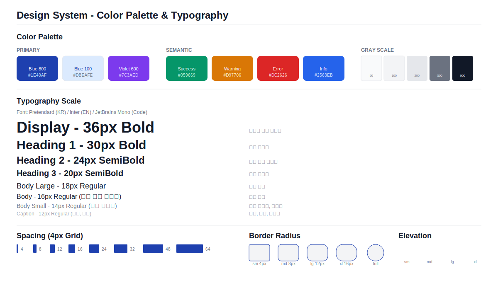

#### 색상 정의 상세

| 용도 | 색상명 | HEX 코드 | 사용 처 |
|------|--------|----------|---------|
| Primary | Blue 800 | `#1E40AF` | 주요 버튼, 링크, 강조 요소 |
| Primary Light | Blue 100 | `#DBEAFE` | 선택 상태 배경, 뱃지 배경 |
| Secondary | Violet 600 | `#7C3AED` | 보조 버튼, 태그 |
| Success | Emerald 600 | `#059669` | 승인, 완료 상태, 성공 알림 |
| Warning | Amber 600 | `#D97706` | 주의 상태, 경고 알림 |
| Error | Red 600 | `#DC2626` | 반려, 에러 상태, 필수 표시 |
| Info | Blue 600 | `#2563EB` | 정보 알림, 도움말 |
| Background | Gray 100 | `#F3F4F6` | 페이지 배경 |
| Surface | White | `#FFFFFF` | 카드, 모달 배경 |
| Text Primary | Gray 900 | `#111827` | 본문 텍스트 |
| Text Secondary | Gray 500 | `#6B7280` | 보조 텍스트, 플레이스홀더 |
| Border | Gray 200 | `#E5E7EB` | 구분선, 카드 보더 |

#### 타이포그래피 체계

| 레벨 | 크기 | 굵기 | 행간 | 용도 |
|------|------|------|------|------|
| Display | 36px | Bold (700) | 1.2 | 페이지 메인 타이틀 |
| Heading 1 | 30px | Bold (700) | 1.3 | 섹션 타이틀 |
| Heading 2 | 24px | SemiBold (600) | 1.3 | 서브 섹션 타이틀 |
| Heading 3 | 20px | SemiBold (600) | 1.4 | 카드 타이틀 |
| Body Large | 18px | Regular (400) | 1.6 | 강조 본문 |
| Body | 16px | Regular (400) | 1.6 | 기본 본문 |
| Body Small | 14px | Regular (400) | 1.5 | 보조 텍스트, 테이블 |
| Caption | 12px | Regular (400) | 1.4 | 라벨, 캡션, 도움말 |

- **한국어 폰트**: Pretendard (Google Fonts)
- **영문/숫자 폰트**: Inter (Google Fonts)
- **코드 폰트**: JetBrains Mono

#### 간격 체계 (4px Grid)

| 토큰 | 값 | 용도 |
|------|-----|------|
| spacing-1 | 4px | 아이콘-텍스트 간격 |
| spacing-2 | 8px | 관련 요소 간 간격 |
| spacing-3 | 12px | 폼 요소 내부 패딩 |
| spacing-4 | 16px | 카드 내부 패딩, 리스트 항목 간격 |
| spacing-6 | 24px | 섹션 내 그룹 간격 |
| spacing-8 | 32px | 섹션 간 간격 |
| spacing-12 | 48px | 대형 섹션 간격 |
| spacing-16 | 64px | 페이지 상하 패딩 |

#### 그림자 (Elevation)

| 레벨 | 값 | 용도 |
|------|-----|------|
| shadow-sm | `0 1px 2px rgba(0,0,0,0.05)` | 버튼, 인풋 |
| shadow-md | `0 4px 6px rgba(0,0,0,0.07)` | 카드, 드롭다운 |
| shadow-lg | `0 10px 15px rgba(0,0,0,0.1)` | 모달, 팝오버 |
| shadow-xl | `0 20px 25px rgba(0,0,0,0.15)` | 다이얼로그 |

#### 보더 라운딩

| 토큰 | 값 | 용도 |
|------|-----|------|
| rounded-sm | 4px | 뱃지, 태그 |
| rounded-md | 8px | 버튼, 인풋 |
| rounded-lg | 12px | 카드 |
| rounded-xl | 16px | 모달, 대형 카드 |
| rounded-full | 9999px | 아바타, 원형 버튼 |

---

## 2. 사용자 페르소나

### 2.1 페르소나 A: 김개발 (신청자 - 백엔드 개발자)

| 항목 | 내용 |
|------|------|
| **이름** | 김개발 |
| **직책** | 백엔드 개발자 (4년차) |
| **나이** | 29세 |
| **부서** | 플랫폼개발팀 |
| **기술 수준** | 상 (웹 서비스에 매우 익숙) |

**목표:**
- Claude Code를 활용하여 코드 리뷰, 리팩토링, 테스트 코드 작성 생산성을 높이고 싶음
- 신청 프로세스를 빠르게 완료하고 바로 도구를 사용하고 싶음
- 현재 2개 프로젝트를 동시에 수행 중이며, 두 프로젝트 모두에서 AI 도구를 활용하고 싶음

**불만사항:**
- 기존의 사내 도구 신청이 이메일과 결재 시스템으로 분산되어 있어 번거로움
- 신청 후 현재 어느 단계인지 알 수 없어 답답함
- 반려 시 무엇을 수정해야 하는지 명확하지 않음

**사용 시나리오:**
> 김개발은 점심시간에 Claude Code 사용 신청을 시작합니다. VDI 환경에서 사용할 예정이며, 현재 수행 중인 '결제 시스템 리뉴얼'과 '내부 API 게이트웨이' 두 프로젝트 정보를 등록합니다. 프로젝트 제안서를 첨부하고 보안 서약에 서명한 뒤 제출합니다. 다음날 보안 검토에서 보완 요청이 와서 추가 설명을 작성하여 재제출하고, 이후 승인되어 API Key를 발급받습니다.

### 2.2 페르소나 B: 이팀장 (검토자 - 개발팀 팀장)

| 항목 | 내용 |
|------|------|
| **이름** | 이팀장 |
| **직책** | 개발팀 팀장 (12년차) |
| **나이** | 38세 |
| **부서** | 플랫폼개발팀 |
| **기술 수준** | 중상 (관리 업무 위주) |

**목표:**
- 팀원들의 AI 도구 신청을 신속하게 검토/승인하고 싶음
- 팀 전체의 AI 도구 사용 현황을 파악하고 싶음
- 비용 효율적으로 팀 리소스를 관리하고 싶음

**불만사항:**
- 검토해야 할 건들이 쌓이면 놓치기 쉬움
- 각 신청의 적절성을 판단할 근거 자료를 찾기 어려움
- 검토 완료 후 다음 단계 진행 상황을 알기 어려움

**사용 시나리오:**
> 이팀장은 아침에 출근하여 검토 대시보드를 확인합니다. 새로운 신청 3건이 대기 중입니다. 각 신청의 프로젝트 정보와 사용 목적을 확인하고, 적절하다고 판단되는 2건은 승인하고, 1건은 프로젝트 설명이 부족하여 보완 요청 피드백을 작성합니다.

### 2.3 페르소나 C: 박보안 (보안 검토자)

| 항목 | 내용 |
|------|------|
| **이름** | 박보안 |
| **직책** | 정보보안팀 담당자 (7년차) |
| **나이** | 35세 |
| **부서** | 정보보안팀 |
| **기술 수준** | 중 (보안 관련 시스템에 익숙) |

**목표:**
- 외부 AI 도구 사용이 보안 정책을 준수하는지 확인하고 싶음
- 보안 서약 이행 여부를 추적하고 싶음
- 민감 데이터 유출 위험이 있는 프로젝트를 식별하고 싶음

**불만사항:**
- 보안 관점에서 필요한 정보가 신청서에 누락되는 경우가 많음
- 보안 서약 관리가 수동으로 이루어져 비효율적임
- 보안 사고 발생 시 추적이 어려움

**사용 시나리오:**
> 박보안은 보안 검토 대기 목록에서 팀장 승인이 완료된 신청을 검토합니다. 보안 서약 서명 여부를 확인하고, 프로젝트의 보안 등급과 첨부 문서를 검토하여 외부 AI 도구에 민감 정보가 전송될 위험이 없는지 판단합니다.

### 2.4 페르소나 D: 최관리 (시스템 관리자)

| 항목 | 내용 |
|------|------|
| **이름** | 최관리 |
| **직책** | IT인프라팀 관리자 (15년차) |
| **나이** | 42세 |
| **부서** | IT인프라팀 |
| **기술 수준** | 상 (시스템 관리 전문) |

**목표:**
- 전사 AI 도구 라이센스와 비용을 효율적으로 관리하고 싶음
- 이상 사용 패턴을 조기에 탐지하고 싶음
- 경영진에게 AI 도구 도입 효과를 데이터로 보고하고 싶음

**불만사항:**
- 여러 AI 도구의 라이센스를 일괄 관리하기 어려움
- 사용량 데이터가 각 도구 공급사에 분산되어 있어 통합 조회가 불가능
- 예산 초과를 사전에 예방하기 어려움

**사용 시나리오:**
> 최관리는 월초에 관리자 대시보드에서 전월 AI 도구 사용 현황을 확인합니다. 부서별 사용량, 비용, 활성 라이센스 수를 분석하고, 사용률이 낮은 부서에 리소스 재배분을 검토합니다. 월간 리포트를 PDF로 다운로드하여 경영진에게 보고합니다.

---

## 3. 사용자 플로우

### 3.1 신청자 플로우

신청자의 전체 사용 흐름을 나타냅니다. 로그인부터 API Key 수령까지의 전 과정을 포함합니다.

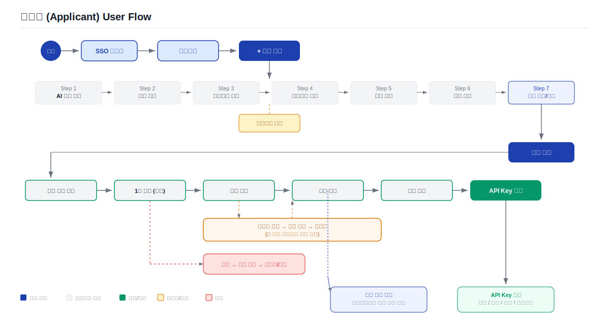

**주요 분기점:**
- 임시저장 후 나중에 이어서 작성 가능
- 각 검토 단계에서 피드백 수신 시 해당 정보 수정 후 재제출
- 반려 시 사유 확인 후 재신청 또는 취소 선택

### 3.2 검토자 플로우

검토자(팀장, 보안팀)의 사용 흐름입니다.

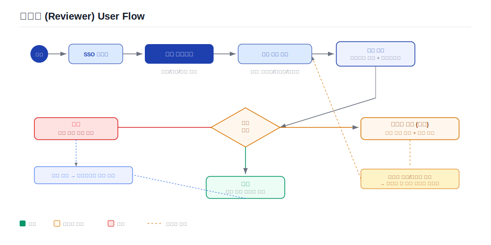

**주요 분기점:**
- 검토 결과: 승인 / 피드백(보완 요청) / 반려 3가지 선택
- 피드백 시 구체적 보완 사항 기재 필수
- 재제출된 건은 우선 표시

### 3.3 관리자 플로우

시스템 관리자의 사용 흐름입니다.

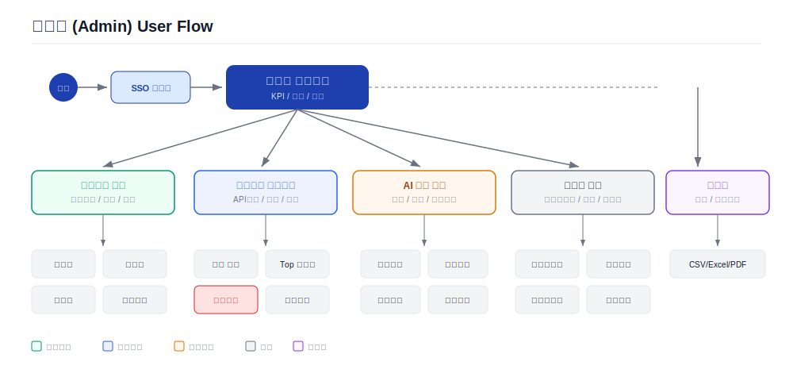

**주요 기능 영역:**
- 대시보드: 전사 현황 한눈에 파악
- 라이센스/API Key: 발급, 리셋, 해지 등 직접 관리
- 모니터링: 사용량, 비용, 이상 탐지
- 설정: 도구 관리, 워크플로우 커스터마이징

---

## 4. 화면 구성 - 공통

### 4.1 GNB (Global Navigation Bar)

모든 페이지 상단에 고정되는 글로벌 네비게이션 바입니다.

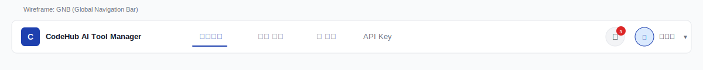

**구성 요소:**
- **좌측**: 로고 + 서비스명 ("CodeHub AI Tool Manager")
- **중앙**: 역할별 주요 메뉴 (신청자: 대시보드/신규신청/내신청/API Key, 검토자: 대시보드/검토목록/검토이력, 관리자: 대시보드/라이센스/모니터링/설정)
- **우측**: 알림 아이콘(미읽음 뱃지) + 사용자 프로필 드롭다운(이름, 역할, 설정, 로그아웃)

### 4.2 로그인 페이지

SSO 연동 로그인 페이지입니다.

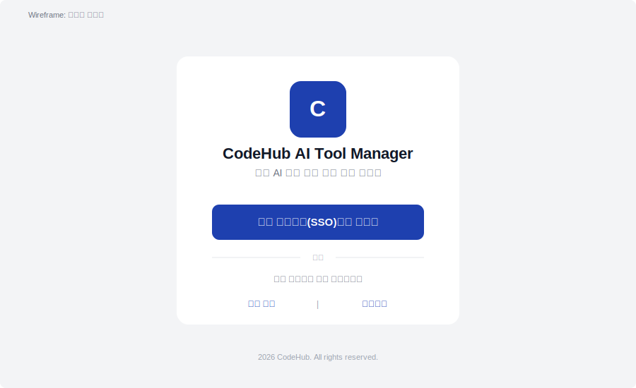

**구성 요소:**
- 서비스 로고 및 서비스명
- SSO 로그인 버튼 (사내 통합인증)
- 서비스 간단 소개 텍스트
- 하단 도움말 링크 (문의처, 이용 안내)

---

## 5. 화면 구성 - 신청자

### 5.1 신청자 대시보드

로그인 후 신청자가 처음 보게 되는 메인 대시보드입니다.

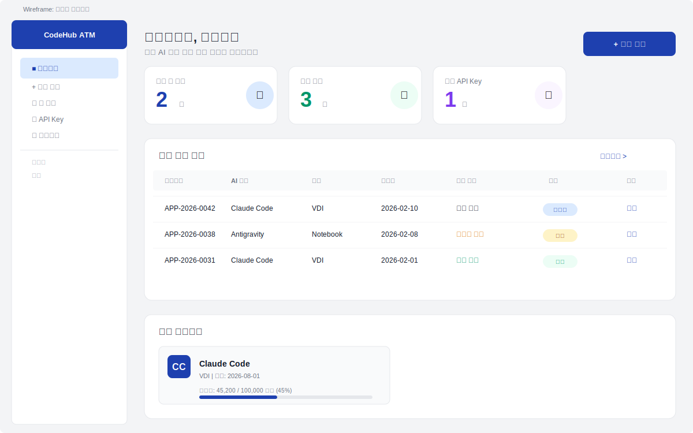

**구성 요소:**
- **상단 요약 카드 (3개)**: 진행 중 신청 수 / 승인 완료 수 / 보유 API Key 수
- **빠른 액션**: [+ 신규 신청] 버튼
- **최근 신청 내역 테이블**: 신청일, AI 도구, 상태(뱃지), 현재 단계, 액션(상세보기)
- **보유 라이센스 카드 리스트**: 도구명, 환경, 만료일, 사용량 프로그레스바

### 5.2 신규 신청 위자드

7단계 Step-by-Step 위자드로 구성됩니다. 상단에 스텝 인디케이터가 표시되며, 하단에 이전/다음/임시저장 버튼이 있습니다.

#### Step 1: AI 도구 선택

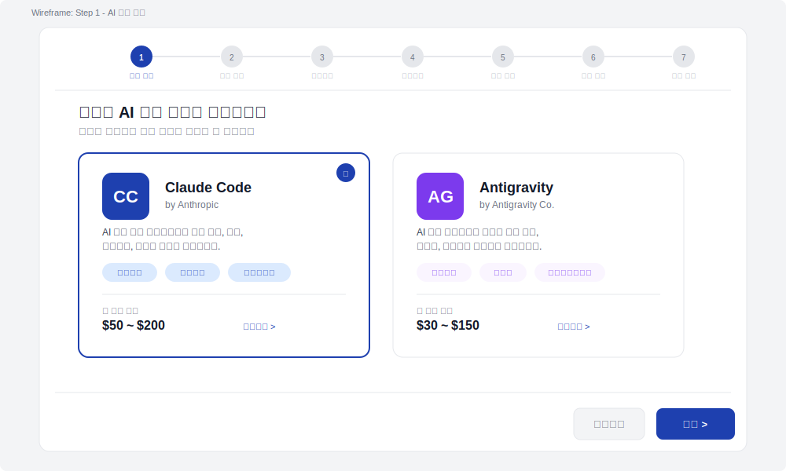

**구성 요소:**
- 스텝 인디케이터 (1/7 활성)
- AI 도구 카드 리스트 (카드당: 도구 아이콘, 이름, 벤더명, 주요 특징 태그, 월 비용 정보, 선택 라디오)
- 기본 도구: Claude Code, Antigravity
- 선택 시 카드 하이라이트 (파란색 보더)
- 도구 상세 정보 펼침 (Accordion)

#### Step 2: 사용 환경 선택

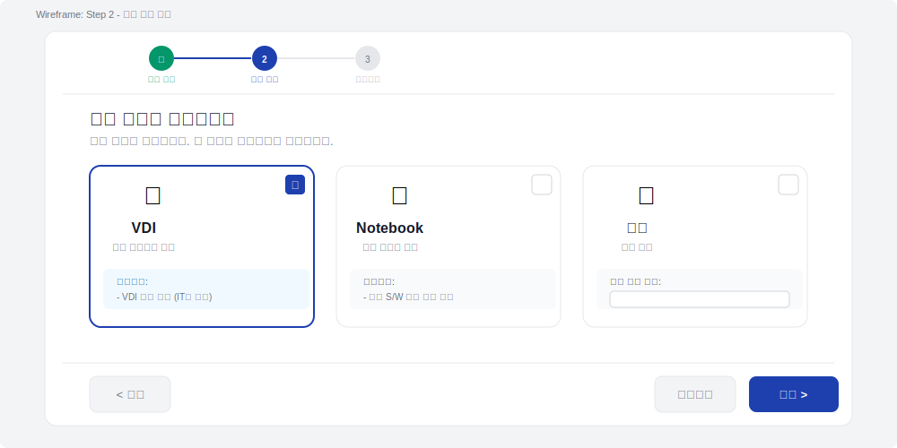

**구성 요소:**
- 스텝 인디케이터 (2/7 활성)
- 환경 카드 (체크박스, 복수 선택 가능): VDI (가상 데스크톱), Notebook (개인 노트북), 기타
- 각 환경별 요구사항 안내 텍스트
- "기타" 선택 시 추가 설명 입력 필드 노출

#### Step 3: 인적정보 확인

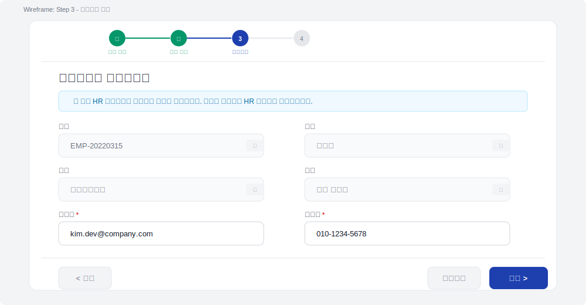

**구성 요소:**
- 스텝 인디케이터 (3/7 활성)
- HR 연동 자동완성된 폼 필드: 사번(읽기전용), 이름(읽기전용), 부서(읽기전용), 직급(읽기전용), 이메일(수정가능), 연락처(수정가능)
- 자동완성 안내 텍스트 ("사내 HR 시스템에서 자동으로 가져온 정보입니다")
- 정보 수정 요청 링크 (HR 시스템으로 이동)

#### Step 4: 프로젝트 정보 입력

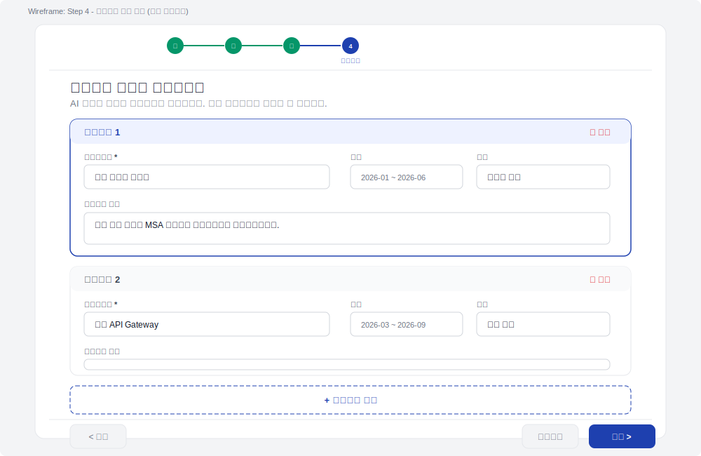

**구성 요소:**
- 스텝 인디케이터 (4/7 활성)
- 프로젝트 카드 리스트 (동적 추가/삭제)
- 각 프로젝트 카드 필드: 프로젝트명, 기간(시작일~종료일 DatePicker), 프로젝트 설명, 본인 역할, PM명, 코드 저장소 URL
- [+ 프로젝트 추가] 버튼
- 프로젝트 카드 우상단 삭제(×) 버튼
- 최소 1개 프로젝트 필수 안내

#### Step 5: 문서 첨부

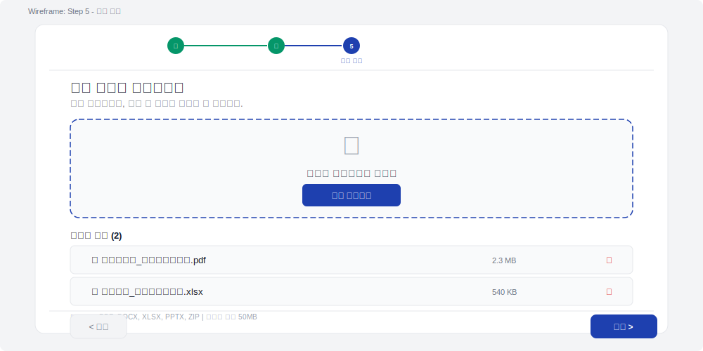

**구성 요소:**
- 스텝 인디케이터 (5/7 활성)
- 드래그앤드롭 업로드 영역 (점선 보더, 아이콘, 안내 텍스트)
- 파일 찾아보기 버튼
- 업로드된 파일 리스트 (파일명, 크기, 삭제 버튼)
- 지원 파일 형식 안내 (PDF, DOCX, XLSX, PPTX, ZIP / 최대 50MB)
- 선택 사항 안내 ("필수는 아니지만, 첨부 시 검토가 빨라질 수 있습니다")

#### Step 6: 보안 서약

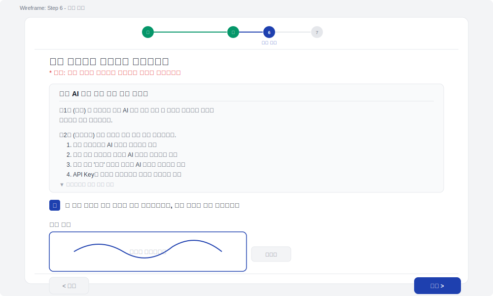

**구성 요소:**
- 스텝 인디케이터 (6/7 활성)
- 보안 서약서 본문 (스크롤 가능 영역, 번호 매긴 조항)
- 전체 동의 체크박스 ("위 보안 서약의 모든 내용을 읽고 이해하였으며, 이를 준수할 것을 서약합니다")
- 전자서명 패드 (Canvas 영역, 서명 그리기)
- 서명 초기화 버튼
- 서약 동의 및 서명 필수 안내

#### Step 7: 최종 확인 및 제출

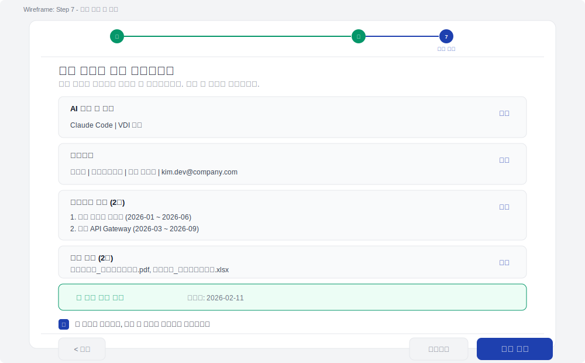

**구성 요소:**
- 스텝 인디케이터 (7/7 활성)
- 입력 정보 요약 카드들:
  - 선택 도구 정보 (도구명, 환경) + [수정] 링크
  - 인적 정보 요약 + [수정] 링크
  - 프로젝트 정보 요약 (프로젝트 수) + [수정] 링크
  - 첨부 파일 목록 + [수정] 링크
  - 보안 서약 완료 확인 (✓)
- 최종 동의 체크박스 ("위 정보가 정확하며, 제출 후 검토가 시작됩니다")
- **[신청 제출]** 주요 버튼 (Primary)
- [임시저장] 보조 버튼

### 5.3 신청 상세 / 진행 상태 페이지

신청 건의 상세 정보와 검토 진행 단계를 타임라인으로 표시합니다.

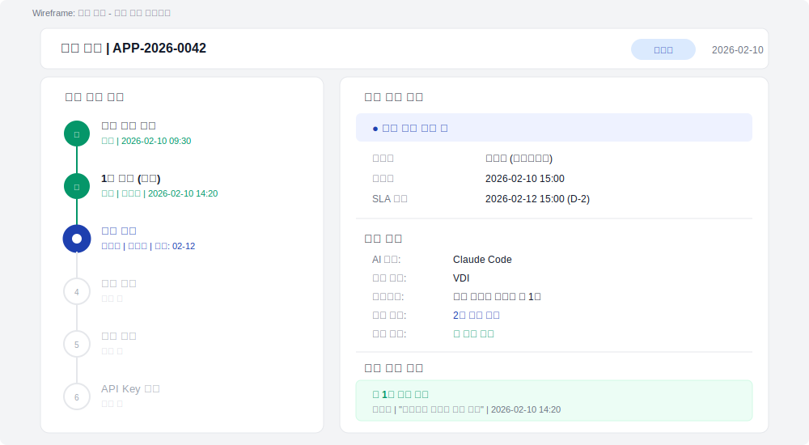

**구성 요소:**
- **좌측: 수직 타임라인 Stepper**
  - 검토 신청 (완료 ✓ / 날짜)
  - 1차 검토 - 팀장 (완료 ✓ / 날짜 / 검토자명)
  - 보안 검토 (진행 중 ● / 예상 완료일)
  - 환경 준비 (대기 ○)
  - 최종 승인 (대기 ○)
  - API Key 발급 (대기 ○)
- **우측: 상세 정보 패널**
  - 현재 단계 강조 표시
  - 해당 단계 상세 정보 (검토자, 시작일, 피드백 내용)
  - 피드백이 있는 경우 알림 뱃지

### 5.4 피드백 확인 및 수정/재제출 페이지

검토자로부터 피드백을 받았을 때 수정하여 재제출하는 페이지입니다.

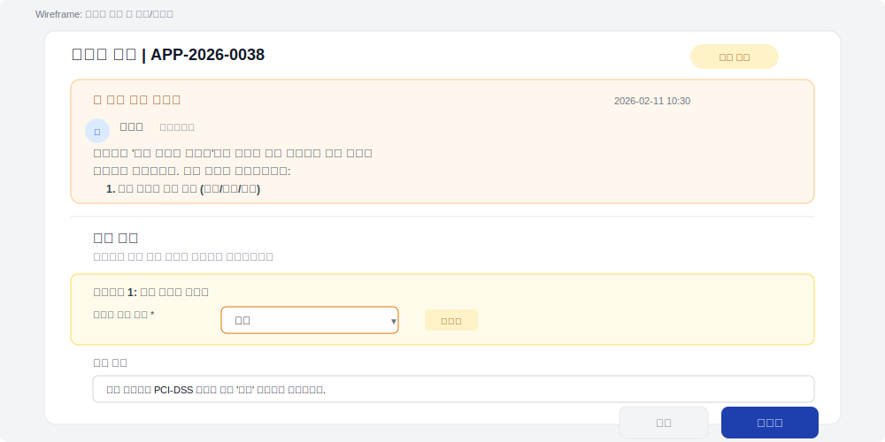

**구성 요소:**
- **피드백 영역** (상단, 노란색 배경 카드):
  - 피드백 제공자 (검토자명, 역할, 날짜)
  - 피드백 유형 뱃지 (보완 요청 / 수정 필요)
  - 피드백 상세 내용
  - 첨부파일 (있는 경우)
- **수정 영역** (하단):
  - 피드백에서 요청한 항목의 기존 입력 폼 (수정 가능 상태)
  - 변경 사항 하이라이트 표시
  - 추가 설명 텍스트 영역
  - [재제출] 버튼

### 5.5 API Key 관리 페이지

발급된 API Key를 조회하고 관리하는 페이지입니다.

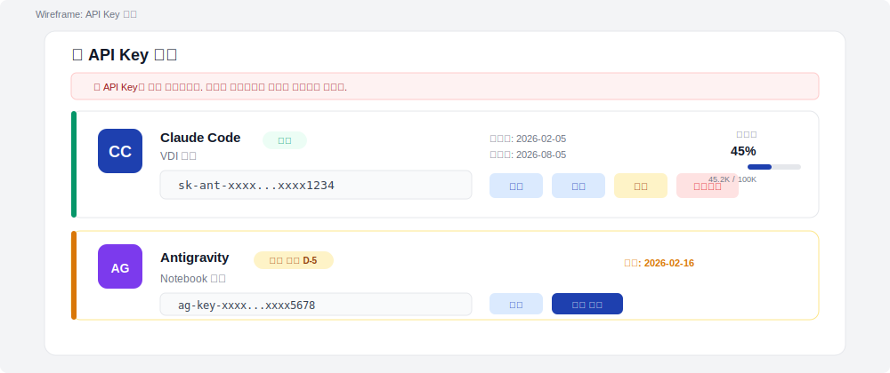

**구성 요소:**
- API Key 카드 리스트:
  - 도구 아이콘 + 이름
  - Key 값 (마스킹 표시: `sk-xxxx...xxxx1234`)
  - 상태 뱃지 (활성/비활성/만료)
  - 발급일 / 만료일
  - 사용량 프로그레스바 (쿼터 대비)
  - 액션 버튼: [복사] [보기(마스킹 해제)] [리셋] [비활성화]
- Key 보안 안내 텍스트 ("API Key는 민감 정보입니다. 안전하게 보관하세요.")
- 만료 임박 알림 (D-7 이내)

---

## 6. 화면 구성 - 검토자

### 6.1 검토자 대시보드

검토자가 로그인 후 보는 대시보드입니다.

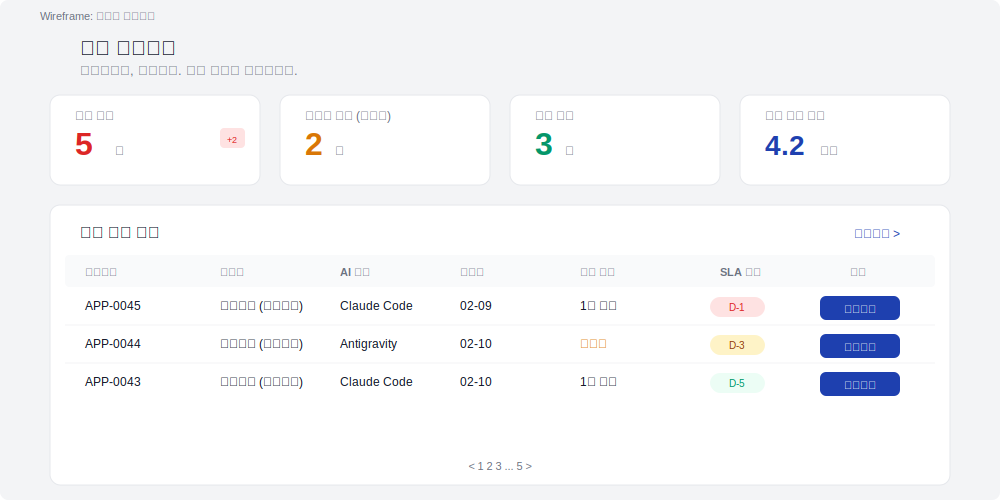

**구성 요소:**
- **요약 카드 (4개)**: 검토 대기 / 피드백 대기(재제출 대기) / 금일 처리 / 평균 처리 시간
- **검토 대기 목록 (최근 5건)**: 신청자명, 도구, 신청일, 긴급도 뱃지, [검토하기] 버튼
- **최근 처리 내역**: 처리일, 신청자, 결과(승인/반려/피드백), 소요시간
- **SLA 현황**: 기한 내 처리율 그래프

### 6.2 검토 대기 목록

검토할 신청 목록을 필터링하고 조회하는 페이지입니다.

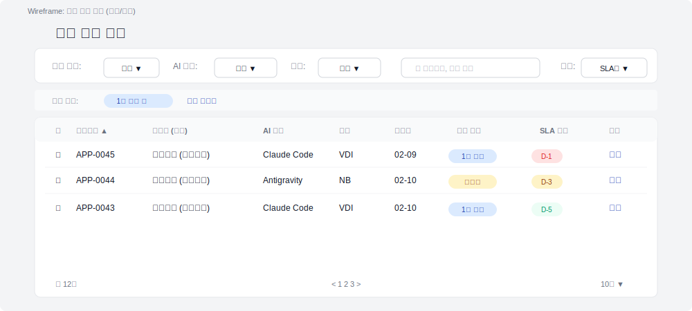

**구성 요소:**
- **필터바**: 검토 단계(1차/보안/환경), AI 도구(전체/Claude Code/Antigravity), 부서, 신청일 기간
- **검색바**: 신청자명, 사번 검색
- **정렬**: 신청일순, 긴급도순, SLA 마감순
- **테이블 컬럼**: 체크박스, 신청번호, 신청자(부서), AI 도구, 환경, 신청일, 현재 단계, SLA 잔여시간, 액션
- **뱃지 색상**: 대기(회색), 진행중(파랑), 긴급(빨강), 재제출(주황)
- **페이지네이션**: 페이지 번호 + 페이지당 건수 선택

### 6.3 검토 상세 페이지

개별 신청 건을 상세 검토하고 피드백을 입력하는 페이지입니다.

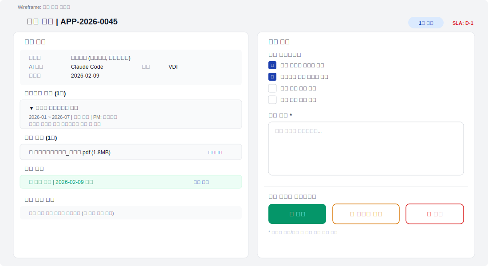

**구성 요소:**
- **좌측 패널 (신청 정보 요약):**
  - 신청 기본 정보 카드 (신청번호, 신청자, 부서, 신청일)
  - 선택 도구 및 환경 정보
  - 프로젝트 정보 (아코디언 - 다수 프로젝트)
  - 첨부 문서 목록 (다운로드 가능)
  - 보안 서약 확인 (서명일, 서명 이미지 미리보기)
  - 이전 검토 이력 타임라인
- **우측 패널 (검토 액션):**
  - 검토 의견 작성 텍스트 영역
  - 체크리스트 (검토 항목별 확인)
  - **액션 버튼 그룹**:
    - [승인] (초록색 Primary 버튼)
    - [피드백 요청] (주황색 버튼) - 보완 필요 항목 체크
    - [반려] (빨간색 버튼) - 반려 사유 필수 입력
  - 검토 완료 확인 모달

---

## 7. 화면 구성 - 관리자

### 7.1 관리자 대시보드

전사 AI 도구 현황을 한눈에 파악할 수 있는 대시보드입니다.

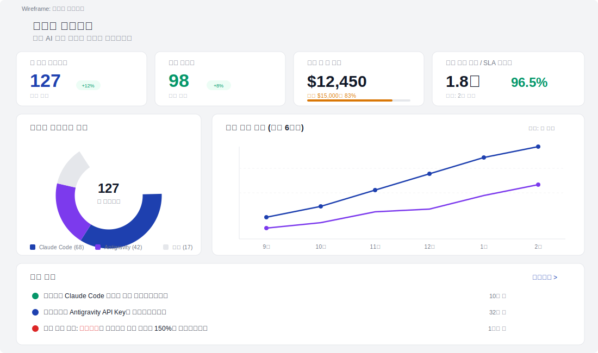

**구성 요소:**
- **KPI 카드 (4개)**:
  - 총 활성 라이센스 수 (전월 대비 증감)
  - 활성 사용자 수 (전월 대비 증감)
  - 이번 달 총 비용 (예산 대비 비율)
  - 평균 처리 시간 (SLA 달성율)
- **차트 영역 (2개)**:
  - 도구별 라이센스 분포 (도넛 차트)
  - 월별 사용 추이 (라인 차트, 최근 6개월)
- **최근 활동 피드** (신규 신청, 승인, 발급 등)
- **알림/이슈 패널** (만료 임박, 이상 사용, SLA 초과)

### 7.2 라이센스 발급 현황

라이센스 발급 및 관리 현황을 조회하는 페이지입니다.

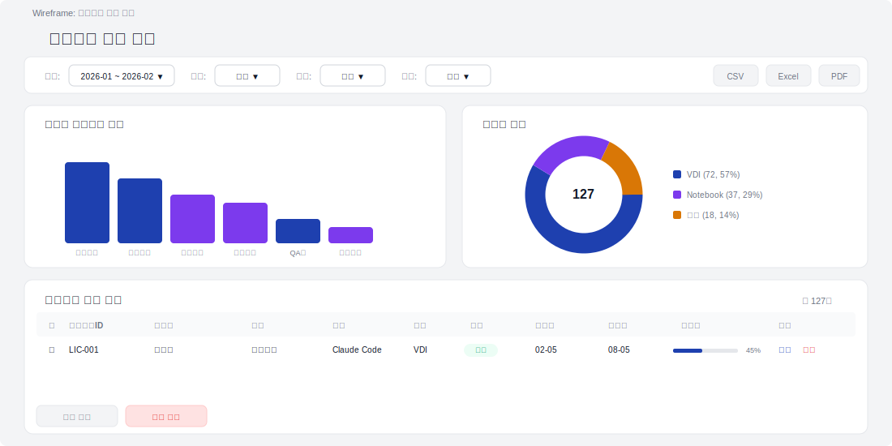

**구성 요소:**
- **필터 영역**: 기간, AI 도구, 부서, 환경, 상태(활성/비활성/만료)
- **시각화 영역**:
  - 도구별 발급 현황 (바 차트)
  - 부서별 라이센스 분포 (파이 차트)
  - 환경별 분포 (도넛 차트)
- **상세 테이블**: 라이센스ID, 사용자, 부서, 도구, 환경, 상태, 발급일, 만료일, 사용량, 액션(상세/해지)
- **일괄 관리**: 체크박스 선택 + 일괄 액션(갱신/해지)
- **데이터 내보내기**: CSV, Excel, PDF 버튼

### 7.3 사용 현황 모니터링

AI 도구의 실시간 사용 현황을 모니터링하는 페이지입니다.

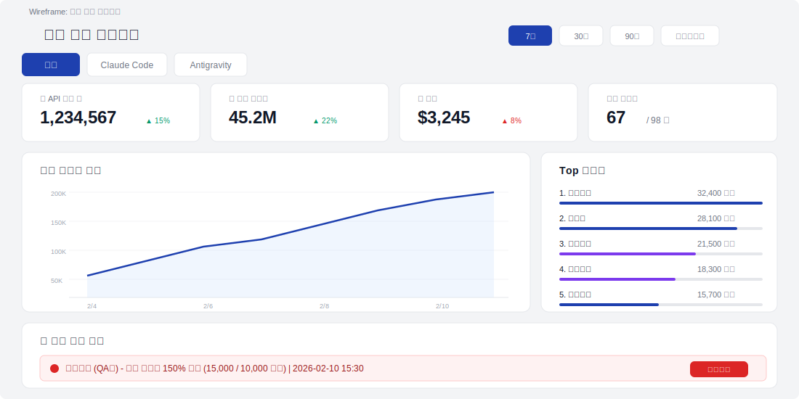

**구성 요소:**
- **기간 필터**: 오늘 / 7일 / 30일 / 사용자 지정 기간
- **도구 탭**: 전체 / Claude Code / Antigravity
- **핵심 지표 카드**: 총 API 호출 수 / 총 토큰 사용량 / 총 비용 / 활성 사용자
- **사용량 추이 차트** (라인 차트 - 일별/주별/월별)
- **Top 사용자 랭킹 테이블** (상위 10명)
- **이상 사용 탐지 알림 목록** (임계치 초과 건)
- **부서별 사용 비교** (그룹 바 차트)

### 7.4 AI 도구 관리

시스템에 등록된 AI 도구를 관리하는 페이지입니다.

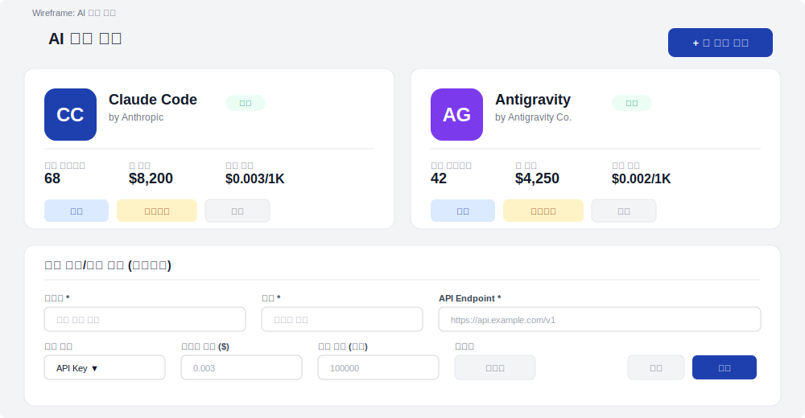

**구성 요소:**
- **도구 카드 리스트**:
  - 도구 아이콘/로고
  - 도구명, 벤더명
  - 상태 뱃지 (활성/비활성)
  - 활성 라이센스 수
  - 월 비용 요약
  - [설정] [비활성화] 버튼
- **[+ 새 도구 추가]** 버튼
- **도구 추가/수정 모달**:
  - 도구명, 벤더, 설명
  - API Endpoint URL
  - 인증 방식 (API Key / OAuth)
  - 토큰당 비용
  - 기본 쿼터 설정
  - 아이콘 업로드

---

## 8. 인터랙션 디자인

### 8.1 위자드 스텝 네비게이션

| 인터랙션 | 동작 |
|---------|------|
| 스텝 클릭 | 완료된 이전 스텝으로만 이동 가능, 미래 스텝은 비활성 |
| [다음] 클릭 | 현재 스텝 유효성 검사 → 통과 시 다음 스텝, 실패 시 에러 표시 |
| [이전] 클릭 | 입력 데이터 유지한 채 이전 스텝으로 이동 |
| [임시저장] 클릭 | 현재까지 입력 데이터 서버에 저장, 토스트 알림("임시저장 완료") |
| 브라우저 뒤로가기 | 확인 모달("작성 중인 내용이 있습니다. 이 페이지를 떠나시겠습니까?") |

### 8.2 검토 진행 타임라인 Stepper

| 상태 | 아이콘 | 색상 | 설명 |
|------|--------|------|------|
| 완료 | ✓ (체크) | Success (#059669) | 해당 단계 완료, 완료 날짜 표시 |
| 진행 중 | ● (점) | Primary (#1E40AF) | 현재 진행 중인 단계, 펄스 애니메이션 |
| 피드백 대기 | ⚠ (경고) | Warning (#D97706) | 피드백 수신, 재제출 대기 |
| 반려 | ✗ (엑스) | Error (#DC2626) | 해당 단계에서 반려 |
| 대기 | ○ (빈 원) | Gray (#9CA3AF) | 아직 도달하지 않은 단계 |

### 8.3 알림 (Toast & Badge)

**토스트 알림:**
| 유형 | 색상 | 아이콘 | 자동 닫힘 | 예시 |
|------|------|--------|----------|------|
| 성공 | #059669 배경 | ✓ | 3초 | "신청이 성공적으로 제출되었습니다" |
| 에러 | #DC2626 배경 | ✗ | 수동 닫기 | "파일 업로드에 실패했습니다" |
| 경고 | #D97706 배경 | ⚠ | 5초 | "API Key가 7일 후 만료됩니다" |
| 정보 | #2563EB 배경 | ℹ | 3초 | "임시저장이 완료되었습니다" |

**알림 뱃지:**
- GNB 알림 아이콘에 미읽음 수 표시 (빨간 원, 최대 99+)
- 클릭 시 알림 드롭다운 패널 (최근 10건)
- 각 알림: 아이콘, 제목, 시간, 읽음 여부 표시

### 8.4 데이터 테이블 인터랙션

| 기능 | 동작 |
|------|------|
| 정렬 | 컬럼 헤더 클릭 → 오름차순/내림차순 토글, 현재 정렬 방향 화살표 표시 |
| 필터 | 필터바에서 조건 선택, 적용된 필터는 태그(Chip)로 표시, 개별/전체 해제 가능 |
| 검색 | 실시간 검색 (디바운스 300ms), 검색어 하이라이트 |
| 페이지네이션 | 페이지 번호 + 이전/다음 + 페이지당 건수 선택(10/20/50) |
| 행 선택 | 체크박스 클릭으로 개별/전체 선택, 선택 시 일괄 액션 바 노출 |
| 행 클릭 | 상세 페이지로 이동 (또는 사이드 패널 오픈) |

### 8.5 차트 인터랙션

| 기능 | 동작 |
|------|------|
| 호버 | 데이터 포인트 호버 시 툴팁 표시 (수치, 날짜, 비교값) |
| 범례 | 범례 항목 클릭 시 해당 시리즈 토글 (표시/숨김) |
| 기간 선택 | 차트 상단 기간 버튼 (7일/30일/90일/1년) 또는 DatePicker |
| 줌 | 드래그로 특정 구간 확대 가능 |
| 내보내기 | 차트 우상단 ... 메뉴에서 PNG/CSV 다운로드 |

### 8.6 로딩 상태

| 상태 | 표현 |
|------|------|
| 페이지 로딩 | 스켈레톤 UI (카드, 테이블 형태의 회색 애니메이션 박스) |
| 데이터 로딩 | 테이블/차트 영역에 스피너 오버레이 |
| 버튼 로딩 | 버튼 텍스트 → 스피너로 변경, 비활성화 |
| 파일 업로드 | 프로그레스 바 (퍼센트 표시) |

### 8.7 빈 상태 (Empty State)

| 화면 | 안내 메시지 | CTA |
|------|-----------|-----|
| 신청 내역 없음 | "아직 신청 내역이 없습니다" | [신규 신청하기] |
| 검토 대기 없음 | "현재 검토 대기 중인 건이 없습니다" | - |
| 검색 결과 없음 | "검색 조건에 맞는 결과가 없습니다" | [필터 초기화] |
| API Key 없음 | "발급된 API Key가 없습니다" | [신규 신청하기] |

---

## 9. 반응형 디자인

### 9.1 브레이크포인트

| 이름 | 크기 | 대상 디바이스 | 비고 |
|------|------|-------------|------|
| sm | 640px | 모바일 | 최소 지원 |
| md | 768px | 태블릿 세로 | - |
| lg | 1024px | 태블릿 가로 | - |
| **xl** | **1280px** | **데스크톱** | **기본 설계 기준** |
| 2xl | 1536px | 대형 모니터 | 최대 너비 제한 |

### 9.2 반응형 전략

**데스크톱 우선 설계** (사내 VDI/Notebook 환경이 주 사용 환경)

| 구성 요소 | 데스크톱 (≥1280px) | 태블릿 (768-1279px) | 모바일 (<768px) |
|---------|-------------------|-------------------|----------------|
| GNB | 전체 메뉴 표시 | 주요 메뉴 + 햄버거 | 로고 + 햄버거 |
| 사이드바 | 고정 표시 (240px) | 접이식 (아이콘만) | 숨김 (드로어) |
| 대시보드 카드 | 4열 그리드 | 2열 그리드 | 1열 스택 |
| 데이터 테이블 | 전체 컬럼 | 주요 컬럼 + 가로스크롤 | 카드형 리스트 |
| 위자드 | 좌우 분할 (스텝바+폼) | 상하 분할 | 상하 분할 (간략) |
| 차트 | 2열 배치 | 1열 배치 | 1열 배치 (축소) |
| 모달 | 중앙 다이얼로그 (600px) | 중앙 다이얼로그 (90%) | 풀스크린 시트 |

---

## 10. 재사용 컴포넌트 목록

### 10.1 기본 입력 컴포넌트

| 컴포넌트 | 변형 (Variants) | 상태 (States) | 주요 Props |
|---------|----------------|--------------|-----------|
| **Button** | primary, secondary, outline, ghost, danger | default, hover, active, disabled, loading | size(sm/md/lg), icon, fullWidth |
| **Input** | text, password, email, number, search | default, focus, error, disabled, readonly | label, placeholder, helperText, errorText |
| **Select** | single, multi | default, open, error, disabled | options[], placeholder, searchable |
| **Checkbox** | default, indeterminate | unchecked, checked, disabled | label, description |
| **Radio** | default | unselected, selected, disabled | label, name, value |
| **Textarea** | default, autosize | default, focus, error, disabled | rows, maxLength, counter |
| **DatePicker** | single, range | default, open, error | minDate, maxDate, format |
| **FileUpload** | dropzone, button | idle, dragover, uploading, complete, error | accept, maxSize, multiple |
| **SignaturePad** | default | empty, signed | width, height, onClear |

### 10.2 표시 컴포넌트

| 컴포넌트 | 변형 (Variants) | 상태 (States) | 주요 Props |
|---------|----------------|--------------|-----------|
| **Badge** | filled, outline | default, dot | color(primary/success/warning/error/gray), size |
| **Tag** | filled, outline, closable | default, hover | color, onClose |
| **Avatar** | image, initial, icon | default | size(sm/md/lg/xl), name, src |
| **Tooltip** | top, bottom, left, right | show, hide | content, delay |
| **ProgressBar** | linear, circular | default, indeterminate | value, max, color, showLabel |
| **Skeleton** | text, rect, circle | loading | width, height, animation |

### 10.3 레이아웃 컴포넌트

| 컴포넌트 | 변형 (Variants) | 주요 Props |
|---------|----------------|-----------|
| **Card** | default, outline, elevated, interactive | header, footer, padding |
| **Modal** | dialog, confirm, form, fullscreen | title, size(sm/md/lg/xl), onClose, footer |
| **Toast** | success, error, warning, info | message, duration, action, position |
| **Sidebar** | fixed, collapsible | items[], collapsed, onToggle |
| **Navbar** | default | logo, menuItems[], rightActions[] |
| **Breadcrumb** | default | items[], separator |
| **Tabs** | line, card | items[], activeKey, onChange |
| **Accordion** | single, multiple | items[], defaultOpen |

### 10.4 데이터 컴포넌트

| 컴포넌트 | 변형 (Variants) | 주요 Props |
|---------|----------------|-----------|
| **Table** | default, striped, compact | columns[], data[], sortable, selectable |
| **Pagination** | default, simple | total, pageSize, current, onChange |
| **Filter** | inline, dropdown, panel | filters[], onApply, onReset |
| **Stepper** | horizontal, vertical | steps[], current, status |
| **Timeline** | default, alternate | items[], mode |
| **Chart** | line, bar, pie, donut | data, options, responsive |
| **StatCard** | default, trend | title, value, change, icon |
| **EmptyState** | default, search, error | icon, title, description, action |

### 10.5 컴포넌트 상태 전이 규칙

**Button 상태 전이:**
```
default → (마우스 진입) → hover → (마우스 누름) → active → (마우스 놓음) → hover
default → (비활성) → disabled (모든 인터랙션 차단)
default → (클릭+비동기) → loading → (완료) → default
```

**Input 상태 전이:**
```
default → (클릭/탭) → focus → (입력 중) → focus
focus → (포커스 해제+유효) → default
focus → (포커스 해제+유효성 실패) → error
error → (클릭/탭) → focus → (수정) → focus → (포커스 해제+유효) → default
```

**Stepper 상태 전이:**
```
step[n]: pending → active → completed
step[n]: active → feedback_requested → active → completed
step[n]: active → rejected (종료)
```

---

## 부록: 이미지 파일 목록

| 파일명 | 설명 | 섹션 |
|--------|------|------|
| [design-system.svg](./images/design-system.svg) | 디자인 시스템 (색상, 타이포그래피) | 1장 |
| [flow-applicant.svg](./images/flow-applicant.svg) | 신청자 사용자 플로우 | 3.1 |
| [flow-reviewer.svg](./images/flow-reviewer.svg) | 검토자 사용자 플로우 | 3.2 |
| [flow-admin.svg](./images/flow-admin.svg) | 관리자 사용자 플로우 | 3.3 |
| [wf-gnb.svg](./images/wf-gnb.svg) | GNB (글로벌 네비게이션 바) | 4.1 |
| [wf-login.svg](./images/wf-login.svg) | 로그인 페이지 | 4.2 |
| [wf-applicant-dashboard.svg](./images/wf-applicant-dashboard.svg) | 신청자 대시보드 | 5.1 |
| [wf-wizard-step1.svg](./images/wf-wizard-step1.svg) | 위자드 Step 1: AI 도구 선택 | 5.2 |
| [wf-wizard-step2.svg](./images/wf-wizard-step2.svg) | 위자드 Step 2: 사용 환경 선택 | 5.2 |
| [wf-wizard-step3.svg](./images/wf-wizard-step3.svg) | 위자드 Step 3: 인적정보 확인 | 5.2 |
| [wf-wizard-step4.svg](./images/wf-wizard-step4.svg) | 위자드 Step 4: 프로젝트 정보 | 5.2 |
| [wf-wizard-step5.svg](./images/wf-wizard-step5.svg) | 위자드 Step 5: 문서 첨부 | 5.2 |
| [wf-wizard-step6.svg](./images/wf-wizard-step6.svg) | 위자드 Step 6: 보안 서약 | 5.2 |
| [wf-wizard-step7.svg](./images/wf-wizard-step7.svg) | 위자드 Step 7: 최종 확인 | 5.2 |
| [wf-application-status.svg](./images/wf-application-status.svg) | 신청 진행 상태 타임라인 | 5.3 |
| [wf-feedback.svg](./images/wf-feedback.svg) | 피드백 확인 및 재제출 | 5.4 |
| [wf-apikey-management.svg](./images/wf-apikey-management.svg) | API Key 관리 | 5.5 |
| [wf-reviewer-dashboard.svg](./images/wf-reviewer-dashboard.svg) | 검토자 대시보드 | 6.1 |
| [wf-reviewer-list.svg](./images/wf-reviewer-list.svg) | 검토 대기 목록 | 6.2 |
| [wf-reviewer-detail.svg](./images/wf-reviewer-detail.svg) | 검토 상세 페이지 | 6.3 |
| [wf-admin-dashboard.svg](./images/wf-admin-dashboard.svg) | 관리자 대시보드 | 7.1 |
| [wf-admin-license.svg](./images/wf-admin-license.svg) | 라이센스 발급 현황 | 7.2 |
| [wf-admin-monitoring.svg](./images/wf-admin-monitoring.svg) | 사용 현황 모니터링 | 7.3 |
| [wf-admin-tools.svg](./images/wf-admin-tools.svg) | AI 도구 관리 | 7.4 |
