# 백엔드 설계서

## CodeHub AI Tool 관리 플랫폼

| 항목 | 내용 |
|------|------|
| 문서 버전 | v1.0 |
| 작성일 | 2026-02-11 |
| 작성자 | 백엔드 아키텍처팀 |
| 문서 상태 | 초안 |

---

## 목차

1. [백엔드 아키텍처 개요](#1-백엔드-아키텍처-개요)
2. [모듈 설계](#2-모듈-설계)
3. [데이터 모델 관계도](#3-데이터-모델-관계도)
4. [워크플로우 엔진](#4-워크플로우-엔진)
5. [API 설계](#5-api-설계)
6. [보안 아키텍처](#6-보안-아키텍처)
7. [인프라 계층](#7-인프라-계층)

---

## 1. 백엔드 아키텍처 개요

### 1.1 기술 스택

| 기술 | 버전 | 역할 |
|------|------|------|
| **NestJS** | 10.x | 백엔드 애플리케이션 프레임워크 (TypeScript 네이티브, DI 컨테이너, 모듈화 아키텍처) |
| **Prisma** | 5.x | ORM (타입 안전한 쿼리, 마이그레이션 자동화, 스키마 기반 개발) |
| **PostgreSQL** | 16.x | 주 데이터베이스 (ACID 트랜잭션, JSONB 지원, 파티셔닝) |
| **Redis** | 7.x | 인메모리 캐시, 세션 관리, BullMQ 백엔드, Pub/Sub |
| **BullMQ** | 5.x | 비동기 작업 큐 (알림 발송, 사용량 집계, 라이센스 만료 처리) |
| **MinIO** | - | S3 호환 오브젝트 스토리지 (첨부파일 관리) |
| **Elasticsearch** | 8.x | 감사 로그 검색, 사용량 분석, 대시보드 시각화 |
| **Passport.js** | - | SAML 2.0 / JWT 인증 전략 |
| **Swagger** | OpenAPI 3.0 | API 문서 자동 생성 |

### 1.2 전체 모듈 구조도


### 1.3 Controller - Service - Repository 계층도


---

## 2. 모듈 설계

### 2.1 Auth Module (인증 모듈)

| 항목 | 내용 |
|------|------|
| **책임** | SAML 2.0 SSO 인증, JWT 발급/검증, 토큰 갱신, 로그아웃 |
| **주요 파일** | `auth.controller.ts`, `auth.service.ts`, `jwt.strategy.ts`, `saml.strategy.ts` |
| **의존 모듈** | Users Module |
| **외부 연동** | 사내 SSO (SAML IdP) |

주요 기능:
- SAML 2.0 SP-Initiated SSO 로그인 처리
- Access Token (15분) / Refresh Token (7일) 발급
- Refresh Token Rotation (사용 시마다 새 토큰 발급)
- 로그아웃 시 Redis 블랙리스트 등록

### 2.2 Users Module (사용자 모듈)

| 항목 | 내용 |
|------|------|
| **책임** | 사용자 CRUD, 역할 관리, HR 시스템 동기화 |
| **주요 파일** | `users.controller.ts`, `users.service.ts` |
| **의존 모듈** | Auth Module |
| **외부 연동** | HR 시스템 (REST API) |

주요 기능:
- 사용자 프로필 조회/수정
- RBAC 역할 관리 (APPLICANT, TEAM_LEAD, SECURITY_REVIEWER, IT_ADMIN, SYSTEM_ADMIN)
- HR 시스템과 일 1회 배치 동기화 (사번, 이름, 부서, 직급, 재직 상태)

### 2.3 Applications Module (신청 모듈)

| 항목 | 내용 |
|------|------|
| **책임** | 신청서 CRUD, 제출, 취소, 재제출, 통계 |
| **주요 파일** | `applications.controller.ts`, `applications.service.ts` |
| **의존 모듈** | Users Module, Reviews Module, Notifications Module, Audit Module |
| **외부 연동** | - |

주요 기능:
- 7단계 신청 위저드 데이터 저장 (임시저장/제출)
- 다중 AI 도구 선택 (M:N 관계: `application_ai_tools` 중간 테이블)
- 다중 프로젝트 연결 (M:N 관계: `application_projects` 중간 테이블)
- 첨부파일 관리, 보안서약 관리
- 신청서 제출 시 검토 워크플로우 자동 생성

### 2.4 Reviews Module (검토 워크플로우 모듈)

| 항목 | 내용 |
|------|------|
| **책임** | 검토 워크플로우 관리, 단계별 검토 처리, 피드백, 상태 전이 |
| **주요 파일** | `reviews.controller.ts`, `reviews.service.ts`, `workflow-engine.service.ts` |
| **의존 모듈** | Applications Module, Users Module, Notifications Module, Audit Module |
| **외부 연동** | - |

주요 기능:
- 검토 워크플로우 생성/관리 (TEAM_REVIEW → SECURITY_REVIEW → ENV_PREPARATION → FINAL_APPROVAL)
- 단계별 검토자 배정 및 검토 수행
- 피드백 작성 (승인/반려/수정 요청)
- 상태 머신 기반 워크플로우 엔진
- SLA 모니터링 (NORMAL / WARNING / OVERDUE)

### 2.5 ApiKeys Module (API Key 모듈)

| 항목 | 내용 |
|------|------|
| **책임** | API Key 발급, 조회, 리셋, 폐기, 사용량 추적 |
| **주요 파일** | `api-keys.controller.ts`, `api-keys.service.ts` |
| **의존 모듈** | Applications Module, Users Module, Licenses Module, Audit Module |
| **외부 연동** | Claude Code API, Antigravity API |

주요 기능:
- 최종 승인 후 API Key 자동 발급
- API Key 암호화 저장 (AES-256-GCM)
- Key 해시 기반 검증 (SHA-256)
- Key 리셋/재발급 (최초 발급 시에만 원문 표시)
- 사용량(quota) 추적 및 제한

### 2.6 Licenses Module (라이센스 모듈)

| 항목 | 내용 |
|------|------|
| **책임** | 라이센스 발급, 상태 관리, 만료 처리, 사용량 관리 |
| **주요 파일** | `licenses.controller.ts`, `licenses.service.ts` |
| **의존 모듈** | Users Module, ApiKeys Module, Notifications Module |
| **외부 연동** | - |

주요 기능:
- 라이센스 발급 (1 라이센스 = 1 AI 도구)
- 상태 관리 (ACTIVE, EXPIRED, REVOKED, SUSPENDED)
- 만료 예정 라이센스 알림 (BullMQ 스케줄 작업)
- 사용량 통계 (quotaLimit, quotaUsed, usagePercent)

### 2.7 Monitoring Module (모니터링 모듈)

| 항목 | 내용 |
|------|------|
| **책임** | 사용량 수집, 비용 분석, 대시보드 데이터, 이상 탐지 |
| **주요 파일** | `monitoring.controller.ts`, `monitoring.service.ts` |
| **의존 모듈** | Users Module, Licenses Module, ApiKeys Module |
| **외부 연동** | Claude Code API, Antigravity API |

주요 기능:
- 전체/사용자별/도구별/부서별 사용량 집계
- 비용 현황 및 예측
- 이상 사용 패턴 탐지 (AnomalyAlert)
- 관리자 대시보드 통합 데이터 제공
- 일별/월별 트렌드 분석

### 2.8 Notifications Module (알림 모듈)

| 항목 | 내용 |
|------|------|
| **책임** | 알림 생성, 다채널 발송, 읽음 처리 |
| **주요 파일** | `notifications.controller.ts`, `notifications.service.ts`, `channels/` |
| **의존 모듈** | Users Module |
| **외부 연동** | 사내 메신저 (Webhook), 이메일 |

주요 기능:
- 인앱 알림 (WebSocket 실시간 푸시)
- 이메일 알림 (SMTP)
- 사내 메신저 알림 (Webhook)
- 알림 템플릿 관리
- 미읽음 알림 카운트, 전체 읽음 처리

### 2.9 Audit Module (감사 로그 모듈)

| 항목 | 내용 |
|------|------|
| **책임** | 모든 데이터 변경 기록, 감사 로그 검색, 위변조 방지 |
| **주요 파일** | `audit.service.ts`, `audit.interceptor.ts` |
| **의존 모듈** | - (다른 모듈에서 의존) |
| **외부 연동** | Elasticsearch |

주요 기능:
- 모든 CUD 작업에 대한 자동 감사 로그 기록 (Interceptor 기반)
- 변경 전/후 값 저장 (JSONB)
- PostgreSQL (원본 저장, 36개월) + Elasticsearch (검색/분석, 12개월) 이중 저장
- 해시 체인 방식 무결성 검증

### 2.10 모듈 간 의존 관계도


---

## 3. 데이터 모델 관계도

### 3.1 전체 ERD

```mermaid
erDiagram
    User {
        uuid id PK
        varchar employee_id UK
        varchar name
        varchar email UK
        varchar department
        varchar team
        varchar position
        varchar phone
        enum role "APPLICANT | TEAM_LEAD | SECURITY_REVIEWER | IT_ADMIN | SYSTEM_ADMIN"
        boolean is_active
        timestamp last_login_at
        timestamp created_at
        timestamp updated_at
    }

    AiTool {
        uuid id PK
        varchar name UK
        varchar vendor
        text description
        varchar api_base_url
        varchar auth_method "API_KEY | OAUTH | TOKEN"
        decimal token_cost
        bigint default_quota
        jsonb config_schema
        boolean is_active
        timestamp created_at
        timestamp updated_at
    }

    Application {
        uuid id PK
        varchar application_number UK
        uuid applicant_id FK
        enum environment "VDI | NOTEBOOK | OTHER"
        text purpose
        enum status "DRAFT | SUBMITTED | TEAM_REVIEW | SECURITY_REVIEW | ENV_PREPARATION | FINAL_APPROVAL | APPROVED | KEY_ISSUED | REJECTED | FEEDBACK_REQUESTED"
        timestamp submitted_at
        timestamp completed_at
        timestamp created_at
        timestamp updated_at
    }

    ApplicationAiTool {
        uuid id PK
        uuid application_id FK
        uuid ai_tool_id FK
    }

    Project {
        uuid id PK
        varchar name
        text description
        date start_date
        date end_date
        varchar role
        varchar pm_name
        varchar pm_email
        boolean is_active
        timestamp created_at
        timestamp updated_at
    }

    ApplicationProject {
        uuid id PK
        uuid application_id FK
        uuid project_id FK
    }

    ReviewStage {
        uuid id PK
        uuid application_id FK
        varchar stage_name "TEAM_REVIEW | SECURITY_REVIEW | ENV_PREPARATION | FINAL_APPROVAL"
        integer stage_order
        uuid reviewer_id FK
        varchar reviewer_name
        enum result "APPROVED | REJECTED | FEEDBACK_REQUESTED"
        text comment
        jsonb checklist
        timestamp reviewed_at
        timestamp due_date
        timestamp created_at
    }

    ReviewFeedback {
        uuid id PK
        uuid review_stage_id FK
        uuid reviewer_id FK
        varchar reviewer_name
        text content
        timestamp created_at
    }

    SecurityAgreement {
        uuid id PK
        uuid application_id FK
        uuid user_id FK
        varchar agreement_version
        text agreement_content
        timestamp agreed_at
        inet ip_address
        text signature_data
        timestamp created_at
    }

    Attachment {
        uuid id PK
        uuid application_id FK
        uuid uploaded_by FK
        varchar file_name
        varchar file_path
        bigint file_size
        varchar mime_type
        enum category "PROJECT_DOC | SECURITY_DOC | APPROVAL_DOC | OTHER"
        timestamp uploaded_at
        boolean is_deleted
    }

    ApiKey {
        uuid id PK
        uuid application_id FK
        uuid user_id FK
        uuid ai_tool_id FK
        varchar ai_tool_name
        varchar key_hash
        varchar key_prefix
        text encrypted_key
        varchar masked_key
        enum status "ACTIVE | EXPIRED | REVOKED | SUSPENDED"
        timestamp issued_at
        timestamp expires_at
        timestamp last_used_at
        integer usage_count
        bigint quota_limit
        bigint quota_used
        integer reset_count
        timestamp created_at
        timestamp updated_at
    }

    License {
        uuid id PK
        varchar license_number UK
        uuid user_id FK
        uuid ai_tool_id FK
        varchar ai_tool_name
        varchar environment
        enum status "ACTIVE | EXPIRED | REVOKED | SUSPENDED"
        bigint quota_limit
        bigint quota_used
        decimal usage_percent
        timestamp issued_at
        timestamp expires_at
        timestamp revoked_at
        timestamp created_at
        timestamp updated_at
    }

    UsageLog {
        uuid id PK
        uuid user_id FK
        uuid api_key_id FK
        uuid ai_tool_id FK
        varchar ai_tool_name
        varchar action
        integer tokens_used
        decimal cost
        integer response_time_ms
        timestamp requested_at
    }

    AnomalyAlert {
        uuid id PK
        uuid user_id FK
        varchar user_name
        varchar department
        varchar type
        text description
        enum severity "LOW | MEDIUM | HIGH | CRITICAL"
        timestamp detected_at
        boolean resolved
    }

    Notification {
        uuid id PK
        uuid user_id FK
        enum type "APPLICATION_SUBMITTED | REVIEW_ASSIGNED | FEEDBACK_RECEIVED | APPROVED | REJECTED | KEY_ISSUED | KEY_EXPIRING | LICENSE_ALERT"
        varchar title
        text content
        varchar link_url
        boolean is_read
        timestamp read_at
        enum channel "IN_APP | EMAIL | MESSENGER | ALL"
        timestamp sent_at
        timestamp created_at
    }

    AuditLog {
        uuid id PK
        uuid user_id FK
        varchar action
        varchar entity_type
        uuid entity_id
        jsonb old_values
        jsonb new_values
        inet ip_address
        text user_agent
        jsonb metadata
        timestamp created_at
    }

    User ||--o{ Application : "신청"
    User ||--o{ License : "보유"
    User ||--o{ UsageLog : "사용"
    User ||--o{ Notification : "수신"
    User ||--o{ AuditLog : "행위"
    User ||--o{ AnomalyAlert : "감지 대상"

    Application ||--o{ ApplicationAiTool : "신청 도구"
    AiTool ||--o{ ApplicationAiTool : "신청됨"
    Application ||--o{ ApplicationProject : "연결 프로젝트"
    Project ||--o{ ApplicationProject : "연결됨"
    Application ||--o{ ReviewStage : "검토 단계"
    Application ||--|| SecurityAgreement : "보안 서약"
    Application ||--o{ Attachment : "첨부파일"
    Application ||--o{ ApiKey : "발급 키"

    ReviewStage ||--o{ ReviewFeedback : "피드백"
    ReviewStage }o--|| User : "검토자"

    License }o--|| AiTool : "대상 도구"
    ApiKey }o--|| AiTool : "대상 도구"
    ApiKey }o--|| User : "소유자"
```



### 3.2 핵심 관계 설명

| 관계 | 유형 | 설명 |
|------|------|------|
| User ↔ Application | 1:N | 한 사용자가 여러 신청서를 작성할 수 있음 |
| Application ↔ AiTool | M:N | 하나의 신청서에 여러 AI 도구를 선택 가능 (`application_ai_tools` 중간 테이블) |
| Application ↔ Project | M:N | 하나의 신청서에 여러 프로젝트를 연결 가능 (`application_projects` 중간 테이블) |
| Application ↔ ReviewStage | 1:N | 하나의 신청서에 여러 검토 단계가 존재 (최대 4단계) |
| Application ↔ SecurityAgreement | 1:1 | 신청서 당 하나의 보안 서약 |
| Application ↔ Attachment | 1:N | 하나의 신청서에 여러 첨부파일 |
| Application ↔ ApiKey | 1:N | 승인된 신청서에서 도구별 API Key 발급 |
| ReviewStage ↔ ReviewFeedback | 1:N | 하나의 검토 단계에 여러 피드백 (수정 요청 루프) |
| User ↔ License | 1:N | 한 사용자가 여러 라이센스를 보유 가능 |
| License ↔ AiTool | N:1 | 하나의 라이센스는 하나의 AI 도구에 대한 사용권 |
| User ↔ UsageLog | 1:N | 사용자의 AI 도구 사용 이력 |

---

## 4. 워크플로우 엔진

### 4.1 검토 상태 전이도


### 4.2 상태 전이 규칙

| 현재 상태 | 이벤트 | 다음 상태 | 조건 | 부수 효과 |
|-----------|--------|-----------|------|-----------|
| DRAFT | submit | SUBMITTED | 필수 필드 모두 입력, 보안 서약 동의 완료 | 워크플로우 자동 생성, 1차 검토자에게 알림 |
| SUBMITTED | startReview | TEAM_REVIEW | 검토 워크플로우 존재 | 팀 리더에게 검토 배정 알림 |
| TEAM_REVIEW | approve | SECURITY_REVIEW | 팀 검토자가 승인 | 보안 검토자에게 알림, 감사 로그 |
| TEAM_REVIEW | reject | REJECTED | 팀 검토자가 반려 | 신청자에게 반려 알림 |
| TEAM_REVIEW | requestFeedback | FEEDBACK_REQUESTED | 팀 검토자가 수정 요청 | 신청자에게 수정 요청 알림 |
| SECURITY_REVIEW | approve | ENV_PREPARATION | 보안 검토자가 승인 | IT 관리자에게 환경 준비 알림 |
| SECURITY_REVIEW | reject | REJECTED | 보안 검토자가 반려 | 신청자에게 반려 알림 |
| ENV_PREPARATION | approve | FINAL_APPROVAL | 환경 준비 완료 | 최종 승인자에게 알림 |
| FINAL_APPROVAL | approve | APPROVED | 최종 승인자가 승인 | API Key 발급 프로세스 시작 |
| FEEDBACK_REQUESTED | resubmit | (해당 단계) | 신청자가 수정 완료 후 재제출 | 해당 단계 검토자에게 재검토 알림 |
| APPROVED | issueKey | KEY_ISSUED | API Key 발급 완료 | 신청자에게 발급 알림, 라이센스 활성화 |

### 4.3 이벤트 기반 처리 흐름


### 4.4 주요 비즈니스 이벤트 목록

| 이벤트명 | 트리거 시점 | 처리 내용 |
|----------|------------|-----------|
| `application.submitted` | 신청서 제출 | 1차 검토자에게 알림 발송, 감사 로그 기록 |
| `review.stage.completed` | 검토 단계 완료 | 다음 단계 검토자에게 알림, 상태 전이 |
| `review.feedback.created` | 피드백 작성 | 신청자에게 알림, 재제출 요청 |
| `review.approved` | 최종 승인 | API Key 발급 프로세스 시작, 환경 준비 요청 |
| `apikey.issued` | API Key 발급 | 사용자에게 발급 알림, 라이센스 활성화 |
| `apikey.reset` | API Key 리셋 | 기존 키 무효화, 신규 키 생성, 사용자 알림 |
| `apikey.revoked` | API Key 폐기 | 키 비활성화, 사용자/관리자 알림 |
| `license.expired` | 라이센스 만료 | 사용자/관리자 알림, 키 비활성화 |
| `license.quota.warning` | 사용량 80% 초과 | 사용자에게 경고 알림 |
| `anomaly.detected` | 이상 사용 패턴 감지 | 관리자에게 알림, 심각도별 에스컬레이션 |

---

## 5. API 설계

### 5.1 API 설계 원칙

| 원칙 | 적용 |
|------|------|
| **RESTful 설계** | 리소스 중심 URL, HTTP 메서드 활용, 적절한 상태 코드 |
| **버전 관리** | URL Path 방식 (`/api/v1/...`) |
| **일관된 응답 형식** | 모든 API 응답을 `ApiResponse<T>` 래퍼로 통일 |
| **페이지네이션** | Offset 기반 (`page`, `limit`, `sortBy`, `sortOrder`) |
| **에러 처리** | RFC 7807 Problem Details 형식 |
| **문서화** | Swagger/OpenAPI 3.0 자동 생성 (`@nestjs/swagger`) |

### 5.2 공통 응답 형식

성공 응답:

```json
{
  "success": true,
  "data": { ... },
  "meta": {
    "timestamp": "2026-02-11T09:00:00Z",
    "requestId": "req-uuid-xxx"
  }
}
```

목록 조회 응답:

```json
{
  "success": true,
  "data": [ ... ],
  "meta": {
    "total": 150,
    "page": 1,
    "limit": 20,
    "totalPages": 8
  }
}
```

에러 응답:

```json
{
  "success": false,
  "error": {
    "code": "VALIDATION_ERROR",
    "message": "입력값이 올바르지 않습니다.",
    "details": [
      { "field": "purpose", "message": "사용 목적은 필수 입력 항목입니다." }
    ]
  },
  "meta": {
    "timestamp": "2026-02-11T09:00:00Z",
    "requestId": "req-uuid-xxx"
  }
}
```

### 5.3 RESTful API 엔드포인트 목록

#### 5.3.1 인증 API

| Method | Endpoint | 설명 | 인증 |
|--------|----------|------|------|
| POST | `/api/v1/auth/saml/login` | SAML SSO 로그인 | - |
| POST | `/api/v1/auth/saml/callback` | SAML 콜백 처리 | - |
| POST | `/api/v1/auth/refresh` | Access Token 갱신 | Refresh Token |
| POST | `/api/v1/auth/logout` | 로그아웃 | JWT |
| GET | `/api/v1/auth/me` | 현재 사용자 정보 | JWT |

#### 5.3.2 사용자 API

| Method | Endpoint | 설명 | 권한 |
|--------|----------|------|------|
| GET | `/api/v1/users` | 사용자 목록 조회 | IT_ADMIN, SYSTEM_ADMIN |
| GET | `/api/v1/users/:id` | 사용자 상세 조회 | 본인, IT_ADMIN |
| PUT | `/api/v1/users/:id` | 사용자 정보 수정 | 본인, SYSTEM_ADMIN |
| PUT | `/api/v1/users/:id/role` | 사용자 역할 변경 | SYSTEM_ADMIN |

#### 5.3.3 AI 도구 API

| Method | Endpoint | 설명 | 권한 |
|--------|----------|------|------|
| GET | `/api/v1/ai-tools` | AI 도구 목록 (활성) | ALL |
| GET | `/api/v1/ai-tools/:id` | AI 도구 상세 | ALL |
| POST | `/api/v1/admin/ai-tools` | AI 도구 등록 | IT_ADMIN, SYSTEM_ADMIN |
| PUT | `/api/v1/admin/ai-tools/:id` | AI 도구 수정 | IT_ADMIN, SYSTEM_ADMIN |
| DELETE | `/api/v1/admin/ai-tools/:id` | AI 도구 삭제 | SYSTEM_ADMIN |

#### 5.3.4 신청 API

| Method | Endpoint | 설명 | 권한 |
|--------|----------|------|------|
| POST | `/api/v1/applications` | 신청서 생성 (임시저장) | APPLICANT |
| GET | `/api/v1/applications` | 신청 목록 조회 | APPLICANT (본인), IT_ADMIN (전체) |
| GET | `/api/v1/applications/:id` | 신청 상세 조회 | 본인, 배정 검토자, IT_ADMIN |
| PUT | `/api/v1/applications/:id` | 신청서 수정 | 본인 (DRAFT/FEEDBACK_REQUESTED) |
| DELETE | `/api/v1/applications/:id` | 신청서 삭제 | 본인 (DRAFT만) |
| POST | `/api/v1/applications/:id/submit` | 신청서 제출 | 본인 |
| POST | `/api/v1/applications/:id/cancel` | 신청 취소 | 본인, IT_ADMIN |
| POST | `/api/v1/applications/:id/resubmit` | 수정 후 재제출 | 본인 |
| GET | `/api/v1/applications/:id/timeline` | 진행 타임라인 | 본인, 검토자, IT_ADMIN |
| GET | `/api/v1/applications/stats` | 신청 통계 | APPLICANT (본인), IT_ADMIN (전체) |
| GET | `/api/v1/applications/summaries` | 신청 요약 목록 | APPLICANT (본인) |

#### 5.3.5 검토 API

| Method | Endpoint | 설명 | 권한 |
|--------|----------|------|------|
| GET | `/api/v1/reviews` | 배정된 검토 목록 | TEAM_LEAD, SECURITY_REVIEWER, IT_ADMIN |
| GET | `/api/v1/reviews/:applicationId` | 검토 상세 (전체 단계 + 피드백) | 검토자, IT_ADMIN |
| POST | `/api/v1/reviews/:stageId/submit` | 검토 결과 제출 (승인/반려/수정요청) | 배정된 검토자 |
| GET | `/api/v1/reviews/stats` | 검토 통계 | TEAM_LEAD, SECURITY_REVIEWER, IT_ADMIN |

#### 5.3.6 API Key 관리 API

| Method | Endpoint | 설명 | 권한 |
|--------|----------|------|------|
| GET | `/api/v1/api-keys` | 내 API Key 목록 | APPLICANT (본인) |
| GET | `/api/v1/api-keys/:id` | API Key 상세 (마스킹) | 본인 |
| POST | `/api/v1/api-keys/:id/regenerate` | API Key 재발급 | 본인 |
| POST | `/api/v1/api-keys/:id/revoke` | API Key 폐기 | 본인, IT_ADMIN |
| GET | `/api/v1/api-keys/:id/usage` | API Key 사용량 조회 | 본인, IT_ADMIN |

#### 5.3.7 라이센스 API

| Method | Endpoint | 설명 | 권한 |
|--------|----------|------|------|
| GET | `/api/v1/licenses` | 라이센스 목록 (필터/검색/페이지네이션) | IT_ADMIN |
| GET | `/api/v1/licenses/:id` | 라이센스 상세 | 본인, IT_ADMIN |
| PUT | `/api/v1/licenses/:id/status` | 라이센스 상태 변경 | IT_ADMIN |

#### 5.3.8 모니터링 API

| Method | Endpoint | 설명 | 권한 |
|--------|----------|------|------|
| GET | `/api/v1/monitoring/stats` | 전체 모니터링 통계 | IT_ADMIN |
| GET | `/api/v1/monitoring/daily-usage` | 일별 사용량 | IT_ADMIN |
| GET | `/api/v1/monitoring/usage-logs` | 사용 로그 목록 | IT_ADMIN |
| GET | `/api/v1/monitoring/top-users` | Top 사용자 목록 | IT_ADMIN |
| GET | `/api/v1/monitoring/anomaly-alerts` | 이상 탐지 알림 목록 | IT_ADMIN |
| POST | `/api/v1/monitoring/anomaly-alerts/:id/resolve` | 알림 해결 처리 | IT_ADMIN |
| GET | `/api/v1/monitoring/costs` | 비용 현황 | IT_ADMIN |
| GET | `/api/v1/monitoring/costs/forecast` | 비용 예측 | IT_ADMIN |
| GET | `/api/v1/monitoring/dashboard` | 대시보드 통합 데이터 | IT_ADMIN |
| GET | `/api/v1/monitoring/tool-distribution` | 도구별 분포 | IT_ADMIN |
| GET | `/api/v1/monitoring/monthly-trends` | 월별 트렌드 | IT_ADMIN |
| GET | `/api/v1/monitoring/my-usage` | 내 사용량 | APPLICANT |

#### 5.3.9 알림 API

| Method | Endpoint | 설명 | 권한 |
|--------|----------|------|------|
| GET | `/api/v1/notifications` | 알림 목록 | ALL (본인) |
| GET | `/api/v1/notifications/unread-count` | 미읽음 알림 수 | ALL (본인) |
| PUT | `/api/v1/notifications/:id/read` | 알림 읽음 처리 | ALL (본인) |
| PUT | `/api/v1/notifications/read-all` | 전체 읽음 처리 | ALL (본인) |

#### 5.3.10 첨부파일 API

| Method | Endpoint | 설명 | 권한 |
|--------|----------|------|------|
| POST | `/api/v1/attachments/upload` | 파일 업로드 | APPLICANT |
| GET | `/api/v1/attachments/:id/download` | 파일 다운로드 | 관련자 |
| DELETE | `/api/v1/attachments/:id` | 파일 삭제 | 업로더 (DRAFT 상태만) |

#### 5.3.11 감사 로그 API

| Method | Endpoint | 설명 | 권한 |
|--------|----------|------|------|
| GET | `/api/v1/admin/audit-logs` | 감사 로그 조회 | IT_ADMIN (제한), SYSTEM_ADMIN (전체) |

#### 5.3.12 WebSocket 이벤트 (실시간 알림)

| 이벤트 | 방향 | 설명 |
|--------|------|------|
| `notification:new` | Server → Client | 새 알림 수신 |
| `application:status-changed` | Server → Client | 신청 상태 변경 |
| `review:assigned` | Server → Client | 검토 배정 알림 |
| `notification:read` | Client → Server | 알림 읽음 처리 |

### 5.4 주요 시나리오 시퀀스 다이어그램

#### 5.4.1 신청 → 검토 → 승인 → API Key 발급 전체 흐름


#### 5.4.2 API Key 리셋/재발급 흐름


---

## 6. 보안 아키텍처

### 6.1 JWT 인증 흐름


### 6.2 RBAC 권한 모델


### 6.3 API Key 암호화/관리

API Key의 보안은 3단계로 관리된다.

**1단계: 키 생성**

| 항목 | 내용 |
|------|------|
| 원문 키 형식 | `sk-codehub-{32바이트 hex}` |
| 생성 방식 | `crypto.randomBytes(32).toString('hex')` |
| 해시 저장 | SHA-256 해시값을 `key_hash` 컬럼에 저장 (검증용) |
| 암호화 저장 | AES-256-GCM으로 암호화하여 `encrypted_key` 컬럼에 저장 (복호화용) |
| 접두사 저장 | 앞 8자리를 `key_prefix` 컬럼에 저장 (식별용) |

**2단계: 키 표시**

| 시점 | 표시 방식 |
|------|-----------|
| 최초 발급 시 | 전체 키 1회 표시 (`sk-codehub-a1b2c3d4...`) |
| 이후 조회 시 | 마스킹 표시 (`sk-codeh****...****`) |
| 재발급 시 | 새로운 전체 키 1회 표시, 기존 키 즉시 폐기 |

**3단계: 키 암호화 키 관리**

| 계층 | 설명 |
|------|------|
| Master Key | 환경변수 또는 HashiCorp Vault에 저장 |
| Key Encryption Key (KEK) | Master Key에서 파생, 분기별 갱신 |
| Data Encryption Key (DEK) | 개별 API Key 암호화에 사용 |

### 6.4 추가 보안 조치

| 영역 | 조치 |
|------|------|
| **통신 보안** | 모든 통신 TLS 1.3, HSTS 적용 |
| **입력 검증** | 모든 API 입력에 대해 DTO 스키마 검증 (`class-validator`) |
| **SQL 인젝션** | Prisma ORM 사용으로 파라미터 바인딩 자동 적용 |
| **XSS 방지** | CSP 헤더, React 기본 이스케이핑, DOMPurify 적용 |
| **CSRF 방지** | SameSite=Strict 쿠키, CSRF 토큰 |
| **Rate Limiting** | IP 기반 + 사용자 기반 요청 제한 (`@nestjs/throttler`) |
| **파일 업로드** | 파일 타입 화이트리스트, 크기 제한 (10MB), 바이러스 스캔 연동 |
| **세션 관리** | Redis 기반 세션, 동시 로그인 제한, 비활동 30분 타임아웃 |
| **감사 로그** | 모든 데이터 변경 자동 기록, UPDATE/DELETE 권한 제거, 해시 체인 무결성 |

---

## 7. 인프라 계층

### 7.1 Redis 캐시 전략

| 캐시 대상 | TTL | 무효화 전략 | 설명 |
|-----------|-----|-------------|------|
| 사용자 프로필 | 30분 | 프로필 수정 시 즉시 무효화 | 빈번한 인증 시 DB 부하 감소 |
| AI 도구 목록 | 1시간 | 도구 등록/수정 시 무효화 | 정적 데이터, 캐시 효율 높음 |
| 대시보드 통계 | 5분 | TTL 기반 자동 갱신 | 집계 쿼리 비용이 높으므로 캐싱 |
| 검토 대기 건수 | 1분 | 검토 상태 변경 시 무효화 | 실시간성이 중요한 카운터 |
| JWT 블랙리스트 | 토큰 만료 시까지 | Access Token 만료 시 자동 삭제 | 로그아웃 토큰 관리 |
| Refresh Token | 7일 | 갱신/로그아웃 시 교체/삭제 | Rotation 방식 |
| Rate Limit 카운터 | 1분/1시간 | 윈도우 기반 자동 리셋 | IP/사용자별 요청 제한 |

Redis 키 네이밍 컨벤션:

```
cache:user:{userId}              # 사용자 프로필 캐시
cache:tools:active               # 활성 AI 도구 목록
cache:dashboard:stats            # 대시보드 통계
cache:review:pending:{userId}    # 검토 대기 건수
auth:blacklist:{tokenJti}        # JWT 블랙리스트
auth:refresh:{userId}:{tokenId}  # Refresh Token
rate:ip:{ipAddress}              # IP 기반 Rate Limit
rate:user:{userId}               # 사용자 기반 Rate Limit
```

### 7.2 BullMQ 비동기 작업

| 큐 이름 | 작업 유형 | 재시도 | 지연 | 설명 |
|---------|----------|--------|------|------|
| `notification-queue` | 알림 발송 | 3회, 지수 백오프 | - | 이메일, 메신저, 인앱 알림 |
| `email-queue` | 이메일 발송 | 3회 | - | SMTP 이메일 발송 |
| `webhook-queue` | 메신저 Webhook | 3회, 지수 백오프 | - | 사내 메신저 알림 |
| `usage-sync-queue` | 사용량 동기화 | 2회 | - | 외부 AI Tool API에서 사용량 수집 |
| `license-check-queue` | 라이센스 만료 체크 | 1회 | 매일 00:00 (Cron) | 만료 예정/만료 라이센스 처리 |
| `hr-sync-queue` | HR 동기화 | 2회 | 매일 06:00 (Cron) | HR 시스템 사용자 정보 동기화 |
| `audit-es-queue` | 감사 로그 ES 적재 | 3회 | - | PostgreSQL → Elasticsearch 동기화 |
| `anomaly-detect-queue` | 이상 탐지 | 1회 | 매시간 (Cron) | 사용 패턴 분석 및 알림 |

BullMQ 설정:

```typescript
// 공통 큐 옵션
{
  connection: { host: 'redis', port: 6379 },
  defaultJobOptions: {
    attempts: 3,
    backoff: { type: 'exponential', delay: 1000 },
    removeOnComplete: { count: 1000 },
    removeOnFail: { count: 5000 },
  }
}
```

### 7.3 MinIO 파일 저장

| 항목 | 내용 |
|------|------|
| **버킷 구조** | `codehub-attachments/{applicationId}/{fileId}_{fileName}` |
| **업로드 방식** | Presigned URL (직접 업로드) 또는 API 프록시 |
| **파일 제한** | 최대 10MB, 허용 타입: PDF, DOCX, XLSX, PNG, JPG |
| **접근 제어** | 버킷 정책으로 직접 접근 차단, API를 통한 Presigned URL 발급만 허용 |
| **보존 정책** | 신청서 삭제 시 관련 파일 소프트 삭제 (`is_deleted = true`), 30일 후 물리 삭제 |
| **바이러스 스캔** | ClamAV 연동, 업로드 시 자동 스캔 |

### 7.4 Elasticsearch 로그

| 인덱스 | 데이터 소스 | 보존 기간 | 용도 |
|--------|------------|-----------|------|
| `codehub-audit-{yyyy.MM}` | audit_logs 테이블 | 12개월 | 감사 로그 검색/분석 |
| `codehub-usage-{yyyy.MM}` | usage_logs 테이블 | 12개월 | 사용량 분석/대시보드 |
| `codehub-app-logs-{yyyy.MM}` | 애플리케이션 로그 | 3개월 | 디버깅/장애 분석 |

인덱스 라이프사이클 관리 (ILM):

| 단계 | 기간 | 정책 |
|------|------|------|
| Hot | 0~30일 | 기본 노드, 인덱싱 활성 |
| Warm | 30~90일 | 읽기 전용, 강제 병합 |
| Cold | 90~365일 | 축소 복제본, 저비용 노드 |
| Delete | 365일 이후 | 자동 삭제 |

---

## 부록

### A. NestJS 디렉토리 구조

```
backend/
├── src/
│   ├── main.ts
│   ├── app.module.ts
│   ├── common/
│   │   ├── decorators/          # @CurrentUser, @Roles, @ApiPaginated
│   │   ├── guards/              # JwtAuthGuard, RolesGuard, ThrottleGuard
│   │   ├── interceptors/        # LoggingInterceptor, TransformInterceptor
│   │   ├── pipes/               # ValidationPipe
│   │   ├── filters/             # HttpExceptionFilter, AllExceptionsFilter
│   │   ├── dto/                 # PaginationDto, ApiResponseDto
│   │   └── utils/               # CryptoUtil, DateUtil
│   ├── modules/
│   │   ├── auth/
│   │   ├── users/
│   │   ├── applications/
│   │   ├── reviews/
│   │   ├── api-keys/
│   │   ├── licenses/
│   │   ├── monitoring/
│   │   ├── notifications/
│   │   ├── attachments/
│   │   └── audit/
│   ├── config/                  # app, database, redis, minio, jwt config
│   └── prisma/                  # schema.prisma, migrations/, seed.ts
├── test/
│   ├── unit/
│   ├── integration/
│   └── e2e/
├── nest-cli.json
├── tsconfig.json
└── package.json
```

### B. 용어 정의

| 용어 | 정의 |
|------|------|
| AI 코딩도구 | Claude Code, Antigravity 등 코드 작성을 보조하는 AI 도구 |
| 신청서 (Application) | 임직원이 AI 도구 사용을 요청하는 문서 |
| 검토 워크플로우 | 신청서에 대한 다단계 검토/승인 절차 (4단계) |
| API Key | AI 도구 접근을 위한 인증 키 (AES-256-GCM 암호화 저장) |
| 라이센스 (License) | AI 도구 사용 권한 및 사용량 제한 정보 |
| 보안 서약 (SecurityAgreement) | AI 도구 사용 시 준수 사항에 대한 전자 서약 |
| 워크플로우 엔진 | 상태 머신 기반의 검토 단계 자동 전이 처리 엔진 |
