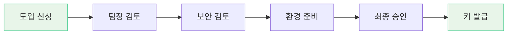

# CodeHub AI Tool 관리 플랫폼

> 사내 AI 코딩 도구(Claude Code, Antigravity 등) 도입 신청/검토/라이선스 관리 플랫폼

---

## 프로젝트 소개

CodeHub는 기업 내 AI 코딩 도구의 **도입 신청 → 다단계 검토 → 라이선스 발급 → 사용 현황 모니터링**까지 전체 라이프사이클을 관리하는 웹 플랫폼입니다.

### 주요 기능

- **도입 신청 위자드** — 7단계 폼을 통한 체계적인 AI 도구 도입 신청
- **다단계 검토 워크플로우** — 팀장 → 보안 → 환경 준비 → 최종 승인
- **라이선스 & API 키 관리** — 발급, 갱신, 회수 이력 추적
- **사용 현황 모니터링** — 대시보드를 통한 실시간 현황 파악
- **역할 기반 접근 제어** — 신청자, 팀장, 보안 담당자, IT 관리자, 시스템 관리자

---

## 기술 문서 목록

| # | 문서 | 설명 |
|---|------|------|
| 01 | [프로젝트 기획안](01_프로젝트_기획안.md) | 프로젝트 비전, 목표, 이해관계자, 핵심 기능 정의 |
| 02 | [요구사항 정의서](02_요구사항_정의서.md) | 기능/비기능 요구사항, 유스케이스 상세 |
| 03 | [아키텍처 설계서](03_아키텍처_설계서.md) | 시스템 아키텍처, 기술 스택, 데이터 모델 |
| 04 | [UI/UX 설계서](04_UIUX_설계서.md) | 화면 설계, 컴포넌트 구조, 인터랙션 흐름 |
| 05 | [백엔드 설계서](05_백엔드_설계서.md) | API 설계, 데이터베이스 스키마, 인증/인가 |

---

## 기술 스택

| 영역 | 기술 |
|------|------|
| **프론트엔드** | Next.js 15 (App Router), TypeScript, Tailwind CSS v4 |
| **UI 컴포넌트** | shadcn/ui (Radix UI + Tailwind) |
| **상태 관리** | Zustand (클라이언트), TanStack React Query (서버) |
| **폼 검증** | React Hook Form + Zod |
| **백엔드 (설계)** | NestJS, PostgreSQL, Redis, JWT |

---

## 검토 워크플로우

---

## 역할 구조

| 역할 | 설명 |
|------|------|
| **APPLICANT** | AI 도구 도입 신청 및 본인 신청 현황 조회 |
| **TEAM_LEAD** | 팀원 신청 검토 및 승인/반려 |
| **SECURITY_REVIEWER** | 보안 관점 검토 및 조건부 승인 |
| **IT_ADMIN** | 환경 준비, 라이선스/API 키 발급 관리 |
| **SYSTEM_ADMIN** | 전체 시스템 관리, 사용자/도구 관리 |
